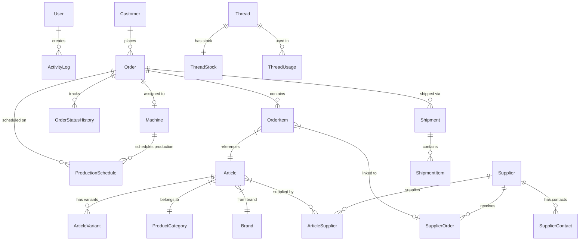

# StitchAdmin 2.0 - Vollständige System-Dokumentation

**Erstellt von Hans Hahn - Alle Rechte vorbehalten**  
**Version:** 2.0.0  
**Stand:** 10. November 2025  
**Status:** Alpha (ca. 40% fertig, Testphase)

---

## 📋 Inhaltsverzeichnis

1. [Projekt-Übersicht](#projekt-übersicht)
2. [Verzeichnisstruktur](#verzeichnisstruktur)
3. [Datenbank-Schema](#datenbank-schema)
4. [Module & Anwendungsbereiche](#module--anwendungsbereiche)
5. [Klassen-Übersicht](#klassen-übersicht)
6. [Workflows & Prozesse](#workflows--prozesse)
7. [API-Endpunkte](#api-endpunkte)
8. [Globale Variablen & Konfiguration](#globale-variablen--konfiguration)
9. [Utilities & Hilfsfunktionen](#utilities--hilfsfunktionen)

---

## 🎯 Projekt-Übersicht

### Technologie-Stack
- **Backend-Framework:** Flask 3.0.3
- **ORM:** SQLAlchemy 2.0.36
- **Datenbank:** SQLite (produktionsbereit für PostgreSQL)
- **Template-Engine:** Jinja2
- **Authentifizierung:** Flask-Login
- **Forms:** Flask-WTF mit WTForms

### Projekt-Statistiken (Stand: 10.11.2025)
- **Controllers (Blueprints):** 38 Dateien
- **Models:** 20+ Datenbank-Tabellen
- **Templates:** 126+ HTML-Dateien
- **Utilities:** 14 Hilfsmodule
- **Zeilen Code:** ~15.000+ LOC

---

## 📁 Verzeichnisstruktur

```
C:\SoftwareEntwicklung\StitchAdmin2.0/
│
├── app.py                              # ⭐ Haupt-Application (Flask Factory Pattern)
├── requirements.txt                     # Python-Abhängigkeiten
├── .env                                # Umgebungsvariablen (SECRET_KEY, DB, etc.)
├── start.bat                           # Windows-Startskript
├── fix_sqlalchemy.bat                  # SQLAlchemy-Fix für Python 3.13
│
├── README.md                           # 📖 Projekt-Hauptdokumentation
├── TODO.md                             # ✅ Aufgaben & Meilensteine
├── CHANGELOG.md                        # 📝 Versions-Historie
├── error.log                           # 🐛 Fehlerprotokoll
│
├── instance/                           # 🔒 Flask Instance-Ordner (nicht in Git!)
│   ├── stitchadmin.db                 # SQLite-Datenbank
│   └── uploads/                       # Hochgeladene Dateien
│       ├── designs/                   # Design-Dateien (DST, EMB, PES, etc.)
│       ├── documents/                 # Dokumente (PDF, etc.)
│       └── images/                    # Bilder
│
├── src/                                # 🎯 Quellcode-Hauptverzeichnis
│   │
│   ├── controllers/                    # 🎮 Flask Blueprints (38 Module)
│   │   ├── customer_controller_db.py  # Kundenverwaltung
│   │   ├── article_controller_db.py   # Artikelverwaltung
│   │   ├── order_controller_db.py     # Auftragsverwaltung
│   │   ├── machine_controller_db.py   # Maschinenverwaltung
│   │   ├── thread_controller_db.py    # Garnverwaltung
│   │   ├── production_controller_db.py # Produktionsverwaltung
│   │   ├── shipping_controller_db.py  # Versandverwaltung
│   │   ├── supplier_controller_db.py  # Lieferantenverwaltung
│   │   ├── design_workflow_controller.py # Design-Workflow
│   │   ├── file_browser_controller.py # Datei-Browser
│   │   ├── api_controller.py          # REST-API
│   │   ├── rechnungsmodul/            # 💰 Rechnungs- & Kassenmodul
│   │   │   ├── kasse_controller.py    # Kasse (TSE-konform)
│   │   │   └── rechnung_controller.py # Rechnungen
│   │   └── ... (weitere 20+ Controller)
│   │
│   ├── models/                         # 🗄️ SQLAlchemy Models (20+ Tabellen)
│   │   ├── models.py                  # ⭐ Haupt-Models (17 Tabellen)
│   │   ├── article_variant.py         # Artikel-Varianten
│   │   ├── article_supplier.py        # Artikel-Lieferanten-Zuordnung
│   │   ├── supplier_contact.py        # Lieferanten-Kontakte
│   │   ├── settings.py                # Einstellungen-Models
│   │   ├── rechnungsmodul.py          # Rechnungsmodul-Models
│   │   └── ...
│   │
│   ├── services/                       # 💼 Business-Logic-Services
│   │   ├── customer_service.py        # Kunden-Geschäftslogik
│   │   ├── order_service.py           # Auftrags-Geschäftslogik
│   │   └── ... (weitere Services)
│   │
│   ├── templates/                      # 🎨 Jinja2 HTML-Templates (126+ Dateien)
│   │   ├── base.html                  # Basis-Template
│   │   ├── dashboard.html             # Dashboard
│   │   ├── login.html                 # Login-Seite
│   │   ├── customers/                 # Kunden-Templates
│   │   ├── articles/                  # Artikel-Templates
│   │   ├── orders/                    # Auftrags-Templates
│   │   ├── machines/                  # Maschinen-Templates
│   │   ├── threads/                   # Garn-Templates
│   │   ├── suppliers/                 # Lieferanten-Templates
│   │   ├── rechnungsmodul/            # Rechnungs-Templates
│   │   └── ... (weitere Template-Ordner)
│   │
│   ├── static/                         # 📦 Statische Dateien
│   │   ├── css/                       # CSS-Stylesheets
│   │   │   ├── style.css             # Haupt-Stylesheet
│   │   │   └── ...
│   │   ├── js/                        # JavaScript-Dateien
│   │   │   ├── main.js               # Haupt-JS
│   │   │   └── ...
│   │   ├── images/                    # Bilder/Icons
│   │   └── thumbnails/                # Design-Thumbnails
│   │
│   └── utils/                          # 🔧 Hilfsfunktionen (14 Module)
│       ├── dst_analyzer.py            # DST-Datei-Analyse
│       ├── design_upload.py           # Sichere File-Uploads
│       ├── pdf_analyzer.py            # PDF-Verarbeitung
│       ├── logger.py                  # Logging-System
│       ├── filters.py                 # Template-Filter
│       ├── validators.py              # Validierungsfunktionen
│       └── ... (weitere 8 Utils)
│
├── config/                             # ⚙️ Konfigurationsdateien
│   └── settings.py                    # Globale Einstellungen
│
├── scripts/                            # 🔨 Hilfsskripte
│   ├── db_migration.py                # Datenbank-Migrationen
│   └── ...
│
├── docs/                               # 📚 Erweiterte Dokumentation
│   ├── VOLLSTAENDIGE_DOKUMENTATION.md # Diese Datei
│   ├── KLASSEN_UEBERSICHT.md         # Detaillierte Klassen-Dokumentation
│   ├── PROJEKT_STRUKTUR.md           # Strukturdokumentation
│   └── workflows/                     # 📊 Workflow-Diagramme (Mermaid)
│       ├── customer_management.md     # Kundenverwaltung
│       ├── article_management.md      # Artikelverwaltung
│       ├── order_workflow.md          # Auftragsprozess
│       ├── design_workflow.md         # Design-Workflow
│       ├── production_planning.md     # Produktionsplanung
│       └── ... (weitere Workflows)
│
├── backups/                            # 💾 Datenbank-Backups
├── logs/                               # 📋 Anwendungs-Logs
└── tests/                              # 🧪 Tests (in Entwicklung)
    ├── conftest.py                    # Pytest-Konfiguration
    ├── test_models.py                 # Model-Tests
    ├── test_controllers.py            # Controller-Tests
    └── ...
```

---

## 🗄️ Datenbank-Schema

### Tabellen-Übersicht (20+ Tabellen)

#### Kern-Tabellen
1. **users** - Benutzer (Authentifizierung)
2. **customers** - Kunden (Privat & Geschäft)
3. **articles** - Artikel (Textilien)
4. **article_variants** - Artikel-Varianten (Größe/Farbe)
5. **article_suppliers** - Artikel-Lieferanten-Zuordnung
6. **orders** - Aufträge (Stickerei/Druck)
7. **order_items** - Auftragspositionen (Textilien pro Auftrag)
8. **order_status_history** - Auftrags-Status-Historie

#### Produktion
9. **machines** - Maschinen (Stickmaschinen, Drucker)
10. **production_schedules** - Produktionsplanung
11. **threads** - Garne/Farben
12. **thread_stock** - Garnbestand
13. **thread_usage** - Garnverbrauch

#### Verwaltung
14. **suppliers** - Lieferanten
15. **supplier_orders** - Lieferanten-Bestellungen
16. **supplier_contacts** - Lieferanten-Kontakte
17. **shipments** - Versand
18. **shipment_items** - Versand-Positionen

#### Konfiguration
19. **product_categories** - Produktkategorien
20. **brands** - Marken/Hersteller
21. **price_calculation_settings** - Preiskalkulationseinstellungen
22. **tax_rates** - Steuersätze
23. **price_calculation_rules** - Kalkulationsregeln

#### System
24. **activity_logs** - Aktivitätsprotokolle
25. **rechnungsmodul_* ** - Rechnungsmodul-Tabellen (TSE, Belege, etc.)

### Entity-Relationship-Diagramm



---

## 📦 Module & Anwendungsbereiche

### 1. Kundenverwaltung (`/customers`)

**Verantwortung:** Verwaltung von Privat- und Geschäftskunden

**Controller:** `customer_controller_db.py`  
**Model:** `Customer`  
**Templates:** `src/templates/customers/`

**Funktionen:**
- ✅ Kunden anlegen (Privat/Geschäft)
- ✅ Kunden bearbeiten
- ✅ Kunden suchen & filtern
- ✅ Kunden-Historie anzeigen
- ✅ Kunden löschen (mit Sicherheitsabfrage)
- ✅ Newsletter-Verwaltung
- ✅ DSGVO-konforme Datenhaltung

**Routen:**
- `GET /customers` - Kundenliste
- `GET /customers/new` - Neuer Kunde (Formular)
- `POST /customers/create` - Kunde anlegen
- `GET /customers/<id>` - Kunden-Details
- `GET /customers/<id>/edit` - Kunde bearbeiten
- `POST /customers/<id>/update` - Kunde aktualisieren
- `POST /customers/<id>/delete` - Kunde löschen

---

### 2. Artikelverwaltung (`/articles`)

**Verantwortung:** Verwaltung von Textil-Artikeln mit Varianten

**Controller:** `article_controller_db.py`  
**Models:** `Article`, `ArticleVariant`, `ArticleSupplier`  
**Templates:** `src/templates/articles/`

**Funktionen:**
- ✅ Artikel anlegen (manuell)
- ✅ L-Shop Excel-Import (automatischer Massenimport)
- ✅ Artikel-Varianten (Größe/Farbe) verwalten
- ✅ Mehrstufige Preiskalkulation (EK → VK)
- ✅ Lagerbestandsverwaltung
- ✅ Kategorien & Marken zuordnen
- ✅ Lieferanten-Zuordnung mit Preishistorie
- ✅ Artikel-Suche mit Filtern

**Routen:**
- `GET /articles` - Artikelliste
- `GET /articles/new` - Neuer Artikel
- `POST /articles/create` - Artikel anlegen
- `GET /articles/<id>` - Artikel-Details
- `GET /articles/<id>/edit` - Artikel bearbeiten
- `POST /articles/<id>/update` - Artikel aktualisieren
- `POST /articles/<id>/delete` - Artikel löschen
- `GET /articles/import` - L-Shop Import-Formular
- `POST /articles/import/excel` - Excel-Datei importieren
- `GET /articles/<id>/variants` - Varianten-Verwaltung
- `POST /articles/<id>/variants/add` - Variante hinzufügen

**L-Shop Import-Prozess:**
1. Excel-Datei hochladen (.xlsx)
2. Automatische Erkennung von:
   - Artikelnummer
   - Produktname
   - EK-Preise (Einzel, Karton, 10er-Karton)
   - Hersteller/Marke
   - Produkttyp
   - Katalogseiten
3. Automatische Preiskalkulation (EK → VK)
4. Duplikat-Prüfung (Artikelnummer)
5. Batch-Import in Datenbank

---

### 3. Auftragsverwaltung (`/orders`)

**Verantwortung:** Verwaltung von Stickerei- und Druck-Aufträgen

**Controller:** `order_controller_db.py`  
**Models:** `Order`, `OrderItem`, `OrderStatusHistory`  
**Templates:** `src/templates/orders/`

**Funktionen:**
- ✅ Stickerei-Aufträge erstellen
- ✅ Druck-Aufträge erstellen (DTG, DTF, Siebdruck)
- ✅ Kombinierte Aufträge (Stickerei + Druck)
- ✅ Design-Upload mit DST-Analyse
- ✅ Stichzahl-basierte Preiskalkulation
- ✅ Status-Tracking (Erfasst → In Produktion → Fertig → Ausgeliefert)
- ✅ Textile-Bestellung beim Lieferanten
- ✅ Liefertermin-Planung
- ✅ Auftragspositionen verwalten (mehrere Textilien pro Auftrag)
- ✅ Auftrags-Historie

**Routen:**
- `GET /orders` - Auftragsliste
- `GET /orders/new` - Neuer Auftrag
- `POST /orders/create` - Auftrag anlegen
- `GET /orders/<id>` - Auftrags-Details
- `GET /orders/<id>/edit` - Auftrag bearbeiten
- `POST /orders/<id>/update` - Auftrag aktualisieren
- `POST /orders/<id>/status` - Status ändern
- `POST /orders/<id>/delete` - Auftrag löschen
- `GET /orders/<id>/items` - Auftragspositionen verwalten
- `POST /orders/<id>/items/add` - Position hinzufügen
- `POST /orders/<id>/items/<item_id>/update` - Position aktualisieren
- `POST /orders/<id>/items/<item_id>/delete` - Position löschen
- `GET /orders/<id>/design` - Design-Workflow

**Auftragsstatus:**
1. `new` - Neu erfasst
2. `accepted` - Angenommen
3. `in_progress` - In Bearbeitung
4. `production` - In Produktion
5. `ready` - Fertig (Abholbereit)
6. `completed` - Abgeschlossen
7. `cancelled` - Storniert

---

### 4. Design-Workflow (`/design-workflow`)

**Verantwortung:** Verwaltung des Design-Prozesses von Upload bis Freigabe

**Controller:** `design_workflow_controller.py`  
**Model:** `Order` (erweiterte Felder)  
**Templates:** `src/templates/design_workflow/`  
**Utilities:** `dst_analyzer.py`, `design_upload.py`

**Funktionen:**
- ✅ Sicherer Datei-Upload (DST, EMB, PES, PNG, JPG, PDF)
- ✅ **Automatische DST-Analyse:**
  - Stichzahl-Erkennung
  - Design-Größe (mm)
  - Farbwechsel-Anzahl
  - Farbliste extrahieren
- ✅ Thumbnail-Generierung für Vorschau
- ✅ Design-Status-Tracking:
  - `none` - Kein Design
  - `customer_provided` - Kunde hat Design geliefert
  - `needs_order` - Muss beim Lieferanten bestellt werden
  - `ordered` - Bei Lieferant bestellt
  - `received` - Vom Lieferanten erhalten
  - `ready` - Produktionsbereit
- ✅ Lieferanten-Bestellung direkt aus Order
- ✅ Design-Dateien mit Aufträgen verknüpfen

**Routen:**
- `GET /design-workflow` - Design-Übersicht
- `GET /design-workflow/<order_id>` - Design für Auftrag verwalten
- `POST /design-workflow/<order_id>/upload` - Design hochladen
- `POST /design-workflow/<order_id>/analyze` - DST-Datei analysieren
- `POST /design-workflow/<order_id>/order-from-supplier` - Design bestellen
- `POST /design-workflow/<order_id>/status` - Status ändern
- `GET /design-workflow/<order_id>/thumbnail` - Thumbnail anzeigen

**DST-Analyse (Automatisch):**
```python
# Beispiel DST-Analyse-Ergebnis
{
    "stitch_count": 15420,
    "width_mm": 85.3,
    "height_mm": 62.8,
    "color_changes": 5,
    "colors": [
        {"index": 0, "rgb": "#FF0000", "name": "Rot"},
        {"index": 1, "rgb": "#00FF00", "name": "Grün"},
        # ...
    ],
    "design_time_minutes": 18  # Geschätzte Produktionszeit
}
```

---

### 5. Produktionsverwaltung (`/production`)

**Verantwortung:** Produktionsplanung und Maschinensteuerung

**Controller:** `production_controller_db.py`  
**Models:** `Machine`, `ProductionSchedule`  
**Templates:** `src/templates/production/`

**Funktionen:**
- ✅ Maschinenzuordnung für Aufträge
- ✅ Kapazitätsplanung (Zeitslots)
- ✅ Reihenfolge-Optimierung
- ✅ Garnverbrauch-Erfassung
- ✅ Produktionszeit-Kalkulation
- ✅ Maschinen-Status-Überwachung
- ✅ Priorisierung von Aufträgen

**Routen:**
- `GET /production` - Produktions-Dashboard
- `GET /production/schedule` - Produktionskalender
- `POST /production/assign` - Auftrag Maschine zuweisen
- `POST /production/start/<order_id>` - Produktion starten
- `POST /production/complete/<order_id>` - Produktion abschließen
- `GET /production/machines` - Maschinen-Übersicht
- `GET /production/machines/<id>/schedule` - Maschinen-Zeitplan

---

### 6. Garnverwaltung (`/threads`)

**Verantwortung:** Verwaltung von Garnen, Farben und Lagerbestand

**Controller:** `thread_controller_db.py`  
**Models:** `Thread`, `ThreadStock`, `ThreadUsage`  
**Templates:** `src/templates/threads/`

**Funktionen:**
- ✅ Garnfarben mit Herstellercodes verwalten
- ✅ Lagerbestand mit Min/Max-Grenzen
- ✅ Verbrauchserfassung pro Auftrag
- ✅ Automatische Nachbestellvorschläge
- ✅ PDF-Import von Garnkarten (Madeira, Isacord, etc.)
- ✅ Hex-Farbe, Pantone, RGB-Werte
- ✅ Garnsuche nach Farbe, Hersteller, Nummer

**Routen:**
- `GET /threads` - Garnübersicht
- `GET /threads/new` - Neues Garn
- `POST /threads/create` - Garn anlegen
- `GET /threads/<id>` - Garn-Details
- `GET /threads/<id>/edit` - Garn bearbeiten
- `POST /threads/<id>/update` - Garn aktualisieren
- `POST /threads/<id>/delete` - Garn löschen
- `GET /threads/import` - PDF-Import
- `POST /threads/import/pdf` - Garnkarte importieren
- `GET /threads/<id>/stock` - Lagerbestand
- `POST /threads/<id>/stock/adjust` - Bestand anpassen
- `GET /threads/reorder` - Nachbestellliste

---

### 7. Lieferantenverwaltung (`/suppliers`)

**Verantwortung:** Verwaltung von Lieferanten und Bestellungen

**Controller:** `supplier_controller_db.py`  
**Models:** `Supplier`, `SupplierOrder`, `SupplierContact`  
**Templates:** `src/templates/suppliers/`

**Funktionen:**
- ✅ Lieferanten-Stammdaten verwalten
- ✅ Kontaktpersonen zuordnen
- ✅ Bestellungen mit Status-Tracking
- ✅ Webshop-Integration (automatische Links zu Artikeln)
- ✅ Kommunikationsprotokoll
- ✅ Retouren-Adressen verwalten
- ✅ Zahlungsbedingungen

**Routen:**
- `GET /suppliers` - Lieferantenliste
- `GET /suppliers/new` - Neuer Lieferant
- `POST /suppliers/create` - Lieferant anlegen
- `GET /suppliers/<id>` - Lieferanten-Details
- `GET /suppliers/<id>/edit` - Lieferant bearbeiten
- `POST /suppliers/<id>/update` - Lieferant aktualisieren
- `POST /suppliers/<id>/delete` - Lieferant löschen
- `GET /suppliers/<id>/orders` - Bestellungen
- `POST /suppliers/<id>/orders/create` - Neue Bestellung
- `GET /suppliers/<id>/contacts` - Kontakte verwalten

---

### 8. Rechnungsmodul (`/kasse`, `/rechnung`)

**Verantwortung:** TSE-konforme Kassenbelege und Rechnungserstellung

**Controller:**  
- `rechnungsmodul/kasse_controller.py`  
- `rechnungsmodul/rechnung_controller.py`

**Models:** `rechnungsmodul.py` (Separate Models)  
**Templates:** `src/templates/rechnungsmodul/`

**Funktionen:**
- ✅ TSE-konforme Kassenbelege (Vorbereitung)
- ✅ Rechnungserstellung mit Positionen
- ✅ ZUGFeRD-XML-Export
- ✅ Zahlungsverfolgung (offen/teilweise/bezahlt)
- ✅ Tagesabschlüsse (Z-Berichte)
- ✅ Mehrwertsteuersätze (19%, 7%, 0%)
- ✅ Storno-Funktionen
- ✅ Rechnungs-Historie

**Routen (Kasse):**
- `GET /kasse` - Kassen-Dashboard
- `GET /kasse/new` - Neuer Kassenbeleg
- `POST /kasse/create` - Beleg erstellen
- `GET /kasse/<id>` - Beleg anzeigen
- `POST /kasse/<id>/storno` - Beleg stornieren
- `GET /kasse/z-bericht` - Tagesabschluss

**Routen (Rechnung):**
- `GET /rechnung` - Rechnungsliste
- `GET /rechnung/new` - Neue Rechnung
- `POST /rechnung/create` - Rechnung erstellen
- `GET /rechnung/<id>` - Rechnung anzeigen
- `GET /rechnung/<id>/pdf` - Rechnung als PDF
- `GET /rechnung/<id>/zugferd` - ZUGFeRD-XML herunterladen
- `POST /rechnung/<id>/payment` - Zahlung erfassen
- `POST /rechnung/<id>/storno` - Rechnung stornieren

---

### 9. Dashboard & Statistiken (`/dashboard`)

**Verantwortung:** Übersicht und Statistiken

**Template:** `dashboard.html`  
**Route:** `GET /dashboard`

**Anzeige:**
- ✅ Offene Aufträge (Status: new, accepted)
- ✅ Aufträge in Produktion
- ✅ Abholbereite Aufträge
- ✅ Heutiger Umsatz
- ✅ Gesamtkunden
- ✅ Gesamtartikel
- ✅ Aktive Maschinen
- ✅ Letzte Bestellungen (10 neueste)
- ✅ Letzte Aktivitäten (10 neueste)

---

### 10. Einstellungen (`/settings`)

**Verantwortung:** Systemweite Konfiguration

**Controller:** `settings_controller_unified.py`  
**Models:** `settings.py` (TaxRate, PriceCalculationRule, etc.)  
**Templates:** `src/templates/settings/`

**Funktionen:**
- ✅ Steuersätze verwalten (19%, 7%, 0%)
- ✅ Preiskalkulationsregeln (kategoriebasiert)
- ✅ Produktkategorien verwalten
- ✅ Marken/Hersteller verwalten
- ✅ Benutzer-Einstellungen
- ✅ E-Mail-Konfiguration

**Routen:**
- `GET /settings` - Einstellungen-Übersicht
- `GET /settings/tax-rates` - Steuersätze
- `POST /settings/tax-rates/add` - Steuersatz hinzufügen
- `GET /settings/price-rules` - Kalkulationsregeln
- `POST /settings/price-rules/add` - Regel hinzufügen
- `GET /settings/categories` - Kategorien
- `GET /settings/brands` - Marken

---

## 🎓 Klassen-Übersicht

### Model-Klassen (models.py)

#### 1. User (Benutzer)
**Tabelle:** `users`  
**Zweck:** Authentifizierung und Benutzerrechte

**Attribute:**
- `id` (Integer, PK)
- `username` (String, unique)
- `email` (String, unique)
- `password_hash` (String)
- `is_active` (Boolean)
- `is_admin` (Boolean)
- `created_at` (DateTime)
- `last_login` (DateTime)

**Methoden:**
- `set_password(password)` - Passwort hashen
- `check_password(password)` - Passwort überprüfen

**Relationships:**
- → `activity_logs` (1:n)

---

#### 2. Customer (Kunde)
**Tabelle:** `customers`  
**Zweck:** Privat- und Geschäftskunden

**Attribute:**
- `id` (String, PK)
- `customer_type` (String) - 'private'/'business'
- `first_name`, `last_name` (String)
- `company_name`, `contact_person` (String)
- `email`, `phone`, `mobile` (String)
- `street`, `house_number`, `postal_code`, `city`, `country` (String)
- `tax_id`, `vat_id` (String)
- `newsletter` (Boolean)
- `notes` (Text)
- `created_at`, `updated_at` (DateTime)

**Properties:**
- `display_name` - Formatierter Anzeigename

**Relationships:**
- → `orders` (1:n)

---

#### 3. Article (Artikel)
**Tabelle:** `articles`  
**Zweck:** Textil-Artikel mit Varianten

**Attribute:**
- `id` (String, PK)
- `article_number` (String, unique)
- `name` (String)
- `description` (Text)
- `category_id` (FK → ProductCategory)
- `brand_id` (FK → Brand)
- `material`, `weight`, `color`, `size` (String/Float)
- **EK-Preise:**
  - `purchase_price_single` (Float)
  - `purchase_price_carton` (Float)
  - `purchase_price_10carton` (Float)
- **VK-Preise:**
  - `price` (Float) - Aktueller VK
  - `price_calculated` (Float) - Kalkulierter VK
  - `price_recommended` (Float) - Empfohlener VK
- `stock`, `min_stock` (Integer)
- `supplier`, `supplier_article_number` (String)
- `active` (Boolean)

**Methoden:**
- `calculate_prices(use_new_system=True)` - VK-Preise berechnen
- `_get_best_purchase_price()` - Besten EK ermitteln

**Relationships:**
- → `variants` (1:n, ArticleVariant)
- → `order_items` (1:n)
- → `article_suppliers` (1:n, ArticleSupplier)
- ← `category_obj` (n:1, ProductCategory)
- ← `brand_obj` (n:1, Brand)

---

#### 4. Order (Auftrag)
**Tabelle:** `orders`  
**Zweck:** Stickerei- und Druck-Aufträge

**Attribute:**
- `id` (String, PK)
- `customer_id` (FK → Customer)
- `order_number` (String, unique)
- `order_type` (String) - 'embroidery'/'printing'/'dtf'/'combined'
- `status` (String) - 'new', 'accepted', 'in_progress', etc.
- `description`, `internal_notes`, `customer_notes` (Text)
- **Stickerei:**
  - `stitch_count` (Integer)
  - `design_width_mm`, `design_height_mm` (Float)
  - `embroidery_position`, `embroidery_size` (String)
  - `thread_colors`, `selected_threads` (Text/JSON)
- **Druck:**
  - `print_width_cm`, `print_height_cm` (Float)
  - `print_method` (String)
  - `ink_coverage_percent` (Integer)
  - `print_colors` (Text/JSON)
- **Design-Workflow:**
  - `design_status` (String)
  - `design_supplier_id` (FK → Supplier)
  - `design_order_date`, `design_expected_date`, `design_received_date` (Date)
  - `design_file_path`, `design_thumbnail_path` (String)
- `total_price`, `deposit_amount`, `discount_percent` (Float)
- `due_date` (DateTime)
- `rush_order` (Boolean)
- `assigned_machine_id` (FK → Machine)
- `production_start`, `production_end` (DateTime)

**Methoden:**
- `get_selected_threads()` - Ausgewählte Garne als Liste
- `set_selected_threads(threads_list)` - Garne speichern (JSON)
- `can_start_production()` - Prüft Produktionsbereitschaft
- `get_design_status_display()` - Benutzerfreundlicher Status-Text
- `has_design_file()` - Prüft ob Design vorhanden
- `needs_design_order()` - Muss Design bestellt werden?
- `is_design_ready()` - Ist Design produktionsbereit?

**Relationships:**
- ← `customer` (n:1)
- → `items` (1:n, OrderItem)
- → `status_history` (1:n, OrderStatusHistory)
- → `shipments` (1:n)
- → `production_schedules` (1:n)
- ← `assigned_machine` (n:1, Machine)
- ← `design_supplier` (n:1, Supplier)

---

#### 5. Machine (Maschine)
**Tabelle:** `machines`  
**Zweck:** Stickmaschinen und Drucker

**Attribute:**
- `id` (String, PK)
- `name` (String)
- `type` (String) - 'embroidery'/'printing'/'dtf'
- `manufacturer`, `model`, `serial_number` (String)
- `purchase_date` (Date)
- **Stickmaschinen-Details:**
  - `num_heads` (Integer) - Anzahl Köpfe
  - `needles_per_head` (Integer) - Nadeln pro Kopf
  - `max_speed` (Integer) - Stiche/Minute
  - `max_area_width`, `max_area_height` (Integer) - mm
- `thread_setup` (Text/JSON) - Fadenkonfiguration
- `status` (String) - 'active'/'inactive'/'maintenance'
- **Zeiten:**
  - `setup_time_minutes` (Integer)
  - `thread_change_time_minutes` (Integer)
  - `hoop_change_time_minutes` (Integer)

**Methoden:**
- `get_thread_setup()` - Thread-Konfiguration als Liste
- `set_thread_setup(setup_list)` - Thread-Konfiguration speichern

**Relationships:**
- → `orders` (1:n)
- → `schedules` (1:n, ProductionSchedule)

---

#### 6. Thread (Garn)
**Tabelle:** `threads`  
**Zweck:** Garne/Farben mit Lagerbestand

**Attribute:**
- `id` (String, PK)
- `manufacturer` (String) - z.B. 'Madeira', 'Isacord'
- `thread_type` (String)
- `color_number` (String) - Herstellernummer
- `color_name_de`, `color_name_en` (String)
- **Farbwerte:**
  - `hex_color` (String) - z.B. '#FF0000'
  - `pantone` (String)
  - `rgb_r`, `rgb_g`, `rgb_b` (Integer)
- `category` (String) - 'Standard'/'Metallic'/etc.
- `weight` (Integer) - z.B. 40 für No.40
- `material` (String) - 'Polyester'/'Rayon'/etc.
- `price` (Float)
- `supplier`, `supplier_article_number` (String)
- `active`, `discontinued` (Boolean)

**Relationships:**
- → `stock` (1:1, ThreadStock)
- → `usage_history` (1:n, ThreadUsage)

---

#### 7. Supplier (Lieferant)
**Tabelle:** `suppliers`  
**Zweck:** Lieferanten-Stammdaten

**Attribute:**
- `id` (String, PK)
- `name` (String)
- `contact_person`, `email`, `phone`, `website` (String)
- `street`, `postal_code`, `city`, `country` (String)
- `tax_id`, `customer_number` (String)
- `payment_terms`, `delivery_time_days` (String/Integer)
- **Webshop-Integration:**
  - `webshop_url`, `webshop_username`, `webshop_password_encrypted` (String)
  - `webshop_type`, `webshop_article_url_pattern` (String)
  - `auto_order_enabled` (Boolean)
- **Retourenadresse:**
  - `return_street`, `return_postal_code`, `return_city` (String)
  - `return_contact`, `return_phone`, `return_notes` (String/Text)
- `active`, `preferred` (Boolean)

**Relationships:**
- → `orders` (1:n, SupplierOrder)
- → `design_orders` (1:n, Order via design_supplier_id)

---

### Weitere wichtige Klassen

**OrderItem** - Auftragspositionen (Textilien)  
**OrderStatusHistory** - Status-Historie  
**ProductionSchedule** - Produktionsplanung  
**ThreadStock** - Garnbestand  
**ThreadUsage** - Garnverbrauch  
**Shipment** - Versand  
**ShipmentItem** - Versandpositionen  
**SupplierOrder** - Lieferanten-Bestellungen  
**ActivityLog** - Aktivitätsprotokolle  
**ProductCategory** - Produktkategorien  
**Brand** - Marken  
**PriceCalculationSettings** - Kalkulationseinstellungen

Siehe [KLASSEN_UEBERSICHT.md](./KLASSEN_UEBERSICHT.md) für vollständige Details aller Klassen.

---

## 🔄 Workflows & Prozesse

Siehe separate Workflow-Diagramme in `docs/workflows/`:

1. **Kundenverwaltung** → [customer_management.md](./workflows/customer_management.md)
2. **Artikelverwaltung** → [article_management.md](./workflows/article_management.md)
3. **Auftragsprozess** → [order_workflow.md](./workflows/order_workflow.md)
4. **Design-Workflow** → [design_workflow.md](./workflows/design_workflow.md)
5. **Produktionsplanung** → [production_planning.md](./workflows/production_planning.md)
6. **Garnverwaltung** → [thread_management.md](./workflows/thread_management.md)
7. **Lieferanten-Bestellung** → [supplier_ordering.md](./workflows/supplier_ordering.md)
8. **Rechnungsstellung** → [invoicing_workflow.md](./workflows/invoicing_workflow.md)
9. **Versandprozess** → [shipping_workflow.md](./workflows/shipping_workflow.md)

---

## 🌐 API-Endpunkte

**Basis-URL:** `/api/v1/`

### Kunden-API
- `GET /api/v1/customers` - Alle Kunden
- `GET /api/v1/customers/<id>` - Kunden-Details
- `POST /api/v1/customers` - Kunden anlegen
- `PUT /api/v1/customers/<id>` - Kunden aktualisieren
- `DELETE /api/v1/customers/<id>` - Kunden löschen

### Artikel-API
- `GET /api/v1/articles` - Alle Artikel
- `GET /api/v1/articles/<id>` - Artikel-Details
- `POST /api/v1/articles` - Artikel anlegen
- `PUT /api/v1/articles/<id>` - Artikel aktualisieren
- `DELETE /api/v1/articles/<id>` - Artikel löschen

### Auftrags-API
- `GET /api/v1/orders` - Alle Aufträge
- `GET /api/v1/orders/<id>` - Auftrags-Details
- `POST /api/v1/orders` - Auftrag anlegen
- `PUT /api/v1/orders/<id>` - Auftrag aktualisieren
- `PATCH /api/v1/orders/<id>/status` - Status ändern
- `DELETE /api/v1/orders/<id>` - Auftrag löschen

*(API noch nicht vollständig implementiert - Meilenstein 3)*

---

## ⚙️ Globale Variablen & Konfiguration

### Umgebungsvariablen (.env)

```bash
# Flask-Konfiguration
FLASK_APP=app.py
FLASK_ENV=development
SECRET_KEY=dein-geheimer-schlüssel-hier

# Datenbank
DATABASE_URL=sqlite:///instance/stitchadmin.db

# Upload-Konfiguration
UPLOAD_FOLDER=instance/uploads
MAX_CONTENT_LENGTH=16777216  # 16MB

# E-Mail (optional)
MAIL_SERVER=smtp.gmail.com
MAIL_PORT=587
MAIL_USE_TLS=True
MAIL_USERNAME=deine-email@example.com
MAIL_PASSWORD=dein-passwort
```

### App-Konfiguration (app.py)

```python
app.config['SECRET_KEY'] = os.environ.get('SECRET_KEY', 'dev-secret-key')
app.config['DEBUG'] = os.environ.get('FLASK_DEBUG', 'True') == 'True'
app.config['SQLALCHEMY_DATABASE_URI'] = f'sqlite:///{db_path}'
app.config['SQLALCHEMY_TRACK_MODIFICATIONS'] = False
app.config['PERMANENT_SESSION_LIFETIME'] = timedelta(minutes=30)
app.config['TEMPLATES_AUTO_RELOAD'] = True
app.config['MAX_CONTENT_LENGTH'] = 16 * 1024 * 1024  # 16MB
app.config['UPLOAD_FOLDER'] = upload_dir
```

### Preiskalkulation-Einstellungen

**Standard-Faktoren:**
- `price_factor_calculated` = 1.5 (EK → VK kalkuliert)
- `price_factor_recommended` = 2.0 (EK → VK empfohlen)
- `default_tax_rate` = 19.0 (MwSt. in %)

**Berechnung:**
```
VK brutto = EK × Faktor × (1 + MwSt/100)
```

---

## 🔧 Utilities & Hilfsfunktionen

### 1. DST-Analyzer (`dst_analyzer.py`)
**Zweck:** Analyse von DST-Stickdateien

**Funktionen:**
- `analyze_dst_file(filepath)` - Analysiert DST-Datei
  - Stichzahl
  - Design-Größe (mm)
  - Farbwechsel
  - Farbliste
  - Geschätzte Produktionszeit

**Verwendung:**
```python
from src.utils.dst_analyzer import analyze_dst_file

result = analyze_dst_file("uploads/designs/logo.dst")
# result = {
#     "stitch_count": 15420,
#     "width_mm": 85.3,
#     "height_mm": 62.8,
#     "color_changes": 5,
#     "colors": [...],
#     "design_time_minutes": 18
# }
```

---

### 2. Design-Upload (`design_upload.py`)
**Zweck:** Sichere Datei-Uploads mit Validierung

**Funktionen:**
- `allowed_file(filename)` - Prüft Datei-Extension
- `secure_filename(filename)` - Bereinigt Dateinamen
- `save_upload(file, upload_folder)` - Speichert Datei sicher
- `generate_thumbnail(filepath)` - Erstellt Thumbnail

**Erlaubte Dateitypen:**
- Stickdateien: `.dst`, `.emb`, `.pes`, `.jef`, `.exp`, `.vp3`
- Bilder: `.png`, `.jpg`, `.jpeg`, `.gif`, `.svg`
- Dokumente: `.pdf`

---

### 3. PDF-Analyzer (`pdf_analyzer.py`)
**Zweck:** Extraktion von Daten aus PDF-Dateien

**Funktionen:**
- `extract_thread_colors(pdf_path)` - Garnfarben aus Garnkarte extrahieren
- `extract_invoice_data(pdf_path)` - Rechnungsdaten extrahieren

---

### 4. Logger (`logger.py`)
**Zweck:** Einheitliches Logging-System

**Funktionen:**
- `log_activity(user, action, details)` - Aktivität protokollieren
- `log_error(error, context)` - Fehler protokollieren

---

### 5. Filters (`filters.py`)
**Zweck:** Custom Jinja2-Template-Filter

**Filter:**
- `{{ value|currency }}` - Formatiert als Währung (€)
- `{{ value|date_format }}` - Formatiert Datum (DE)
- `{{ value|datetime_format }}` - Formatiert Datum+Zeit
- `{{ value|status_badge }}` - Bootstrap-Badge für Status
- `{{ value|truncate(50) }}` - Kürzt Text

---

### 6. Validators (`validators.py`)
**Zweck:** Validierungsfunktionen

**Funktionen:**
- `validate_email(email)` - E-Mail-Validierung
- `validate_vat_id(vat_id)` - Umsatzsteuer-ID prüfen
- `validate_article_number(number)` - Artikelnummer prüfen

---

## 📝 Entwicklungs-Hinweise

### Code-Standards
- **PEP 8** Python Style Guide
- **Type Hints** wo sinnvoll
- **Docstrings** für alle Funktionen und Klassen
- **Deutsche Kommentare** für Geschäftslogik
- **Englische Kommentare** für technische Details

### Testing-Strategie
- Integration-Tests vor Unit-Tests
- End-to-End-Tests für Hauptworkflows
- Ziel: 60% Code-Coverage

### Git-Workflow
- `main` - Produktionsversion
- `develop` - Entwicklungsversion
- Feature-Branches: `feature/name`
- Bugfix-Branches: `bugfix/name`

---

## 🐛 Bekannte Probleme & Einschränkungen

### Critical Issues
- Keine bekannten kritischen Fehler (Stand: 10.11.2025)

### Limitations
- SQLite-Datenbank (nicht für High-Traffic geeignet)
- Keine Multi-Mandanten-Fähigkeit
- API noch nicht vollständig implementiert
- Testing-Framework in Entwicklung

### Planned Improvements
Siehe [TODO.md](../TODO.md) für geplante Verbesserungen.

---

## 📞 Support & Kontakt

**Entwickler:** Hans Hahn  
**Projekt:** StitchAdmin 2.0  
**Version:** 2.0.0-alpha  
**Lizenz:** Alle Rechte vorbehalten

**Dokumentation:**
- [README.md](../README.md) - Projekt-Hauptdokumentation
- [TODO.md](../TODO.md) - Aufgaben & Meilensteine
- [CHANGELOG.md](../CHANGELOG.md) - Versions-Historie
- [KLASSEN_UEBERSICHT.md](./KLASSEN_UEBERSICHT.md) - Detaillierte Klassen-Dokumentation

---

**Erstellt von Hans Hahn - Alle Rechte vorbehalten**  
**Letzte Aktualisierung:** 10. November 2025  
**Version:** 1.0.0
