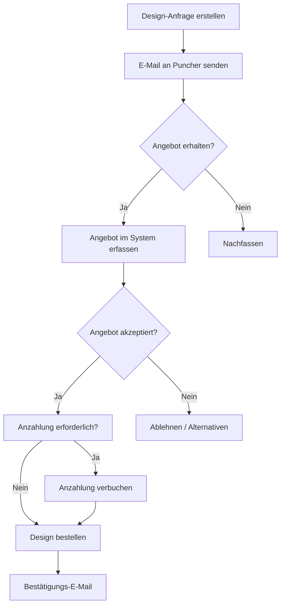

# 🛒 Einkauf-Modul - Konzept & Spezifikation

**Erstellt:** 30.11.2025  
**Aktualisiert:** 30.11.2025  
**Status:** Konzeptphase  
**Autor:** Hans Hahn - Alle Rechte vorbehalten

---

## 1. Übersicht & Zielsetzung

### 1.1 Problemstellung

Aktuell sind die Einkaufsfunktionen im Lieferanten-Modul (`/suppliers/`) versteckt:
- Kein direkter Dashboard-Zugang
- Keine zentrale Bestellübersicht
- Design-Bestellungen nur rudimentär im Order-Model integriert
- Keine klare Trennung zwischen Artikel- und Design-Bestellungen
- Keine druckbare Bestellliste für manuelle Online-Shop-Bestellungen

### 1.2 Ziel

Ein **eigenständiges Einkauf-Modul** als Dashboard-Kachel mit:
- Zentraler Bestellübersicht (alle Lieferanten)
- Automatischen Bestellvorschlägen
- **Druckbare Bestelllisten** mit Abhak-Funktion ⭐ NEU
- Design-Bestellworkflow (Puncher/Digitizer) mit **E-Mail-Versand**
- **Anzahlungs-Management** für Design-Bestellungen
- Wareneingang-Management
- Einkaufsstatistiken
- **Eigene Nummernkreise** (PO, DO)

### 1.3 Abgrenzung

| Modul | Verantwortung |
|-------|---------------|
| **Einkauf (NEU)** | Bestellprozess, Wareneingang, Design-Beschaffung, Bestelllisten |
| **Lieferanten** | Stammdaten, Kontakte, Bewertungen, Webshop-Integration |
| **Lager/Artikel** | Bestand, Artikelstamm, Preise |
| **Produktion** | Auftragsabwicklung, Fertigung |

---

## 2. Nummernkreise (NEU)

### 2.1 Neue Dokumenttypen

Erweiterung von `src/models/nummernkreis.py`:

```python
class DocumentType:
    # ... bestehende Typen ...
    
    # NEU: Einkauf
    PURCHASE_ORDER = 'purchase_order'    # Einkaufsbestellung (Artikel)
    DESIGN_ORDER = 'design_order'        # Design-Bestellung (Puncher)
```

### 2.2 Format-Konfiguration

| Typ | Präfix | Format | Beispiel |
|-----|--------|--------|----------|
| Einkaufsbestellung | PO | PO-{year}-{number:04d} | PO-2025-0001 |
| Design-Bestellung | DO | DO-{year}-{number:04d} | DO-2025-0001 |

### 2.3 Integration

```python
# Default-Einstellungen erweitern in NumberSequenceSettings.get_settings()
DocumentType.PURCHASE_ORDER: {
    'prefix': 'PO',
    'use_year': True,
    'use_month': False,
    'format_pattern': '{prefix}-{year}-{number:04d}'
},
DocumentType.DESIGN_ORDER: {
    'prefix': 'DO',
    'use_year': True,
    'use_month': False,
    'format_pattern': '{prefix}-{year}-{number:04d}'
}
```

---

## 3. Modul-Architektur

### 3.1 Dashboard-Kachel "Einkauf"

```
🛒 EINKAUF
├── Bestellübersicht
├── Bestellvorschläge
├── 📋 Bestelllisten (Druck) ⭐ NEU
├── Design-Bestellungen
├── Wareneingang
└── Statistiken
```

**Quick-Stats auf der Kachel:**
- Offene Bestellungen (Anzahl)
- Bestellvorschläge (Anzahl)
- Offene Design-Anfragen (Anzahl)
- Erwartete Lieferungen heute/diese Woche

### 3.2 Hauptmenü-Struktur

```
/purchasing/                        → Dashboard/Übersicht
/purchasing/orders                  → Alle Bestellungen
/purchasing/orders/pending          → Offene Bestellungen
/purchasing/orders/<id>/print-list  → Bestellliste drucken ⭐ NEU
/purchasing/suggestions             → Bestellvorschläge
/purchasing/design-orders           → Design-Bestellungen
/purchasing/design-orders/new       → Neue Design-Anfrage
/purchasing/receiving               → Wareneingang
/purchasing/statistics              → Einkaufsstatistiken
```

---

## 4. Druckbare Bestellliste ⭐ NEU

### 4.1 Anwendungsfall

Beim Bestellen in einem **Online-Shop ohne API** (z.B. L-Shop, manuell):
1. Bestellung im System anlegen (Entwurf)
2. **Bestellliste drucken** mit allen Positionen
3. Im Browser den Webshop öffnen
4. Artikel einzeln in den Warenkorb legen und **auf der Liste abhaken**
5. Nach Abschluss: Bestellung als "bestellt" markieren

### 4.2 UI-Konzept: Bestellliste

```
┌──────────────────────────────────────────────────────────────────────────┐
│  📋 BESTELLLISTE                                     PO-2025-0042        │
│  ═══════════════════════════════════════════════════════════════════════ │
│                                                                          │
│  Lieferant: L-Shop Team                              Datum: 30.11.2025  │
│  Webshop:   https://www.l-shop-team.de                                  │
│  Kd.-Nr.:   123456                                                       │
│                                                                          │
│  ─────────────────────────────────────────────────────────────────────── │
│                                                                          │
│  □  Art.-Nr.        Bezeichnung                    Größe   Farbe   Menge │
│  ─────────────────────────────────────────────────────────────────────── │
│  □  JN071          James & Nicholson Polo          XL      Navy      5  │
│  □  JN071          James & Nicholson Polo          L       Navy      3  │
│  □  JN071          James & Nicholson Polo          M       Navy      2  │
│  □  FO1000         Fruit Premium T-Shirt           XL      Schwarz  10  │
│  □  FO1000         Fruit Premium T-Shirt           L       Schwarz   8  │
│  □  B&C123         B&C Softshell Jacke             M       Rot       2  │
│                                                                          │
│  ─────────────────────────────────────────────────────────────────────── │
│                                                                          │
│  Positionen: 6                           Gesamtmenge: 30 Stück          │
│                                                                          │
│  Für Auftrag(e):                                                        │
│  • A-2025-0234 - Müller GmbH (Eilig!)                                   │
│  • A-2025-0231 - Sport AG                                                │
│                                                                          │
│  ─────────────────────────────────────────────────────────────────────── │
│  Notizen: _____________________________________________________________ │
│           _____________________________________________________________ │
│                                                                          │
│  Bestellt am: ____________  Bestellnummer Shop: _______________________ │
│  Unterschrift: _______________________________________________________  │
│                                                                          │
└──────────────────────────────────────────────────────────────────────────┘
```

### 4.3 Features der Bestellliste

| Feature | Beschreibung |
|---------|--------------|
| **Checkbox-Spalte** | Zum Abhaken während der Bestellung |
| **Artikelnummer prominent** | Für schnelles Suchen im Shop |
| **Gruppierung** | Nach Artikel, dann Größe/Farbe |
| **Auftrags-Referenzen** | Zeigt wohin die Artikel gehören |
| **Eingabefelder unten** | Shop-Bestellnummer notieren |
| **QR-Code (optional)** | Link zum Webshop |

### 4.4 Datenmodell-Erweiterung

```python
# Erweiterung SupplierOrder
class SupplierOrder(db.Model):
    # ... bestehende Felder ...
    
    # NEU: Eigene Bestellnummer aus Nummernkreis
    purchase_order_number = db.Column(db.String(50), unique=True)  # PO-2025-0001
    
    # NEU: Verknüpfte Kundenaufträge (für Bestellliste)
    linked_customer_orders = db.Column(db.Text)  # JSON Array von Order-IDs
    
    # NEU: Druck-Tracking
    print_count = db.Column(db.Integer, default=0)
    last_printed_at = db.Column(db.DateTime)
    last_printed_by = db.Column(db.String(80))
```

---

## 5. Design-Bestellungen mit E-Mail & Anzahlung

### 5.1 E-Mail-Integration

#### Workflow mit E-Mail



#### E-Mail-Templates

**1. Anfrage-E-Mail:**
```
Betreff: Design-Anfrage {DO-2025-0001} - {design_name}

Guten Tag,

wir benötigen ein Stickprogramm mit folgenden Spezifikationen:

Design: {design_name}
Zielgröße: {width} x {height} mm
Max. Stichzahl: {max_stitches}
Max. Farben: {max_colors}
Farbvorgaben: {color_notes}

Besondere Anforderungen:
{special_requirements}

Bitte senden Sie uns ein Angebot.

Im Anhang: Kundenvorlage

Mit freundlichen Grüßen
{company_name}
```

**2. Bestell-E-Mail:**
```
Betreff: Design-Bestellung {DO-2025-0001} - Freigabe

Guten Tag,

hiermit bestellen wir das Design zu Ihrer Angebotsnummer {quote_number}.

Anzahlung: {deposit_amount} € wurde überwiesen am {deposit_date}
Verwendungszweck: {DO-2025-0001}

Bitte liefern Sie das fertige Programm an: {email}

Mit freundlichen Grüßen
{company_name}
```

### 5.2 Anzahlungs-Workflow ⭐ NEU

#### Datenmodell: DesignOrder (erweitert)

```python
class DesignOrder(db.Model):
    """Design-Bestellungen bei externen Punchern/Digitizern"""
    __tablename__ = 'design_orders'
    
    id = db.Column(db.String(50), primary_key=True)
    
    # Eigene Bestellnummer aus Nummernkreis
    design_order_number = db.Column(db.String(50), unique=True)  # DO-2025-0001
    
    # Verknüpfungen
    order_id = db.Column(db.String(50), db.ForeignKey('orders.id'))
    supplier_id = db.Column(db.String(50), db.ForeignKey('suppliers.id'))
    
    # Anfrage-Details
    request_date = db.Column(db.DateTime, default=datetime.utcnow)
    
    # Design-Spezifikation
    design_name = db.Column(db.String(200))
    design_type = db.Column(db.String(50))  # embroidery, print, dtf
    target_width_mm = db.Column(db.Float)
    target_height_mm = db.Column(db.Float)
    max_stitch_count = db.Column(db.Integer)
    max_colors = db.Column(db.Integer)
    color_notes = db.Column(db.Text)
    special_requirements = db.Column(db.Text)
    
    # Kundenvorlage
    source_file_path = db.Column(db.String(500))
    source_file_type = db.Column(db.String(50))
    reference_images = db.Column(db.Text)  # JSON Array
    
    # Status-Workflow
    status = db.Column(db.String(50), default='draft')
    # draft, sent, quoted, deposit_pending, deposit_paid, ordered, 
    # in_progress, delivered, received, reviewed, approved, revision_requested
    
    # E-Mail-Tracking ⭐ NEU
    request_sent_at = db.Column(db.DateTime)
    request_sent_to = db.Column(db.String(200))  # E-Mail-Adresse
    request_email_id = db.Column(db.String(100))  # Message-ID für Threading
    
    # Angebot
    quote_received_date = db.Column(db.DateTime)
    quote_price = db.Column(db.Float)
    quote_delivery_days = db.Column(db.Integer)
    quote_notes = db.Column(db.Text)
    quote_file_path = db.Column(db.String(500))
    quote_number = db.Column(db.String(100))  # Angebotsnummer des Punchers
    
    # ═══════════════════════════════════════════════════════════════
    # ANZAHLUNGS-WORKFLOW ⭐ NEU
    # ═══════════════════════════════════════════════════════════════
    
    # Anzahlung erforderlich?
    deposit_required = db.Column(db.Boolean, default=False)
    deposit_percent = db.Column(db.Float)  # z.B. 50%
    deposit_amount = db.Column(db.Float)   # Berechneter Betrag
    
    # Anzahlung geleistet
    deposit_status = db.Column(db.String(50))  # pending, paid, not_required
    deposit_paid_date = db.Column(db.DateTime)
    deposit_payment_method = db.Column(db.String(50))  # bank_transfer, paypal
    deposit_reference = db.Column(db.String(100))  # Verwendungszweck / Transaktions-ID
    deposit_confirmed_by = db.Column(db.String(80))  # Wer hat bestätigt
    
    # Restzahlung
    final_amount = db.Column(db.Float)  # Restbetrag nach Anzahlung
    final_paid_date = db.Column(db.DateTime)
    final_payment_method = db.Column(db.String(50))
    final_reference = db.Column(db.String(100))
    
    # Gesamtkosten
    total_price = db.Column(db.Float)
    payment_status = db.Column(db.String(50))  # pending, partial, paid
    invoice_number = db.Column(db.String(100))  # Rechnungsnummer des Punchers
    
    # ═══════════════════════════════════════════════════════════════
    
    # Bestellung
    order_date = db.Column(db.DateTime)
    order_confirmation = db.Column(db.String(100))
    expected_delivery = db.Column(db.Date)
    order_email_sent_at = db.Column(db.DateTime)  # ⭐ NEU
    
    # Lieferung
    delivered_date = db.Column(db.DateTime)
    delivered_file_path = db.Column(db.String(500))
    delivered_preview_path = db.Column(db.String(500))
    
    # DST-Analyse (automatisch via pyembroidery)
    actual_stitch_count = db.Column(db.Integer)
    actual_width_mm = db.Column(db.Float)
    actual_height_mm = db.Column(db.Float)
    actual_colors = db.Column(db.Integer)
    color_sequence = db.Column(db.Text)  # JSON Array
    estimated_time_minutes = db.Column(db.Integer)
    
    # Qualitätsprüfung
    review_status = db.Column(db.String(50))
    review_date = db.Column(db.DateTime)
    review_notes = db.Column(db.Text)
    revision_count = db.Column(db.Integer, default=0)
    
    # Kommunikation
    communication_log = db.Column(db.Text)  # JSON Array mit Nachrichten
    
    # Metadaten
    priority = db.Column(db.String(20), default='normal')
    internal_notes = db.Column(db.Text)
    created_at = db.Column(db.DateTime, default=datetime.utcnow)
    created_by = db.Column(db.String(80))
    updated_at = db.Column(db.DateTime, onupdate=datetime.utcnow)
    
    # Relationships
    order = db.relationship('Order', backref='design_orders')
    supplier = db.relationship('Supplier', backref='design_orders_received')
    
    # ═══════════════════════════════════════════════════════════════
    # METHODEN
    # ═══════════════════════════════════════════════════════════════
    
    def calculate_deposit(self):
        """Berechnet Anzahlungsbetrag"""
        if self.deposit_required and self.quote_price and self.deposit_percent:
            self.deposit_amount = round(self.quote_price * (self.deposit_percent / 100), 2)
            self.final_amount = round(self.quote_price - self.deposit_amount, 2)
        return self.deposit_amount
    
    def record_deposit_payment(self, method, reference, confirmed_by):
        """Verbucht Anzahlung"""
        self.deposit_status = 'paid'
        self.deposit_paid_date = datetime.utcnow()
        self.deposit_payment_method = method
        self.deposit_reference = reference
        self.deposit_confirmed_by = confirmed_by
        self.payment_status = 'partial'
        
        # Status-Übergang
        if self.status == 'deposit_pending':
            self.status = 'deposit_paid'
    
    def record_final_payment(self, method, reference):
        """Verbucht Restzahlung"""
        self.final_paid_date = datetime.utcnow()
        self.final_payment_method = method
        self.final_reference = reference
        self.payment_status = 'paid'
    
    def can_order(self):
        """Prüft ob Bestellung ausgelöst werden kann"""
        if self.status not in ['quoted', 'deposit_paid']:
            return False, f"Status muss 'quoted' oder 'deposit_paid' sein, ist aber '{self.status}'"
        
        if self.deposit_required and self.deposit_status != 'paid':
            return False, "Anzahlung noch nicht bezahlt"
        
        return True, "OK"
    
    def get_payment_status_display(self):
        """Zahlungsstatus als Text"""
        if not self.deposit_required:
            if self.payment_status == 'paid':
                return "✓ Bezahlt"
            return "Ausstehend"
        
        if self.deposit_status == 'paid' and self.payment_status == 'paid':
            return "✓ Vollständig bezahlt"
        elif self.deposit_status == 'paid':
            return f"Anzahlung bezahlt ({self.deposit_amount}€), Rest: {self.final_amount}€"
        else:
            return f"Anzahlung ausstehend: {self.deposit_amount}€"
```

### 5.3 UI: Anzahlungs-Workflow

**Status-Anzeige in der Design-Bestellliste:**

| Status | Bestellung | Design | Puncher | Zahlung | Aktion |
|--------|-----------|--------|---------|---------|--------|
| 🟡 | DO-2025-042 | Logo 80mm | PunchPro | ⚠️ Anzahlung 25€ offen | [Zahlung erfassen] |
| 🟢 | DO-2025-041 | Rücken | StitchMaster | ✓ Anzahlung 40€ | [Als bestellt markieren] |
| 🔵 | DO-2025-040 | Brust | PunchPro | ✓ Vollständig | Warte auf Lieferung |

**Formular: Anzahlung erfassen**

```
┌─────────────────────────────────────────────────────────────────┐
│  💰 Anzahlung erfassen - DO-2025-042                            │
├─────────────────────────────────────────────────────────────────┤
│                                                                  │
│  Angebotspreis:        50,00 €                                  │
│  Anzahlung (50%):      25,00 €                                  │
│  Restbetrag:           25,00 €                                  │
│                                                                  │
│  ─── Zahlung ─────────────────────────────────────────────────  │
│                                                                  │
│  Zahlungsart:  (●) Überweisung  ( ) PayPal  ( ) Bar            │
│                                                                  │
│  Zahlungsdatum: [30.11.2025]                                    │
│                                                                  │
│  Referenz/Verwendungszweck: [DO-2025-042 Anzahlung]            │
│                                                                  │
│  ─── Aktionen ────────────────────────────────────────────────  │
│  [Zahlung bestätigen]  [Abbrechen]                              │
│                                                                  │
└─────────────────────────────────────────────────────────────────┘
```

---

## 6. Lieferanten-Erweiterung für Puncher

```python
class DesignSupplierProfile(db.Model):
    """Erweiterte Profile für Design-Lieferanten (Puncher/Digitizer)"""
    __tablename__ = 'design_supplier_profiles'
    
    id = db.Column(db.Integer, primary_key=True)
    supplier_id = db.Column(db.String(50), db.ForeignKey('suppliers.id'), unique=True)
    
    # Spezialisierung
    is_puncher = db.Column(db.Boolean, default=True)
    specializations = db.Column(db.Text)  # JSON: ["caps", "left_chest", "large_back"]
    supported_formats = db.Column(db.Text)  # JSON: ["dst", "emb", "pes", "jef"]
    
    # Preismodell
    base_price_per_design = db.Column(db.Float)
    price_per_1000_stitches = db.Column(db.Float)
    rush_surcharge_percent = db.Column(db.Float)
    revision_policy = db.Column(db.Text)  # "1 free, then 15€ each"
    
    # Anzahlungs-Einstellungen ⭐ NEU
    requires_deposit = db.Column(db.Boolean, default=False)
    default_deposit_percent = db.Column(db.Float, default=50)
    
    # Lieferzeiten
    standard_delivery_days = db.Column(db.Integer, default=3)
    rush_delivery_days = db.Column(db.Integer, default=1)
    
    # Qualitäts-Tracking
    avg_quality_rating = db.Column(db.Float)
    avg_revision_rate = db.Column(db.Float)
    total_designs_ordered = db.Column(db.Integer, default=0)
    
    # Kommunikation
    preferred_contact_method = db.Column(db.String(50))  # email, portal, phone
    order_email = db.Column(db.String(120))  # Spezifische E-Mail für Bestellungen
    portal_url = db.Column(db.String(500))
    
    # Relationship
    supplier = db.relationship('Supplier', backref='design_profile', uselist=False)
```

---

## 7. Technische Umsetzung

### 7.1 Neue Dateien

```
src/
├── controllers/
│   ├── purchasing_controller.py      # Haupt-Controller
│   └── design_order_controller.py    # Design-Bestellungen
├── models/
│   ├── design_order.py               # DesignOrder Model
│   └── design_supplier_profile.py    # Puncher-Profile
├── templates/
│   └── purchasing/
│       ├── dashboard.html            # Einkaufs-Dashboard
│       ├── orders/
│       │   ├── index.html            # Bestellübersicht
│       │   ├── pending.html          # Offene Bestellungen
│       │   ├── detail.html           # Bestelldetails
│       │   └── print_list.html       # Druckbare Bestellliste ⭐ NEU
│       ├── suggestions/
│       │   └── index.html            # Bestellvorschläge
│       ├── design_orders/
│       │   ├── index.html            # Design-Bestellungen Liste
│       │   ├── new.html              # Neue Anfrage
│       │   ├── detail.html           # Anfrage-Details
│       │   ├── receive.html          # Design-Eingang
│       │   └── record_deposit.html   # Anzahlung erfassen ⭐ NEU
│       ├── receiving/
│       │   └── index.html            # Wareneingang
│       └── statistics/
│           └── index.html            # Statistiken
├── services/
│   └── purchasing_email_service.py   # E-Mail-Versand ⭐ NEU
└── templates/emails/
    ├── design_request.html           # Anfrage-E-Mail
    └── design_order_confirm.html     # Bestell-E-Mail
```

### 7.2 Nummernkreis-Migration

```python
# Migration: Neue Dokumenttypen hinzufügen
def upgrade():
    # Neue Einträge in number_sequence_settings
    db.session.execute("""
        INSERT INTO number_sequence_settings 
        (document_type, prefix, use_year, use_month, format_pattern, current_year, current_number)
        VALUES 
        ('purchase_order', 'PO', 1, 0, '{prefix}-{year}-{number:04d}', 2025, 0),
        ('design_order', 'DO', 1, 0, '{prefix}-{year}-{number:04d}', 2025, 0)
    """)
```

### 7.3 E-Mail-Service

```python
# src/services/purchasing_email_service.py

from flask_mail import Message
from flask import render_template, current_app
from datetime import datetime

class PurchasingEmailService:
    """E-Mail-Service für Einkauf"""
    
    @staticmethod
    def send_design_request(design_order, attachment_path=None):
        """Sendet Design-Anfrage per E-Mail"""
        supplier = design_order.supplier
        profile = supplier.design_profile
        
        recipient = profile.order_email if profile else supplier.email
        
        msg = Message(
            subject=f"Design-Anfrage {design_order.design_order_number} - {design_order.design_name}",
            recipients=[recipient],
            html=render_template('emails/design_request.html', 
                               order=design_order,
                               supplier=supplier)
        )
        
        if attachment_path:
            with current_app.open_resource(attachment_path) as fp:
                msg.attach(
                    filename=os.path.basename(attachment_path),
                    content_type="application/octet-stream",
                    data=fp.read()
                )
        
        mail.send(msg)
        
        # Tracking aktualisieren
        design_order.request_sent_at = datetime.utcnow()
        design_order.request_sent_to = recipient
        design_order.status = 'sent'
        
        return True
    
    @staticmethod
    def send_design_order_confirmation(design_order):
        """Sendet Bestellbestätigung nach Anzahlung"""
        supplier = design_order.supplier
        profile = supplier.design_profile
        
        recipient = profile.order_email if profile else supplier.email
        
        msg = Message(
            subject=f"Design-Bestellung {design_order.design_order_number} - Freigabe",
            recipients=[recipient],
            html=render_template('emails/design_order_confirm.html', 
                               order=design_order,
                               supplier=supplier)
        )
        
        mail.send(msg)
        
        design_order.order_email_sent_at = datetime.utcnow()
        design_order.status = 'ordered'
        design_order.order_date = datetime.utcnow()
        
        return True
```

---

## 8. Phasenplan (aktualisiert)

### Phase 1: Grundgerüst + Nummernkreise (Sprint 1)
- [ ] Nummernkreise erweitern (PO, DO)
- [ ] Dashboard-Kachel "Einkauf" hinzufügen
- [ ] purchasing_controller.py mit Basis-Routen
- [ ] Redirect von alten Supplier-Routen

### Phase 2: Bestellübersicht + Druckliste (Sprint 1-2)
- [ ] Zentrale Bestellliste (alle Lieferanten)
- [ ] **Druckbare Bestellliste mit Abhak-Funktion** ⭐
- [ ] Erweiterter Filter & Suche
- [ ] Export-Funktionen

### Phase 3: Design-Bestellungen + E-Mail (Sprint 2-3)
- [ ] DesignOrder Model + Migration
- [ ] DesignSupplierProfile Model
- [ ] **E-Mail-Versand** für Anfragen/Bestellungen ⭐
- [ ] **Anzahlungs-Workflow** ⭐
- [ ] DST-Analyse Integration

### Phase 4: Wareneingang & Statistiken (Sprint 3-4)
- [ ] Erweiterter Wareneingang
- [ ] Teillieferungen
- [ ] Einkaufsstatistiken
- [ ] Puncher-Performance Tracking

---

## 9. Zusammenfassung der neuen Features

| Feature | Beschreibung | Phase |
|---------|--------------|-------|
| **Nummernkreise PO/DO** | Eigene, fortlaufende Bestellnummern | 1 |
| **Druckbare Bestellliste** | Mit Abhak-Funktion für manuelle Shop-Bestellungen | 2 |
| **E-Mail-Integration** | Anfragen und Bestellungen direkt versenden | 3 |
| **Anzahlungs-Workflow** | Anzahlung erfassen und tracken | 3 |
| **Puncher-Profile** | Spezialisierte Lieferanten-Einstellungen | 3 |

---

**Nächster Schritt:** Freigabe des erweiterten Konzepts, dann Start mit Phase 1.
