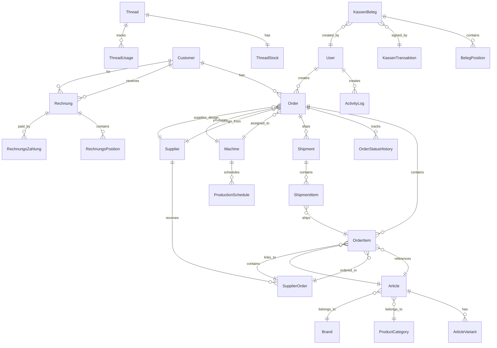

# StitchAdmin 2.0 - Vollständige Technische Dokumentation

**Erstellt von Hans Hahn - Alle Rechte vorbehalten**  
**Version:** 2.0.0-alpha  
**Stand:** November 2025  
**Status:** Ca. 40% fertig, in Testphase

---

## 📋 Inhaltsverzeichnis

1. [Projektübersicht](#projektübersicht)
2. [Systemarchitektur](#systemarchitektur)
3. [Datenbankstruktur](#datenbankstruktur)
4. [Module und Controller](#module-und-controller)
5. [Workflows](#workflows)
6. [API-Dokumentation](#api-dokumentation)
7. [Installation und Setup](#installation-und-setup)
8. [Testing](#testing)
9. [Deployment](#deployment)

---

## 1. Projektübersicht

### Zweck
StitchAdmin 2.0 ist ein spezialisiertes ERP-System für Stickerei- und Textilveredelungsbetriebe im deutschsprachigen Raum. Es kombiniert Standard-Geschäftsprozesse mit branchenspezifischen Funktionen.

### Kernmerkmale
- **Kundenverwaltung** (Privat/Geschäftskunden)
- **Artikelverwaltung** mit L-Shop Import
- **Auftragsverwaltung** (Stickerei/Druck/Kombiniert)
- **Design-Workflow** mit DST-Analyse
- **Garnverwaltung** mit Lagerbestand
- **Produktionsplanung** mit Maschinensteuerung
- **Lieferantenverwaltung** mit Webshop-Integration
- **TSE-konformes Kassensystem**
- **ZUGPFERD-konforme Rechnungserstellung**
- **Versandverwaltung**

### Technologie-Stack

#### Backend
- **Framework:** Flask 3.0.3
- **ORM:** SQLAlchemy 2.0.36
- **Datenbank:** SQLite (Development), PostgreSQL (Production-ready)
- **Authentication:** Flask-Login
- **Forms:** Flask-WTF

#### Frontend
- **Templates:** Jinja2
- **CSS:** Custom + Bootstrap-kompatibel
- **JavaScript:** Vanilla JS

#### Spezial-Libraries
- **pyembroidery 1.5.1** - DST-Datei-Analyse
- **Pillow ≥10.4.0** - Bildverarbeitung
- **openpyxl 3.1.2** - Excel-Import
- **pandas ≥2.2.0** - Datenverarbeitung
- **PyPDF2/pdfplumber** - PDF-Verarbeitung

### Projektstatistik
- **Controller:** 38 Module
- **Models:** 17 Haupttabellen + 3 Rechnungsmodule
- **Templates:** 126 Dateien
- **Utils:** 14 Hilfsfunktionen
- **Services:** 6 Business-Logic-Services

---

## 2. Systemarchitektur

### MVC-Architektur

```
┌─────────────────────────────────────────────┐
│           USER INTERFACE (Browser)          │
└──────────────────┬──────────────────────────┘
                   │ HTTP Request/Response
┌──────────────────▼──────────────────────────┐
│         FLASK APPLICATION (app.py)          │
│  - Blueprint Registration                   │
│  - Database Initialization                  │
│  - Error Handling                           │
└──────────────────┬──────────────────────────┘
                   │
     ┌─────────────┴─────────────┐
     │                           │
┌────▼────────┐         ┌────────▼────────┐
│ CONTROLLERS │◄────────┤    SERVICES     │
│  (Routes)   │         │ (Business Logic)│
└────┬────────┘         └─────────────────┘
     │
     │ SQLAlchemy ORM
     │
┌────▼────────┐         ┌─────────────────┐
│   MODELS    │◄────────┤     UTILS       │
│ (Database)  │         │ (Helpers)       │
└─────────────┘         └─────────────────┘
```

### Ordnerstruktur

```
StitchAdmin2.0/
├── app.py                      # Flask Application Factory
├── instance/                   # Flask Instance Folder
│   ├── stitchadmin.db         # SQLite Database
│   └── uploads/               # Hochgeladene Dateien
│
├── src/
│   ├── controllers/           # Flask Blueprints (38 Module)
│   │   ├── customer_controller_db.py
│   │   ├── article_controller_db.py
│   │   ├── order_controller_db.py
│   │   ├── rechnungsmodul/
│   │   │   ├── kasse_controller.py
│   │   │   └── rechnung_controller.py
│   │   └── ...
│   │
│   ├── models/                # SQLAlchemy Models
│   │   ├── models.py          # Haupt-Models (17 Tabellen)
│   │   ├── rechnungsmodul/
│   │   │   └── models.py      # Rechnungs-Models
│   │   ├── article_variant.py
│   │   ├── settings.py
│   │   └── ...
│   │
│   ├── services/              # Business Logic
│   │   ├── lshop_import_service.py
│   │   ├── pdf_service.py
│   │   ├── zugpferd_service.py
│   │   └── ...
│   │
│   ├── utils/                 # Hilfsfunktionen
│   │   ├── dst_analyzer.py
│   │   ├── design_upload.py
│   │   ├── pdf_analyzer.py
│   │   └── ...
│   │
│   ├── templates/             # Jinja2 Templates
│   │   ├── base.html
│   │   ├── dashboard.html
│   │   ├── customers/
│   │   ├── articles/
│   │   ├── orders/
│   │   └── ...
│   │
│   └── static/                # Statische Dateien
│       ├── css/
│       ├── js/
│       └── images/
│
└── docs/                      # Dokumentation
    └── technische-dokumentation/
```

### Request-Response-Flow

```
1. Browser sendet HTTP-Request
   └─> app.py empfängt Request
       └─> Blueprint Router (z.B. customer_controller_db)
           └─> Controller-Funktion
               ├─> Service-Layer (optional, für komplexe Logik)
               ├─> Models (SQLAlchemy ORM)
               │   └─> Database Query
               └─> Template Rendering (Jinja2)
                   └─> HTTP-Response an Browser
```

---

## 3. Datenbankstruktur

### Datenbank-ER-Diagramm



### Haupttabellen (17 Kern-Tabellen)

#### 1. **users** - Benutzerverwaltung
```sql
id: Integer (PK)
username: String(80) UNIQUE
email: String(120) UNIQUE
password_hash: String(255)
is_active: Boolean
is_admin: Boolean
created_at: DateTime
last_login: DateTime
```

#### 2. **customers** - Kundenverwaltung
```sql
id: String(50) (PK)
customer_type: String(20)  # private/business
-- Persönliche Daten --
first_name, last_name, birth_date
-- Firmendaten --
company_name, contact_person, department, position
tax_id, vat_id
-- Kontakt --
email, phone, mobile
-- Adresse --
street, house_number, postal_code, city, country
-- Sonstiges --
newsletter: Boolean
notes: Text
created_at, created_by, updated_at, updated_by: DateTime/String
```

#### 3. **articles** - Artikelverwaltung
```sql
id: String(50) (PK)
article_number: String(100) UNIQUE
name: String(200)
description: Text
-- Kategorisierung --
category_id: Integer (FK → product_categories)
brand_id: Integer (FK → brands)
-- Produktdetails --
material, weight, color, size
-- L-Shop Preise (Einkauf) --
purchase_price_single: Float
purchase_price_carton: Float
purchase_price_10carton: Float
-- Verkaufspreise (inkl. MwSt) --
price: Float  # Aktueller VK
price_calculated: Float  # Kalkulierter VK
price_recommended: Float  # Empfohlener VK
-- Lager --
stock, min_stock, location
-- Lieferant --
supplier, supplier_article_number
-- Status --
active: Boolean
-- Metadaten --
created_at, created_by, updated_at, updated_by
-- L-Shop spezifisch --
product_type, manufacturer_number
has_variants: Boolean
units_per_carton, catalog_page_*
```

#### 4. **article_variants** - Artikel-Varianten (Farbe/Größe)
```sql
id: Integer (PK)
article_id: String(50) (FK → articles)
sku: String(100) UNIQUE
color, size, variant_name
purchase_price_single, price
stock, min_stock
active: Boolean
created_at, updated_at
```

#### 5. **orders** - Auftragsverwaltung
```sql
id: String(50) (PK)
customer_id: String(50) (FK → customers)
order_number: String(50) UNIQUE
order_type: String(20)  # embroidery/printing/dtf/combined
status: String(50)  # new/in_production/completed/shipped
-- Stickerei-Details --
stitch_count, design_width_mm, design_height_mm
embroidery_position, embroidery_size
thread_colors, selected_threads: Text (JSON)
-- Druck-Details --
print_width_cm, print_height_cm
print_method, ink_coverage_percent
print_colors: Text (JSON)
-- Design-Workflow --
design_status: String(50)  # none/customer_provided/needs_order/ordered/received/ready
design_supplier_id: String(50) (FK → suppliers)
design_order_date, design_expected_date, design_received_date
design_order_notes
-- Dateien --
design_file, design_file_path, design_thumbnail_path
production_file
-- Preise --
total_price, deposit_amount, discount_percent
-- Termine --
due_date, rush_order: Boolean
-- Produktion --
assigned_machine_id (FK → machines)
production_start, production_end, production_minutes
-- Metadaten --
created_at, created_by, updated_at, updated_by
completed_at, completed_by
```

#### 6. **order_items** - Auftragspositionen
```sql
id: Integer (PK)
order_id: String(50) (FK → orders)
article_id: String(50) (FK → articles)
quantity, unit_price
-- Details --
textile_size, textile_color
position_details: Text
-- Lieferanten-Bestellung --
supplier_order_status: String(50)  # none/to_order/ordered/delivered
supplier_order_id (FK → supplier_orders)
supplier_order_date, supplier_expected_date, supplier_delivered_date
supplier_order_notes
created_at
```

#### 7. **order_status_history** - Auftrags-Status-Historie
```sql
id: Integer (PK)
order_id: String(50) (FK → orders)
from_status, to_status: String(50)
comment: Text
changed_at, changed_by: DateTime/String
```

#### 8. **machines** - Maschinenverzeichnis
```sql
id: String(50) (PK)
name, type: String  # embroidery/printing/dtf
-- Maschinendetails --
manufacturer, model, serial_number
purchase_date
-- Stickmaschinen --
num_heads, needles_per_head
max_speed, max_area_width, max_area_height
-- Konfiguration --
thread_setup, default_settings: Text (JSON)
-- Status --
status: String(50)  # active/maintenance/defect
maintenance_due
-- Zeiten --
setup_time_minutes, thread_change_time_minutes
hoop_change_time_minutes
-- Metadaten --
created_at, created_by, updated_at, updated_by
```

#### 9. **production_schedules** - Produktionsplanung
```sql
id: Integer (PK)
machine_id (FK → machines)
order_id (FK → orders)
-- Zeitplanung --
scheduled_start, scheduled_end
actual_start, actual_end
-- Details --
status: String(50)  # scheduled/in_progress/completed/cancelled
priority: Integer  # 1-10
notes
-- Metadaten --
created_at, created_by, updated_at, updated_by
```

#### 10. **threads** - Garnverwaltung
```sql
id: String(50) (PK)
manufacturer, thread_type
color_number
-- Farbnamen --
color_name_de, color_name_en
-- Farbwerte --
hex_color, pantone
rgb_r, rgb_g, rgb_b
-- Details --
category: String(50)  # Standard/Metallic/etc.
weight: Integer  # z.B. 40
material: String(50)  # Polyester/Rayon
-- Preis --
price, supplier, supplier_article_number
-- Status --
active, discontinued: Boolean
-- Metadaten --
created_at, created_by, updated_at, updated_by
```

#### 11. **thread_stock** - Garnbestand
```sql
id: Integer (PK)
thread_id (FK → threads)
quantity, min_stock, location
-- Bestellinfo --
last_order_date, supplier_order_number
-- Metadaten --
updated_at, updated_by
```

#### 12. **thread_usage** - Garnverbrauch
```sql
id: Integer (PK)
thread_id (FK → threads)
order_id (FK → orders)
quantity_used: Float
usage_type: String(50)  # production/test/waste
machine_id
-- Metadaten --
used_at, recorded_by, notes
```

#### 13. **suppliers** - Lieferantenverwaltung
```sql
id: String(50) (PK)
name
-- Kontakt --
contact_person, email, phone, website
-- Adresse --
street, postal_code, city, country
-- Details --
tax_id, customer_number
payment_terms, delivery_time_days
minimum_order_value
-- Webshop-Integration --
webshop_url, webshop_username, webshop_password_encrypted
webshop_type, webshop_article_url_pattern
auto_order_enabled: Boolean
webshop_notes
-- Retourenadresse --
return_street, return_postal_code, return_city, return_country
return_contact, return_phone, return_notes
-- Status --
active, preferred: Boolean
-- Metadaten --
created_at, created_by, updated_at
```

#### 14. **supplier_orders** - Lieferantenbestellungen
```sql
id: String(50) (PK)
supplier_id (FK → suppliers)
-- Bestellinformationen --
order_number, supplier_order_number
order_date, delivery_date
-- Status --
status: String(50)  # draft/ordered/confirmed/shipped/delivered/cancelled
-- Versand --
shipping_method, tracking_number
-- Kosten --
subtotal, shipping_cost, tax_amount, discount_amount
total_amount, currency
-- Zahlung --
payment_method, payment_status, payment_date
invoice_number
-- Details --
items: Text (JSON)
notes, internal_notes
-- Lieferadresse (optional) --
delivery_name, delivery_street, delivery_postal_code
delivery_city, delivery_country
-- Metadaten --
created_at, created_by, updated_at, updated_by
```

#### 15. **shipments** - Versandverwaltung
```sql
id: String(50) (PK)
order_id (FK → orders)
-- Versanddetails --
tracking_number, carrier, service
-- Paketdetails --
weight, length, width, height
-- Status --
status: String(50)  # created/shipped/in_transit/delivered
shipped_date, delivered_date
-- Kosten --
shipping_cost, insurance_value
-- Empfänger --
recipient_name, recipient_street
recipient_postal_code, recipient_city, recipient_country
-- Metadaten --
created_at, created_by, updated_at
```

#### 16. **shipment_items** - Versandpositionen
```sql
id: Integer (PK)
shipment_id (FK → shipments)
order_item_id (FK → order_items)
quantity, description
```

#### 17. **activity_logs** - Aktivitätsprotokoll
```sql
id: Integer (PK)
username: String(80)
action: String(100)
details: Text
-- Request-Details --
ip_address, user_agent
-- Zeitstempel --
timestamp: DateTime (indexed)
```

### Hilfs-Tabellen (6 Tabellen)

#### **product_categories** - Produktkategorien
```sql
id: Integer (PK)
name: String(100) UNIQUE
description, parent_id (FK → product_categories)
active: Boolean, sort_order: Integer
created_at, created_by, updated_at
```

#### **brands** - Marken/Hersteller
```sql
id: Integer (PK)
name: String(100) UNIQUE
description, logo_url, website
active: Boolean
created_at, created_by, updated_at
```

#### **article_supplier** - Artikel-Lieferanten-Zuordnung
```sql
id: Integer (PK)
article_id (FK → articles)
supplier_id (FK → suppliers)
supplier_article_number, price
is_preferred: Boolean
last_order_date, created_at, updated_at
```

#### **supplier_contact** - Lieferanten-Ansprechpartner
```sql
id: Integer (PK)
supplier_id (FK → suppliers)
name, position, department
email, phone, mobile
is_primary: Boolean
notes, created_at, updated_at
```

#### **price_calculation_settings** - Preiskalkulationseinstellungen
```sql
id: Integer (PK)
name: String(50) UNIQUE
value: Float
description
updated_at, updated_by
```

#### **settings** (TaxRate, PriceCalculationRule) - Erweiterte Einstellungen
```sql
# Siehe settings.py für Details
```

### Rechnungsmodul-Tabellen (10 Tabellen)

#### 1. **kassen_belege** - Kassenbuchungen
```sql
id: Integer (PK)
belegnummer: String(50) UNIQUE
beleg_typ: Enum(BelegTyp)  # RECHNUNG/GUTSCHRIFT/TRAINING/STORNO
-- Kunde --
kunde_id (FK → customers), kunde_name, kunde_adresse
-- Beträge --
netto_gesamt, mwst_gesamt, brutto_gesamt
-- Zahlung --
zahlungsart: Enum(ZahlungsArt)
gegeben, rueckgeld
-- TSE --
tse_transaktion_id (FK → kassen_transaktionen)
-- Kasse --
kassen_id, kassierer_id (FK → users), kassierer_name
-- Status --
storniert: Boolean, storno_grund, storno_beleg_id
-- Zeitstempel --
erstellt_am, bearbeitet_am
notizen
```

#### 2. **beleg_positionen** - Belegpositionen
```sql
id: Integer (PK)
beleg_id (FK → kassen_belege)
position: Integer
-- Artikel --
artikel_id (FK → articles)
artikel_nummer, artikel_name, artikel_kategorie
-- Mengen/Preise --
menge, einzelpreis_netto, einzelpreis_brutto
-- Steuer --
mwst_satz, mwst_betrag
-- Rabatt --
rabatt_prozent, rabatt_betrag
-- Beträge --
netto_betrag, brutto_betrag
notizen
```

#### 3. **kassen_transaktionen** - TSE-Transaktionen
```sql
id: Integer (PK)
-- TSE-Identifikation --
tse_serial, tse_transaktion_nummer: String UNIQUE
-- Zeitstempel --
tse_start, tse_ende
-- Signatur --
tse_signatur_zaehler, tse_signatur_algorithmus
tse_signatur: Text
-- Prozess --
tse_prozess_typ, tse_prozess_daten: Text (JSON)
tse_client_id
erstellt_am
```

#### 4. **mwst_saetze** - Mehrwertsteuersätze
```sql
id: Integer (PK)
bezeichnung, satz: Decimal(5,2)
gueltig_von, gueltig_bis
aktiv, standard: Boolean
verwendung: String  # normal/ermäßigt/befreit/export
erstellt_am, erstellt_von
```

#### 5. **tse_konfigurationen** - TSE-Hardware-Konfiguration
```sql
id: Integer (PK)
tse_seriennummer: String UNIQUE
tse_hersteller, tse_modell, tse_version
-- Zertifikat --
zertifikat_seriennummer, zertifikat_gueltig_von/bis
-- Konfiguration --
kassen_id, client_id
-- Status --
status: Enum(TSEStatus), aktiv: Boolean
-- Wartung --
letzte_wartung, naechste_wartung, wartungsnotizen
erstellt_am, aktualisiert_am
```

#### 6. **rechnungen** - Rechnungen
```sql
id: Integer (PK)
rechnungsnummer: String(50) UNIQUE
-- Kunde --
kunde_id (FK → customers)
kunde_name, kunde_adresse, kunde_email
kunde_steuernummer, kunde_ust_id
-- Daten --
rechnungsdatum, leistungsdatum, faelligkeitsdatum
-- Beträge --
netto_gesamt, mwst_gesamt, brutto_gesamt
rabatt_prozent, rabatt_betrag
skonto_prozent, skonto_tage
-- Status --
status: Enum(RechnungsStatus)
-- ZUGPFERD --
zugpferd_profil: Enum(ZugpferdProfil)
zugpferd_xml: Text
-- Dateien --
pdf_datei, xml_datei
-- Versand --
versendet_am, versendet_von, versand_email
-- Zahlung --
zahlungsbedingungen, mahnstufe, letzte_mahnung
bezahlt_am, bezahlt_betrag
-- Sonstiges --
bemerkungen, interne_notizen
-- Zeitstempel --
erstellt_am, erstellt_von, bearbeitet_am, bearbeitet_von
```

#### 7. **rechnungs_positionen** - Rechnungspositionen
```sql
id: Integer (PK)
rechnung_id (FK → rechnungen)
position: Integer
-- Artikel --
artikel_id (FK → articles)
artikel_nummer, artikel_name, beschreibung
-- Mengen/Preise --
menge, einheit, einzelpreis
-- Steuer --
mwst_satz, mwst_betrag
-- Rabatt --
rabatt_prozent, rabatt_betrag
-- Beträge --
netto_betrag, brutto_betrag
```

#### 8. **rechnungs_zahlungen** - Rechnungs-Zahlungen
```sql
id: Integer (PK)
rechnung_id (FK → rechnungen)
-- Zahlung --
betrag, zahlungsart: Enum(ZahlungsArt)
zahlungsdatum
-- Details --
referenz, bank_name, verwendungszweck
-- Skonto --
skonto_prozent, skonto_betrag
-- Status --
status: String  # erfasst/geprueft/verbucht
bemerkungen
erfasst_am, erfasst_von
```

#### 9. **tagesabschluesse** - Tagesabschlüsse (Z-Berichte)
```sql
id: Integer (PK)
datum, kassen_id
-- Statistiken --
anzahl_belege, anzahl_stornos
-- Umsätze nach Zahlungsart --
umsatz_bar, umsatz_ec, umsatz_kreditkarte
umsatz_rechnung, umsatz_sonstige
-- Gesamtumsätze --
umsatz_netto, umsatz_mwst, umsatz_brutto
-- Kassenstand --
kassenstand_anfang, kassenstand_ende
-- TSE --
tse_von, tse_bis
-- Status --
abgeschlossen, geprueft: Boolean
-- Zeitstempel --
erstellt_am, erstellt_von
abgeschlossen_am, abgeschlossen_von
```

#### 10. **zugpferd_konfigurationen** - ZUGPFERD-Einstellungen
```sql
id: Integer (PK)
-- Unternehmensdaten --
unternehmen_name, unternehmen_adresse
unternehmen_plz, unternehmen_ort, unternehmen_land
-- Steuer --
steuernummer, ust_id, handelsregisternummer
-- Kontakt --
telefon, email, website
-- Bank --
bank_name, iban, bic
-- ZUGPFERD --
standard_profil: Enum(ZugpferdProfil)
xml_validierung: Boolean
-- Status --
aktiv: Boolean
erstellt_am, aktualisiert_am
```

---

*Fortsetzung folgt in den nächsten Dateien...*

**Erstellt von Hans Hahn - Alle Rechte vorbehalten**
