```mermaid
flowchart TD
    Start([Artikelverwaltung Start]) --> Liste[Artikelliste anzeigen<br/>/articles]
    
    Liste --> Action{Aktion wählen}
    
    Action -->|Manuell anlegen| New[Artikel anlegen<br/>/articles/new]
    Action -->|L-Shop Import| Import[L-Shop Import<br/>/articles/import-lshop]
    Action -->|Artikel bearbeiten| Edit[Artikel bearbeiten<br/>/articles/edit/id]
    Action -->|Artikel anzeigen| Show[Artikeldetails<br/>/articles/show/id]
    
    Import --> UploadExcel[Excel-Datei hochladen<br/>L-Shop Format]
    
    UploadExcel --> ParseExcel{Excel parsen<br/>lshop_import_service}
    
    ParseExcel -->|Fehler| ImportError[Fehler anzeigen<br/>Ungültiges Format]
    ImportError --> Import
    
    ParseExcel -->|Erfolg| PreviewData[Vorschau anzeigen<br/>Zu importierende Artikel]
    
    PreviewData --> ConfirmImport{Import bestätigen?}
    
    ConfirmImport -->|Nein| Import
    ConfirmImport -->|Ja| ProcessImport[Artikel importieren]
    
    ProcessImport --> ForEach[Für jeden Artikel...]
    
    ForEach --> CheckExists{Artikel existiert?<br/>article_number}
    
    CheckExists -->|Ja| UpdateArticle[Artikel aktualisieren<br/>Preise, Lager, etc.]
    CheckExists -->|Nein| CreateArticle[Neuen Artikel anlegen]
    
    UpdateArticle --> CalcPrice[Preise kalkulieren<br/>calculate_prices]
    CreateArticle --> CalcPrice
    
    CalcPrice --> SaveArticle[(Artikel in DB speichern)]
    
    SaveArticle --> HasVariants{Hat Varianten?<br/>has_variants=true}
    
    HasVariants -->|Ja| CreateVariants[Varianten anlegen<br/>ArticleVariant]
    HasVariants -->|Nein| NextArticle
    
    CreateVariants --> NextArticle{Weitere Artikel?}
    
    NextArticle -->|Ja| ForEach
    NextArticle -->|Nein| ImportSuccess[Import erfolgreich<br/>Anzahl importiert anzeigen]
    
    ImportSuccess --> Liste
    
    New --> ArticleForm[Artikelformular<br/>Name, Nummer, Kategorie, Marke]
    
    ArticleForm --> PriceData[Preisdaten<br/>EK Single/Carton/10Carton]
    
    PriceData --> CalcPriceManual[Preise kalkulieren<br/>Faktoren aus Settings]
    
    CalcPriceManual --> StockData[Lagerdaten<br/>Bestand, Min-Bestand, Lagerort]
    
    StockData --> SupplierData[Lieferantendaten<br/>Lieferant, Artikel-Nr]
    
    SupplierData --> ValidateArticle{Validierung}
    
    ValidateArticle -->|Fehler| ValidationError[Fehler anzeigen]
    ValidationError --> ArticleForm
    
    ValidateArticle -->|OK| GenerateArticleID[Artikel-ID generieren]
    
    GenerateArticleID --> SaveArticleManual[(Artikel speichern)]
    
    SaveArticleManual --> ArticleSuccess[Erfolg anzeigen]
    
    ArticleSuccess --> Show
    
    Show --> ShowActions{Weitere Aktionen}
    ShowActions -->|Bearbeiten| Edit
    ShowActions -->|Varianten verwalten| ManageVariants[Varianten-Management]
    ShowActions -->|Lieferanten zuordnen| ManageSuppliers[Lieferanten-Zuordnung]
    ShowActions -->|Etiketten drucken| PrintLabels[Etiketten drucken<br/>/articles/label/id]
    ShowActions -->|Datenblatt| Datasheet[Datenblatt anzeigen<br/>/articles/datasheet/id]
    
    Edit --> EditForm[Artikelformular laden]
    EditForm --> PriceData
    
    ManageVariants --> VariantList[Varianten auflisten]
    VariantList --> VariantActions{Varianten-Aktion}
    VariantActions -->|Neue Variante| NewVariant[Variante anlegen<br/>Farbe + Größe]
    VariantActions -->|Variante bearbeiten| EditVariant[Variante bearbeiten]
    VariantActions -->|Variante löschen| DeleteVariant[Variante löschen]
    
    NewVariant --> SaveVariant[(ArticleVariant speichern)]
    SaveVariant --> VariantList
    
    ManageSuppliers --> SupplierList[Zugeordnete Lieferanten]
    SupplierList --> SupplierActions{Lieferanten-Aktion}
    SupplierActions -->|Lieferant hinzufügen| AddSupplier[Lieferant zuordnen<br/>ArticleSupplier]
    SupplierActions -->|Preis aktualisieren| UpdateSupplierPrice[Preis aktualisieren]
    
    AddSupplier --> SaveSupplierLink[(ArticleSupplier speichern)]
    SaveSupplierLink --> SupplierList
```

# StitchAdmin 2.0 - Workflow-Diagramme

**Erstellt von Hans Hahn - Alle Rechte vorbehalten**  
**Version:** 2.0.0-alpha  
**Stand:** November 2025

---

## 📋 Inhaltsverzeichnis

1. [Kundenverwaltung-Workflow](#1-kundenverwaltung-workflow)
2. [Artikelverwaltung-Workflow](#2-artikelverwaltung-workflow)
3. [Auftrags-Workflow](#3-auftrags-workflow)
4. [Design-Workflow](#4-design-workflow)
5. [Produktions-Workflow](#5-produktions-workflow)
6. [Lieferanten-Workflow](#6-lieferanten-workflow)
7. [Kassen-Workflow](#7-kassen-workflow)
8. [Rechnungs-Workflow](#8-rechnungs-workflow)
9. [Versand-Workflow](#9-versand-workflow)
10. [Garnverwaltung-Workflow](#10-garnverwaltung-workflow)

---

## 1. Kundenverwaltung-Workflow

### Übersicht
Der Kundenverwaltungs-Workflow ermöglicht die Erfassung und Verwaltung von Privat- und Geschäftskunden mit vollständiger Historie.

### Workflow-Diagramm

```mermaid
flowchart TD
    Start([Kundenverwaltung Start]) --> Liste[Kundenliste anzeigen<br/>/customers]
    
    Liste --> Action{Aktion wählen}
    
    Action -->|Neuer Kunde| New[Kunde anlegen<br/>/customers/new]
    Action -->|Kunde bearbeiten| Edit[Kunde bearbeiten<br/>/customers/edit/id]
    Action -->|Kunde anzeigen| Show[Kundendetails<br/>/customers/show/id]
    Action -->|Suchen| Search[Suche durchführen]
    
    New --> TypeSelect{Kundentyp?}
    TypeSelect -->|Privatkunde| PrivateForm[Privatkundenformular<br/>Vorname, Nachname, Geburtsdatum]
    TypeSelect -->|Geschäftskunde| BusinessForm[Geschäftskundenformular<br/>Firma, Ansprechpartner, USt-ID]
    
    PrivateForm --> ContactData[Kontaktdaten<br/>Email, Telefon, Mobil]
    BusinessForm --> ContactData
    
    ContactData --> AddressData[Adressdaten<br/>Straße, PLZ, Stadt, Land]
    
    AddressData --> OptionalData[Optionale Daten<br/>Newsletter, Notizen]
    
    OptionalData --> Validate{Validierung}
    
    Validate -->|Fehler| ValidationError[Fehler anzeigen<br/>Zurück zum Formular]
    ValidationError --> TypeSelect
    
    Validate -->|OK| GenerateID[Kunden-ID generieren<br/>Format: C-YYYYMMDD-XXXX]
    
    GenerateID --> SaveCustomer[(Customer in DB speichern)]
    
    SaveCustomer --> LogActivity[Aktivität protokollieren<br/>ActivityLog]
    
    LogActivity --> Success[Erfolg anzeigen<br/>Weiterleitung zu Kundendetails]
    
    Success --> Show
    
    Show --> ShowActions{Weitere Aktionen}
    ShowActions -->|Bearbeiten| Edit
    ShowActions -->|Auftrag erstellen| CreateOrder[/orders/new?customer_id=xxx]
    ShowActions -->|Historie anzeigen| History[Auftragshistorie<br/>Rechnungen<br/>Aktivitäten]
    ShowActions -->|Zurück| Liste
    
    Edit --> EditForm[Kundenformular laden<br/>Vorhandene Daten]
    EditForm --> ContactData
    
    Search --> SearchResults[Suchergebnisse<br/>Nach Name, Firma, Email]
    SearchResults --> Liste
    
    History --> Liste
    CreateOrder --> OrderWorkflow[→ Auftrags-Workflow]
```

### Funktionen im Detail

#### Controller: `customer_controller_db.py`

**Route: `/customers` (GET)**
```python
def index():
    """
    Kundenliste anzeigen
    - Alle Kunden aus DB laden
    - Suche nach Name/Firma/Email
    - Filterung nach Typ (Privat/Geschäft)
    - Sortierung nach Name
    """
```

**Route: `/customers/new` (GET, POST)**
```python
def new():
    """
    Neuen Kunden anlegen
    - Formular anzeigen (GET)
    - Validierung der Eingaben
    - Kunden-ID generieren
    - In DB speichern (POST)
    - Aktivität protokollieren
    """
```

**Route: `/customers/show/<id>` (GET)**
```python
def show(id):
    """
    Kundendetails anzeigen
    - Kunde aus DB laden
    - Auftragshistorie laden
    - Rechnungshistorie laden
    - Aktivitäten anzeigen
    """
```

**Route: `/customers/edit/<id>` (GET, POST)**
```python
def edit(id):
    """
    Kunde bearbeiten
    - Vorhandene Daten laden (GET)
    - Änderungen speichern (POST)
    - Metadaten aktualisieren (updated_at, updated_by)
    """
```

---

## 2. Artikelverwaltung-Workflow

### Übersicht
Artikelverwaltung mit L-Shop Excel-Import, Varianten-Management und automatischer Preiskalkulation.

### Workflow-Diagramm



### Funktionen im Detail

#### Controller: `article_controller_db.py`

**Route: `/articles` (GET)**
```python
def index():
    """
    Artikelliste anzeigen
    - Alle Artikel aus DB laden
    - Suche nach Name/Nummer
    - Filterung nach Kategorie/Marke
    - Sortierung nach Name/Preis
    - Lagerbestand-Warnungen
    """
```

**Route: `/articles/import-lshop` (GET, POST)**
```python
def import_lshop():
    """
    L-Shop Excel-Import
    - Excel-Upload (GET)
    - Excel parsen mit lshop_import_service
    - Artikel extrahieren
    - Vorschau anzeigen
    - Import durchführen (POST)
    - Preise kalkulieren
    - Varianten anlegen
    """
```

**Route: `/articles/new` (GET, POST)**
```python
def new():
    """
    Neuen Artikel anlegen
    - Formular anzeigen (GET)
    - Kategorien und Marken laden
    - Validierung
    - Preiskalkulation
    - Artikel-ID generieren
    - In DB speichern (POST)
    """
```

**Route: `/articles/show/<id>` (GET)**
```python
def show(id):
    """
    Artikeldetails anzeigen
    - Artikel aus DB laden
    - Varianten laden
    - Lieferanten laden
    - Lagerbestand anzeigen
    - Verwendung in Aufträgen
    """
```

**Route: `/articles/edit/<id>` (GET, POST)**
```python
def edit(id):
    """
    Artikel bearbeiten
    - Vorhandene Daten laden (GET)
    - Preise neu kalkulieren bei EK-Änderung
    - Änderungen speichern (POST)
    - Metadaten aktualisieren
    """
```

#### Service: `lshop_import_service.py`

**Funktion: `parse_lshop_excel(file_path)`**
```python
def parse_lshop_excel(file_path):
    """
    L-Shop Excel-Datei parsen
    
    Schritte:
    1. Excel-Datei öffnen (openpyxl)
    2. Header-Zeile finden
    3. Spalten-Mapping erstellen
    4. Datenzeilen lesen
    5. Artikel-Objekte erstellen
    6. Preise konvertieren (€ → Float)
    7. Varianten erkennen (Größen/Farben)
    
    Returns:
        List[Dict]: Liste von Artikel-Dictionaries
    """
```

---

## 3. Auftrags-Workflow

### Übersicht
Komplexer Workflow für Stickerei-, Druck- und kombinierte Aufträge mit Design-Management und Produktionssteuerung.

### Workflow-Diagramm

```mermaid
flowchart TD
    Start([Auftragsverwaltung Start]) --> Liste[Auftragsliste<br/>/orders]
    
    Liste --> Action{Aktion wählen}
    
    Action -->|Neuer Auftrag| New[Auftrag anlegen<br/>/orders/new]
    Action -->|Auftrag anzeigen| Show[Auftragsdetails<br/>/orders/show/id]
    Action -->|Auftrag bearbeiten| Edit[Auftrags bearbeiten<br/>/orders/edit/id]
    
    New --> SelectCustomer[Kunde wählen<br/>Customer-Suche]
    
    SelectCustomer --> OrderType{Auftragstyp?}
    
    OrderType -->|Stickerei| EmbroideryForm[Stickerei-Formular<br/>Position, Größe]
    OrderType -->|Druck| PrintForm[Druck-Formular<br/>Methode, Größe]
    OrderType -->|Kombiniert| CombinedForm[Kombiniertes Formular<br/>Stickerei + Druck]
    
    EmbroideryForm --> DesignUpload{Design vorhanden?}
    PrintForm --> DesignUpload
    CombinedForm --> DesignUpload
    
    DesignUpload -->|Ja - Kunde liefert| CustomerDesign[Design hochladen<br/>design_upload.py]
    DesignUpload -->|Nein - Bestellen| OrderDesign[Design bestellen<br/>→ Design-Workflow]
    
    CustomerDesign --> AnalyzeDesign{Dateiformat?}
    
    AnalyzeDesign -->|DST-Datei| AnalyzeDST[DST analysieren<br/>dst_analyzer.py<br/>Stichzahl, Größe, Farben]
    AnalyzeDesign -->|Andere| CreateThumbnail[Thumbnail erstellen<br/>Pillow]
    
    AnalyzeDST --> ExtractStitches[Stichzahl extrahieren<br/>design_width_mm, design_height_mm]
    
    ExtractStitches --> ExtractColors[Farbwechsel zählen<br/>thread_colors]
    
    ExtractColors --> CreateThumbnail
    
    CreateThumbnail --> SaveDesignFile[(Design-Datei speichern<br/>instance/uploads/designs/)]
    
    SaveDesignFile --> SetDesignStatus[design_status = 'customer_provided']
    
    OrderDesign --> SelectSupplier[Design-Lieferant wählen]
    SelectSupplier --> SetOrderDesignStatus[design_status = 'needs_order']
    
    SetDesignStatus --> SelectThreads[Garne auswählen<br/>Thread-Datenbank]
    SetOrderDesignStatus --> SelectThreads
    
    SelectThreads --> AddTextiles[Textilien hinzufügen<br/>OrderItems]
    
    AddTextiles --> ForEachItem[Für jedes Textil...]
    
    ForEachItem --> SelectArticle[Artikel wählen]
    
    SelectArticle --> SelectVariant{Hat Varianten?}
    
    SelectVariant -->|Ja| ChooseVariant[Variante wählen<br/>Größe + Farbe]
    SelectVariant -->|Nein| SetQuantity[Menge eingeben]
    
    ChooseVariant --> SetQuantity
    
    SetQuantity --> CheckStock{Auf Lager?}
    
    CheckStock -->|Ja| AddItem[OrderItem anlegen<br/>supplier_order_status = 'none']
    CheckStock -->|Nein| NeedOrder[OrderItem anlegen<br/>supplier_order_status = 'to_order']
    
    AddItem --> MoreItems{Weitere Artikel?}
    NeedOrder --> MoreItems
    
    MoreItems -->|Ja| ForEachItem
    MoreItems -->|Nein| CalculatePrice[Preis berechnen]
    
    CalculatePrice --> EmbroideryCalc{Stickerei?}
    
    EmbroideryCalc -->|Ja| CalcStitches[Preis nach Stichzahl<br/>Grundpreis + (Stiche/1000 × Preis)]
    EmbroideryCalc -->|Nein| CalcPrint[Preis nach Druckgröße]
    
    CalcStitches --> CalcTextiles[Textil-Preise addieren]
    CalcPrint --> CalcTextiles
    
    CalcTextiles --> ShowTotal[Gesamtpreis anzeigen]
    
    ShowTotal --> SetDueDate[Liefertermin wählen]
    
    SetDueDate --> AddNotes[Notizen hinzufügen]
    
    AddNotes --> ValidateOrder{Validierung}
    
    ValidateOrder -->|Fehler| ShowErrors[Fehler anzeigen]
    ShowErrors --> OrderType
    
    ValidateOrder -->|OK| GenerateOrderNumber[Auftragsnummer generieren<br/>Format: ORD-YYYYMMDD-XXXX]
    
    GenerateOrderNumber --> SaveOrder[(Order in DB speichern)]
    
    SaveOrder --> CreateStatusHistory[Status-Historie anlegen<br/>OrderStatusHistory<br/>'new']
    
    CreateStatusHistory --> CheckTextileOrders{Textilien bestellen?}
    
    CheckTextileOrders -->|Ja| CreateSupplierOrders[Lieferantenbestellungen<br/>erstellen → Lieferanten-Workflow]
    CheckTextileOrders -->|Nein| OrderCreated
    
    CreateSupplierOrders --> OrderCreated[Auftrag erstellt<br/>Erfolg anzeigen]
    
    OrderCreated --> Show
    
    Show --> ShowActions{Weitere Aktionen}
    
    ShowActions -->|Bearbeiten| Edit
    ShowActions -->|Status ändern| ChangeStatus[Status ändern<br/>Produktionsplanung]
    ShowActions -->|Design-Management| DesignManagement[→ Design-Workflow]
    ShowActions -->|Produktion starten| StartProduction[→ Produktions-Workflow]
    ShowActions -->|Auftragsblatt drucken| PrintSheet[Auftragsblatt<br/>/orders/order-sheet/id]
    ShowActions -->|Produktionslabels| PrintLabels[Produktions-Etiketten<br/>/orders/production-labels/id]
    ShowActions -->|Versand erstellen| CreateShipment[→ Versand-Workflow]
    
    Edit --> EditForm[Auftragsformular laden]
    EditForm --> DesignUpload
    
    ChangeStatus --> StatusUpdate[Status aktualisieren]
    StatusUpdate --> LogStatusChange[StatusHistory anlegen]
    LogStatusChange --> CheckStatus{Neuer Status?}
    
    CheckStatus -->|'in_production'| AssignMachine[Maschine zuweisen<br/>ProductionSchedule]
    CheckStatus -->|'completed'| SetCompletedDate[completed_at = now]
    CheckStatus -->|Andere| UpdateOrder
    
    AssignMachine --> UpdateOrder[(Order aktualisieren)]
    SetCompletedDate --> UpdateOrder
    
    UpdateOrder --> Show
```

### Funktionen im Detail

#### Controller: `order_controller_db.py`

**Route: `/orders` (GET)**
```python
def index():
    """
    Auftragsliste anzeigen
    - Alle Aufträge aus DB laden
    - Filterung nach Status
    - Filterung nach Typ
    - Filterung nach Datum
    - Sortierung
    - Status-Statistiken
    """
```

**Route: `/orders/new` (GET, POST)**
```python
def new():
    """
    Neuen Auftrag anlegen
    - Kunde wählen (GET parameter: customer_id)
    - Auftragstyp wählen
    - Design hochladen/bestellen
    - DST-Datei analysieren (dst_analyzer)
    - Garne auswählen
    - Textilien hinzufügen (OrderItems)
    - Preise berechnen
    - Liefertermin setzen
    - Auftrag speichern (POST)
    - Status-Historie anlegen
    """
```

**Route: `/orders/show/<id>` (GET)**
```python
def show(id):
    """
    Auftragsdetails anzeigen
    - Auftrag aus DB laden
    - Kunde laden
    - OrderItems laden
    - Status-Historie laden
    - Design-Dateien anzeigen
    - Produktionsstatus
    - Versandstatus
    """
```

**Route: `/orders/edit/<id>` (GET, POST)**
```python
def edit(id):
    """
    Auftrag bearbeiten
    - Vorhandene Daten laden (GET)
    - Design aktualisieren
    - OrderItems bearbeiten
    - Preise neu berechnen
    - Status ändern
    - Änderungen speichern (POST)
    """
```

**Route: `/orders/change-status/<id>` (POST)**
```python
def change_status(id):
    """
    Status ändern
    - Neuen Status setzen
    - Status-Historie anlegen
    - Bei 'in_production': Maschine zuweisen
    - Bei 'completed': completed_at setzen
    - Bei 'shipped': Versand erstellen
    """
```

#### Utils: `dst_analyzer.py`

**Funktion: `analyze_dst_file(file_path)`**
```python
def analyze_dst_file(file_path):
    """
    DST-Datei analysieren
    
    Schritte:
    1. DST-Datei öffnen (pyembroidery)
    2. Stichzahl zählen
    3. Design-Größe berechnen (mm)
    4. Farbwechsel zählen
    5. Farb-Codes extrahieren
    6. Metadata sammeln
    
    Returns:
        Dict: {
            'stitch_count': int,
            'width_mm': float,
            'height_mm': float,
            'color_changes': int,
            'colors': List[str],
            'metadata': Dict
        }
    """
```

#### Utils: `design_upload.py`

**Funktion: `save_design_file(file, order_id)`**
```python
def save_design_file(file, order_id):
    """
    Design-Datei sicher speichern
    
    Schritte:
    1. Dateiname sichern (secure_filename)
    2. Eindeutigen Namen generieren
    3. Datei speichern (instance/uploads/designs/)
    4. Thumbnail erstellen (Pillow)
    5. Thumbnail speichern
    6. Pfade zurückgeben
    
    Returns:
        Tuple: (file_path, thumbnail_path)
    """
```

---

## 4. Design-Workflow

### Übersicht
Verwaltung von Design-Dateien mit Bestellung beim Lieferanten, Status-Tracking und DST-Analyse.

### Workflow-Diagramm

```mermaid
flowchart TD
    Start([Design-Workflow Start]) --> Entry{Einstiegspunkt}
    
    Entry -->|Von Auftra erstellen| FromOrder[Von Order<br/>order.design_status = 'needs_order']
    Entry -->|Direkter Zugriff| DirectAccess[Design-Workflow Übersicht<br/>/design-workflow]
    
    FromOrder --> CheckDesignStatus{design_status?}
    DirectAccess --> DesignList[Design-Übersicht<br/>Alle Designs mit Status]
    
    CheckDesignStatus -->|'none'| NoDesign[Kein Design vorhanden]
    CheckDesignStatus -->|'customer_provided'| CustomerProvided[Kunde hat geliefert<br/>Design-Datei vorhanden]
    CheckDesignStatus -->|'needs_order'| NeedsOrder[Muss bestellt werden]
    CheckDesignStatus -->|'ordered'| Ordered[Beim Lieferanten bestellt]
    CheckDesignStatus -->|'received'| Received[Vom Lieferanten erhalten]
    CheckDesignStatus -->|'ready'| Ready[Produktionsbereit]
    
    NoDesign --> ChoiceDesign{Design-Option?}
    
    ChoiceDesign -->|Kunde liefert| UploadDesign[Design hochladen<br/>/design-workflow/upload]
    ChoiceDesign -->|Lieferant bestellen| OrderFromSupplier[Beim Lieferanten bestellen]
    
    UploadDesign --> FileUpload[Datei-Upload<br/>Erlaubte Formate:<br/>DST, EMB, PES, EXP, JEF]
    
    FileUpload --> ValidateFile{Validierung}
    
    ValidateFile -->|Fehler| UploadError[Fehler anzeigen<br/>Ungültiges Format/Größe]
    UploadError --> UploadDesign
    
    ValidateFile -->|OK| SaveFile[Datei speichern<br/>design_upload.py]
    
    SaveFile --> CheckFormat{Dateiformat?}
    
    CheckFormat -->|DST| AnalyzeDST[DST analysieren<br/>dst_analyzer.py]
    CheckFormat -->|Andere| SkipAnalysis[Analyse überspringen]
    
    AnalyzeDST --> ExtractData[Daten extrahieren<br/>- Stichzahl<br/>- Design-Größe<br/>- Farbwechsel<br/>- Farb-Codes]
    
    ExtractData --> UpdateOrder[Order aktualisieren<br/>stitch_count, design_width_mm<br/>design_height_mm, thread_colors]
    
    SkipAnalysis --> UpdateOrder
    
    UpdateOrder --> CreateThumbnail[Thumbnail erstellen<br/>Pillow (wenn möglich)]
    
    CreateThumbnail --> SavePaths[Pfade speichern<br/>design_file_path<br/>design_thumbnail_path]
    
    SavePaths --> SetStatusProvided[design_status =<br/>'customer_provided']
    
    SetStatusProvided --> DesignReady[Design bereit<br/>Kann produziert werden]
    
    OrderFromSupplier --> SelectSupplier[Design-Lieferant wählen<br/>Supplier auswählen]
    
    SelectSupplier --> SupplierForm[Bestellformular<br/>- Erwartetes Lieferdatum<br/>- Notizen<br/>- Referenz]
    
    SupplierForm --> ValidateSupplierOrder{Validierung}
    
    ValidateSupplierOrder -->|Fehler| SupplierError[Fehler anzeigen]
    SupplierError --> SupplierForm
    
    ValidateSupplierOrder -->|OK| CreateDesignOrder[Design-Bestellung erstellen]
    
    CreateDesignOrder --> UpdateOrderDesign[Order aktualisieren<br/>design_supplier_id<br/>design_order_date<br/>design_expected_date]
    
    UpdateOrderDesign --> SetStatusOrdered[design_status = 'ordered']
    
    SetStatusOrdered --> NotifyUser[Benutzer benachrichtigen<br/>Design bestellt]
    
    NotifyUser --> Ordered
    
    Ordered --> WaitDelivery[Auf Lieferung warten]
    
    WaitDelivery --> CheckDelivered{Design geliefert?}
    
    CheckDelivered -->|Nein| Ordered
    CheckDelivered -->|Ja| ReceiveDesign[Design erhalten<br/>/design-workflow/receive/id]
    
    ReceiveDesign --> UploadReceivedFile[Geliefertes Design hochladen]
    
    UploadReceivedFile --> FileUpload
    
    NeedsOrder --> OrderFromSupplier
    
    Received --> ReviewDesign[Design prüfen<br/>Qualitätskontrolle]
    
    ReviewDesign --> DesignOK{Design OK?}
    
    DesignOK -->|Ja| ApproveDesign[Design freigeben<br/>design_status = 'ready']
    DesignOK -->|Nein| RejectDesign[Design ablehnen<br/>Erneut bestellen]
    
    ApproveDesign --> DesignReady
    RejectDesign --> OrderFromSupplier
    
    Ready --> DesignReady
    CustomerProvided --> DesignReady
    
    DesignReady --> CanProduce[Produktion möglich<br/>→ Produktions-Workflow]
    
    DesignList --> DesignActions{Design-Aktion}
    
    DesignActions -->|Design hochladen| UploadDesign
    DesignActions -->|Design bestellen| OrderFromSupplier
    DesignActions -->|Design empfangen| ReceiveDesign
    DesignActions -->|Design prüfen| ReviewDesign
    DesignActions -->|Design-Analyse| ShowAnalysis[Analyse anzeigen<br/>/design-workflow/analysis/id]
    
    ShowAnalysis --> AnalysisView[DST-Analyse Details<br/>- Stichzahl<br/>- Größe<br/>- Farben<br/>- Metadata]
    
    AnalysisView --> DesignList
```

### Funktionen im Detail

#### Controller: `design_workflow_controller.py`

**Route: `/design-workflow` (GET)**
```python
def index():
    """
    Design-Workflow Übersicht
    - Alle Aufträge mit Design-Status
    - Gruppierung nach Status
    - Offene Design-Bestellungen
    - Erwartete Lieferungen
    """
```

**Route: `/design-workflow/upload` (GET, POST)**
```python
def upload():
    """
    Design hochladen
    - Datei-Upload Formular (GET)
    - Datei validieren (Typ, Größe)
    - Datei speichern (design_upload.py)
    - DST analysieren (dst_analyzer.py)
    - Thumbnail erstellen
    - Order aktualisieren (POST)
    - design_status = 'customer_provided'
    """
```

**Route: `/design-workflow/order/<order_id>` (GET, POST)**
```python
def order_design(order_id):
    """
    Design beim Lieferanten bestellen
    - Lieferant wählen (GET)
    - Bestelldetails eingeben
    - Erwartetes Datum setzen
    - Order aktualisieren (POST)
    - design_status = 'ordered'
    """
```

**Route: `/design-workflow/receive/<order_id>` (GET, POST)**
```python
def receive_design(order_id):
    """
    Design vom Lieferanten empfangen
    - Geliefertes Design hochladen (GET)
    - Datei speichern
    - DST analysieren
    - Order aktualisieren (POST)
    - design_status = 'received'
    - design_received_date = heute
    """
```

**Route: `/design-workflow/approve/<order_id>` (POST)**
```python
def approve_design(order_id):
    """
    Design freigeben
    - Qualitätsprüfung bestanden
    - design_status = 'ready'
    - Produktion kann starten
    """
```

**Route: `/design-workflow/reject/<order_id>` (POST)**
```python
def reject_design(order_id):
    """
    Design ablehnen
    - Qualitätsprüfung nicht bestanden
    - design_status = 'needs_order'
    - Neuerliche Bestellung notwendig
    """
```

**Route: `/design-workflow/analysis/<order_id>` (GET)**
```python
def show_analysis(order_id):
    """
    Design-Analyse anzeigen
    - Order laden
    - DST-Daten anzeigen
    - Stichzahl, Größe, Farben
    - Thumbnail anzeigen
    - Metadata
    """
```

---

*Fortsetzung folgt mit weiteren Workflows...*

**Erstellt von Hans Hahn - Alle Rechte vorbehalten**
