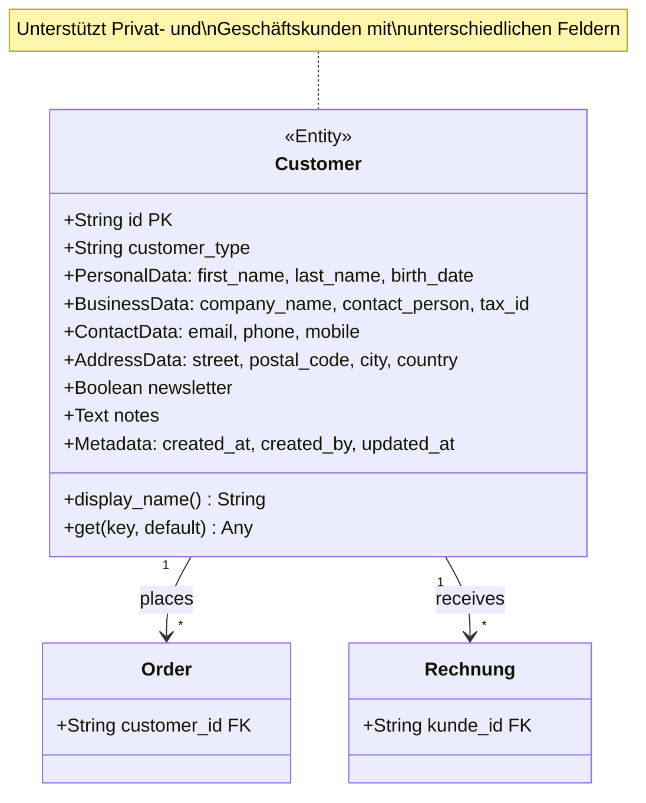
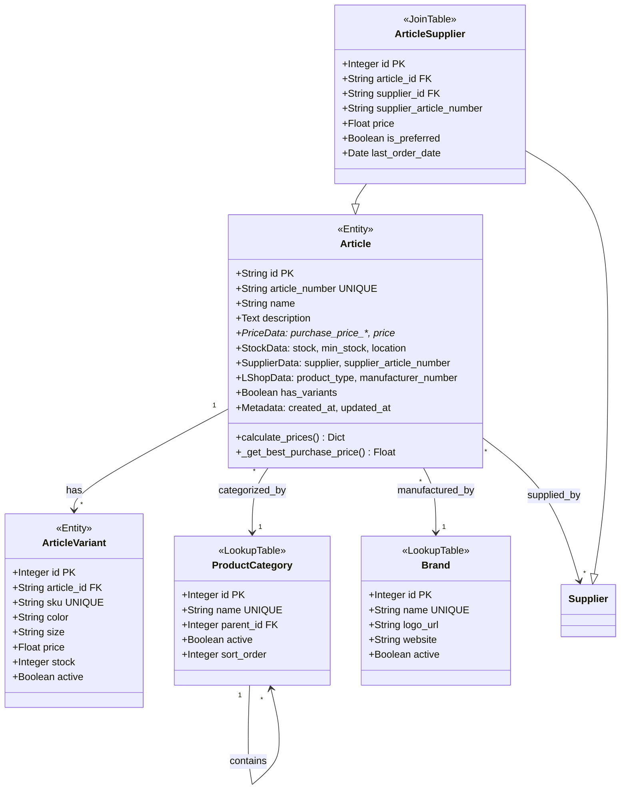
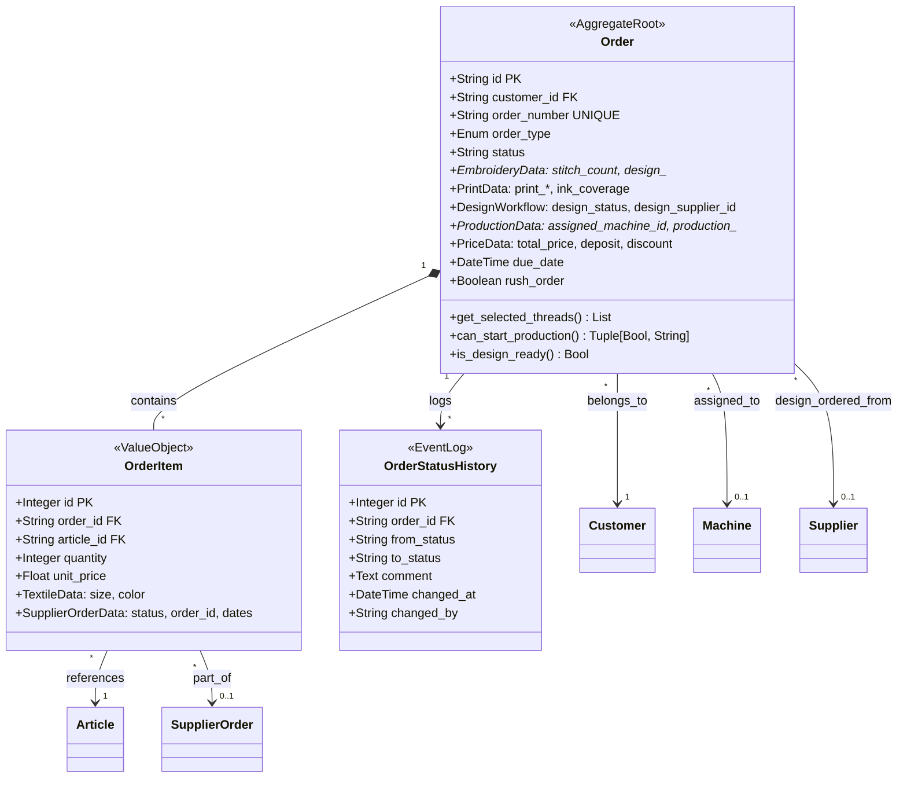
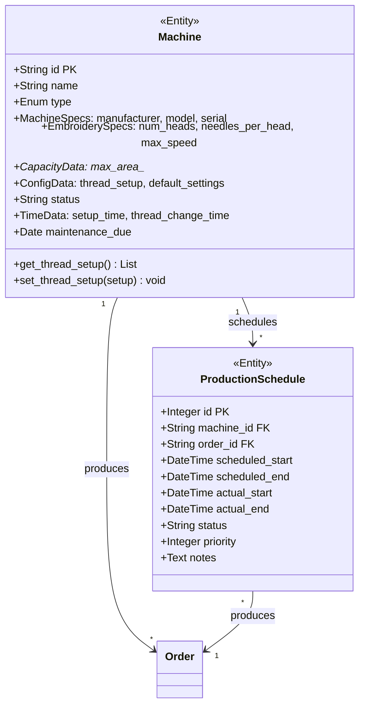
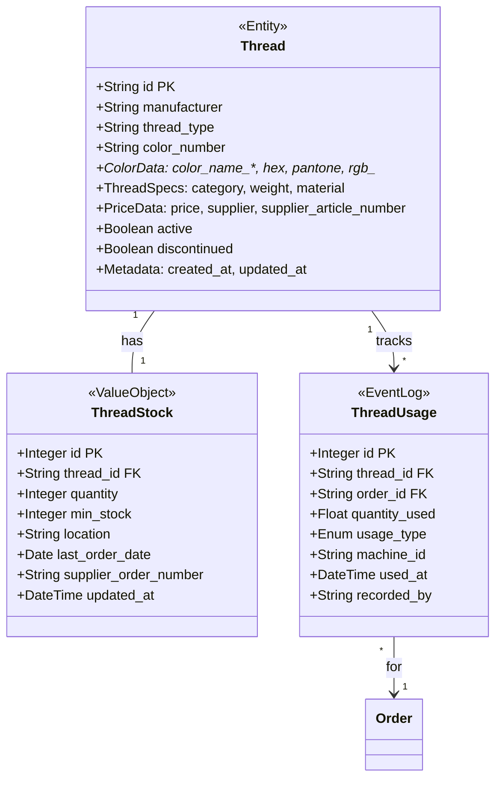
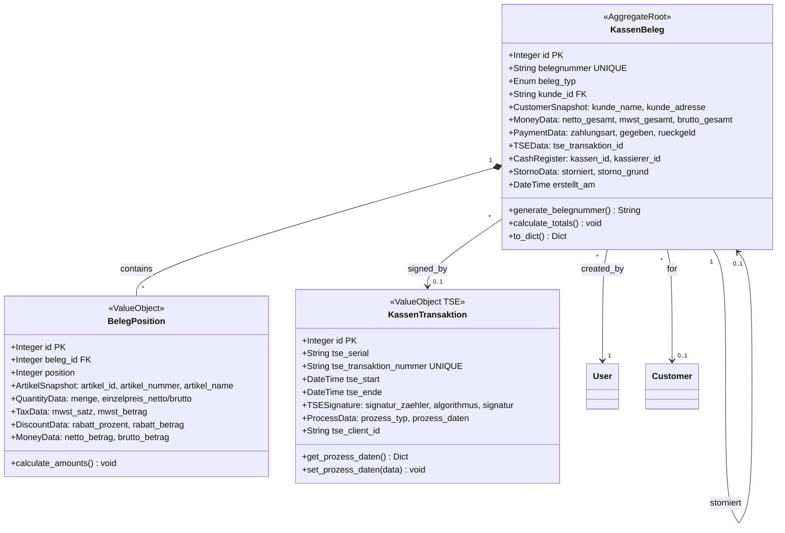
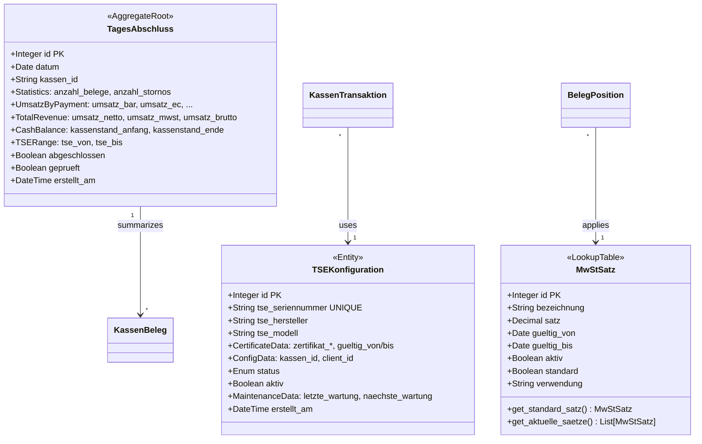
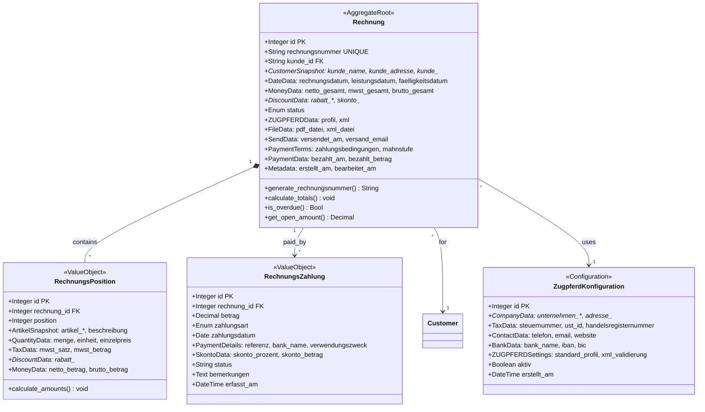
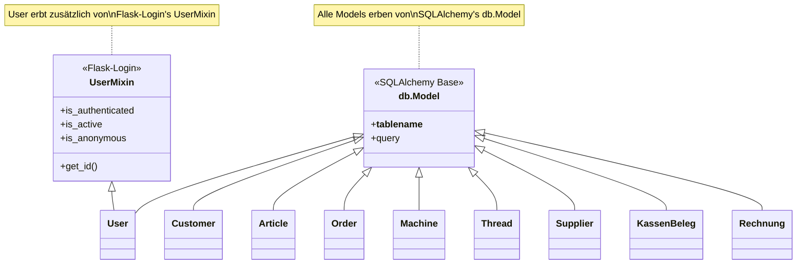

# StitchAdmin 2.0 - Klassen und Beziehungen

**Erstellt von Hans Hahn - Alle Rechte vorbehalten**  
**Version:** 2.0.0-alpha  
**Stand:** November 2025

---

## 📋 Inhaltsverzeichnis

1. [Gesamt-Klassendiagramm](#1-gesamt-klassendiagramm)
2. [Kern-Module Detailliert](#2-kern-module-detailliert)
3. [Rechnungsmodul Detailliert](#3-rechnungsmodul-detailliert)
4. [Beziehungs-Matrix](#4-beziehungs-matrix)
5. [Vererbungshierarchie](#5-vererbungshierarchie)

---

## 1. Gesamt-Klassendiagramm

### Vollständiges UML-Klassendiagramm

```mermaid
classDiagram
    %% Benutzer und Authentifizierung
    class User {
        +Integer id PK
        +String username UNIQUE
        +String email UNIQUE
        +String password_hash
        +Boolean is_active
        +Boolean is_admin
        +DateTime created_at
        +DateTime last_login
        +set_password(password)
        +check_password(password)
    }
    
    %% Kundenverwaltung
    class Customer {
        +String id PK
        +String customer_type
        +String first_name
        +String last_name
        +Date birth_date
        +String company_name
        +String contact_person
        +String email
        +String phone
        +String street
        +String postal_code
        +String city
        +String country
        +Boolean newsletter
        +Text notes
        +DateTime created_at
        +String created_by
        +display_name()
        +get(key, default)
    }
    
    %% Artikelverwaltung
    class Article {
        +String id PK
        +String article_number UNIQUE
        +String name
        +Text description
        +Integer category_id FK
        +Integer brand_id FK
        +String material
        +Float weight
        +Float purchase_price_single
        +Float purchase_price_carton
        +Float price
        +Float price_calculated
        +Integer stock
        +Integer min_stock
        +Boolean active
        +DateTime created_at
        +calculate_prices()
        +get(key, default)
    }
    
    class ArticleVariant {
        +Integer id PK
        +String article_id FK
        +String sku UNIQUE
        +String color
        +String size
        +String variant_name
        +Float purchase_price_single
        +Float price
        +Integer stock
        +Boolean active
        +DateTime created_at
    }
    
    class ProductCategory {
        +Integer id PK
        +String name UNIQUE
        +Text description
        +Integer parent_id FK
        +Boolean active
        +Integer sort_order
        +DateTime created_at
    }
    
    class Brand {
        +Integer id PK
        +String name UNIQUE
        +Text description
        +String logo_url
        +String website
        +Boolean active
        +DateTime created_at
    }
    
    %% Auftragsverwaltung
    class Order {
        +String id PK
        +String customer_id FK
        +String order_number UNIQUE
        +String order_type
        +String status
        +Integer stitch_count
        +Float design_width_mm
        +String embroidery_position
        +Text selected_threads
        +String design_status
        +String design_supplier_id FK
        +String design_file_path
        +Float total_price
        +DateTime due_date
        +Boolean rush_order
        +String assigned_machine_id FK
        +DateTime created_at
        +get_selected_threads()
        +can_start_production()
        +has_design_file()
    }
    
    class OrderItem {
        +Integer id PK
        +String order_id FK
        +String article_id FK
        +Integer quantity
        +Float unit_price
        +String textile_size
        +String textile_color
        +String supplier_order_status
        +String supplier_order_id FK
        +DateTime created_at
    }
    
    class OrderStatusHistory {
        +Integer id PK
        +String order_id FK
        +String from_status
        +String to_status
        +Text comment
        +DateTime changed_at
        +String changed_by
    }
    
    %% Maschinenverwaltung
    class Machine {
        +String id PK
        +String name
        +String type
        +String manufacturer
        +String model
        +Integer num_heads
        +Integer needles_per_head
        +Integer max_speed
        +Text thread_setup
        +String status
        +Date maintenance_due
        +DateTime created_at
        +get_thread_setup()
        +set_thread_setup(setup)
    }
    
    class ProductionSchedule {
        +Integer id PK
        +String machine_id FK
        +String order_id FK
        +DateTime scheduled_start
        +DateTime scheduled_end
        +DateTime actual_start
        +DateTime actual_end
        +String status
        +Integer priority
        +DateTime created_at
    }
    
    %% Garnverwaltung
    class Thread {
        +String id PK
        +String manufacturer
        +String thread_type
        +String color_number
        +String color_name_de
        +String hex_color
        +String pantone
        +Integer rgb_r
        +Integer rgb_g
        +Integer rgb_b
        +String category
        +Float price
        +Boolean active
        +DateTime created_at
    }
    
    class ThreadStock {
        +Integer id PK
        +String thread_id FK
        +Integer quantity
        +Integer min_stock
        +String location
        +Date last_order_date
        +DateTime updated_at
    }
    
    class ThreadUsage {
        +Integer id PK
        +String thread_id FK
        +String order_id FK
        +Float quantity_used
        +String usage_type
        +DateTime used_at
    }
    
    %% Lieferantenverwaltung
    class Supplier {
        +String id PK
        +String name
        +String contact_person
        +String email
        +String phone
        +String street
        +String city
        +String webshop_url
        +String webshop_type
        +Boolean auto_order_enabled
        +Boolean active
        +DateTime created_at
    }
    
    class SupplierOrder {
        +String id PK
        +String supplier_id FK
        +String order_number
        +String supplier_order_number
        +Date order_date
        +String status
        +Float total_amount
        +Text items
        +DateTime created_at
        +get_items()
        +set_items(items_list)
        +calculate_total()
    }
    
    %% Versandverwaltung
    class Shipment {
        +String id PK
        +String order_id FK
        +String tracking_number
        +String carrier
        +Float weight
        +String status
        +DateTime shipped_date
        +String recipient_name
        +String recipient_city
        +DateTime created_at
    }
    
    class ShipmentItem {
        +Integer id PK
        +String shipment_id FK
        +Integer order_item_id FK
        +Integer quantity
        +String description
    }
    
    %% Aktivitätsprotokoll
    class ActivityLog {
        +Integer id PK
        +String username
        +String action
        +Text details
        +String ip_address
        +DateTime timestamp
    }
    
    %% Beziehungen - Kunden
    User "1" --> "*" Order : creates
    User "1" --> "*" ActivityLog : performs
    Customer "1" --> "*" Order : has
    
    %% Beziehungen - Artikel
    Article "1" --> "*" ArticleVariant : has
    Article "*" --> "1" ProductCategory : belongs_to
    Article "*" --> "1" Brand : belongs_to
    Article "1" --> "*" OrderItem : used_in
    
    %% Beziehungen - Aufträge
    Order "1" --> "*" OrderItem : contains
    Order "1" --> "*" OrderStatusHistory : tracks
    Order "1" --> "*" Shipment : ships
    Order "*" --> "0..1" Machine : assigned_to
    Order "*" --> "0..1" Supplier : design_from
    Order "1" --> "*" ThreadUsage : uses
    
    %% Beziehungen - OrderItems
    OrderItem "*" --> "1" Article : references
    OrderItem "*" --> "0..1" SupplierOrder : ordered_in
    
    %% Beziehungen - Maschinen
    Machine "1" --> "*" ProductionSchedule : has
    Machine "1" --> "*" Order : produces
    
    %% Beziehungen - Garne
    Thread "1" --> "1" ThreadStock : has
    Thread "1" --> "*" ThreadUsage : tracks
    
    %% Beziehungen - Lieferanten
    Supplier "1" --> "*" SupplierOrder : receives
    Supplier "1" --> "*" Order : supplies_design
    
    %% Beziehungen - Versand
    Shipment "1" --> "*" ShipmentItem : contains
    ShipmentItem "*" --> "1" OrderItem : ships
```



---

## 2. Kern-Module Detailliert

### 2.1 Kundenverwaltung



**Methoden:**

```python
@property
def display_name(self):
    """
    Gibt den Anzeigenamen zurück
    - Geschäftskunde: company_name
    - Privatkunde: first_name + last_name
    """
```

### 2.2 Artikelverwaltung



**Preiskalkulation:**

```python
def calculate_prices(self, use_new_system=True):
    """
    Berechnet VK-Preise basierend auf EK und Einstellungen
    
    Methoden:
    1. Neue Methode (PriceCalculationRule):
       - Regelbasierte Kalkulation nach Kategorie/Marke
       - Verschiedene Faktoren pro Regel
       - Steuersätze pro Regel
    
    2. Legacy-Methode (Fallback):
       - Globale Faktoren aus PriceCalculationSettings
       - Standard-Steuersatz
    
    Formel:
    VK = EK × Faktor × (1 + MwSt/100)
    
    Returns:
        Dict: {
            'base_price': Float,
            'calculated': Float,
            'recommended': Float,
            'tax_rate': Float,
            'rule_used': String
        }
    """
```

### 2.3 Auftragsverwaltung



**Status-Übergänge:**

```
new → in_production → completed → shipped → delivered
  ↓         ↓            ↓
cancelled  paused    cancelled
```

**Design-Status-Übergänge:**

```
none → customer_provided → ready
  ↓                          ↑
needs_order → ordered → received
```

### 2.4 Produktionsverwaltung



**Machine Thread Setup (JSON):**

```json
[
    {
        "position": 1,
        "thread_id": "THR-001",
        "color": "Schwarz",
        "manufacturer": "Madeira"
    },
    {
        "position": 2,
        "thread_id": "THR-002",
        "color": "Weiß",
        "manufacturer": "Madeira"
    }
]
```

### 2.5 Garnverwaltung



**Garnkategorien:**

- **Standard** - Normale Stickgarne
- **Metallic** - Metallicgarne
- **Rayon** - Rayongarne  
- **Polyester** - Polyestergarne
- **Spezial** - Spezialgarne (Glow-in-dark, etc.)

---

## 3. Rechnungsmodul Detailliert

### 3.1 Kassensystem



**Beleg-Typen (Enum):**

```python
class BelegTyp(Enum):
    RECHNUNG = "RECHNUNG"      # Normaler Kassenbeleg
    GUTSCHRIFT = "GUTSCHRIFT"  # Gutschrift/Rückerstattung
    TRAINING = "TRAINING"       # Trainings-Beleg
    STORNO = "STORNO"           # Storno-Beleg
```

**Zahlungsarten (Enum):**

```python
class ZahlungsArt(Enum):
    BAR = "BAR"
    EC_KARTE = "EC_KARTE"
    KREDITKARTE = "KREDITKARTE"
    RECHNUNG = "RECHNUNG"
    UEBERWEISUNG = "UEBERWEISUNG"
    PAYPAL = "PAYPAL"
    LASTSCHRIFT = "LASTSCHRIFT"
```

### 3.2 TSE-System



**TSE-Status (Enum):**

```python
class TSEStatus(Enum):
    AKTIV = "AKTIV"
    INAKTIV = "INAKTIV"
    DEFEKT = "DEFEKT"
    WARTUNG = "WARTUNG"
```

### 3.3 Rechnungssystem



**Rechnungs-Status (Enum):**

```python
class RechnungsStatus(Enum):
    ENTWURF = "ENTWURF"           # Noch nicht versendet
    OFFEN = "OFFEN"               # Versendet, unbezahlt
    TEILBEZAHLT = "TEILBEZAHLT"   # Teilweise bezahlt
    BEZAHLT = "BEZAHLT"           # Vollständig bezahlt
    UEBERFAELLIG = "UEBERFAELLIG" # Fälligkeitsdatum überschritten
    STORNIERT = "STORNIERT"       # Storniert
    GUTSCHRIFT = "GUTSCHRIFT"     # Gutschrift erstellt
```

**ZUGPFERD-Profile (Enum):**

```python
class ZugpferdProfil(Enum):
    MINIMUM = "MINIMUM"       # Mindestanforderungen
    BASIC = "BASIC"           # Standard-Profil
    COMFORT = "COMFORT"       # Erweiterte Informationen
    EXTENDED = "EXTENDED"     # Maximale Informationen
```

---

## 4. Beziehungs-Matrix

### Direkte Beziehungen

| Von → Nach | Typ | Kardinalität | FK-Spalte | Beschreibung |
|------------|-----|--------------|-----------|--------------|
| **User → ActivityLog** | Composition | 1:N | username | Benutzer-Aktivitäten |
| **User → Order** | Association | 1:N | created_by | Auftrag-Ersteller |
| **User → KassenBeleg** | Association | 1:N | kassierer_id | Kassierer |
| **Customer → Order** | Composition | 1:N | customer_id | Kunden-Aufträge |
| **Customer → Rechnung** | Composition | 1:N | kunde_id | Kunden-Rechnungen |
| **Article → ArticleVariant** | Composition | 1:N | article_id | Artikel-Varianten |
| **Article → OrderItem** | Association | 1:N | article_id | Artikel in Aufträgen |
| **Article → ProductCategory** | Association | N:1 | category_id | Artikel-Kategorie |
| **Article → Brand** | Association | N:1 | brand_id | Artikel-Marke |
| **Order → OrderItem** | Composition | 1:N | order_id | Auftragspositionen |
| **Order → OrderStatusHistory** | Composition | 1:N | order_id | Status-Historie |
| **Order → Shipment** | Composition | 1:N | order_id | Versendungen |
| **Order → Machine** | Association | N:0..1 | assigned_machine_id | Maschinen-Zuweisung |
| **Order → Supplier** | Association | N:0..1 | design_supplier_id | Design-Lieferant |
| **OrderItem → Article** | Association | N:1 | article_id | Artikel-Referenz |
| **OrderItem → SupplierOrder** | Association | N:0..1 | supplier_order_id | Lieferantenbestellung |
| **Machine → ProductionSchedule** | Composition | 1:N | machine_id | Maschinen-Plan |
| **Machine → Order** | Association | 1:N | assigned_machine_id | Zugewiesene Aufträge |
| **Thread → ThreadStock** | Composition | 1:1 | thread_id | Garn-Bestand |
| **Thread → ThreadUsage** | Composition | 1:N | thread_id | Garn-Verbrauch |
| **ThreadUsage → Order** | Association | N:1 | order_id | Verbrauch für Auftrag |
| **Supplier → SupplierOrder** | Composition | 1:N | supplier_id | Lieferanten-Bestellungen |
| **Supplier → Order** | Association | 1:N | design_supplier_id | Design-Bestellungen |
| **Shipment → ShipmentItem** | Composition | 1:N | shipment_id | Versand-Positionen |
| **ShipmentItem → OrderItem** | Association | N:1 | order_item_id | Versendete Positionen |
| **KassenBeleg → BelegPosition** | Composition | 1:N | beleg_id | Beleg-Positionen |
| **KassenBeleg → KassenTransaktion** | Association | N:0..1 | tse_transaktion_id | TSE-Signatur |
| **KassenBeleg → Customer** | Association | N:0..1 | kunde_id | Kunde (optional) |
| **Rechnung → RechnungsPosition** | Composition | 1:N | rechnung_id | Rechnungs-Positionen |
| **Rechnung → RechnungsZahlung** | Composition | 1:N | rechnung_id | Zahlungen |
| **Rechnung → Customer** | Association | N:1 | kunde_id | Rechnungs-Kunde |

### Indirekte Beziehungen (über Join-Tables)

| Tabelle A | Join-Table | Tabelle B | Beschreibung |
|-----------|------------|-----------|--------------|
| **Article** | ArticleSupplier | **Supplier** | Artikel ↔ Lieferanten |
| **Supplier** | SupplierContact | *Contact-Info* | Lieferanten ↔ Ansprechpartner |

---

## 5. Vererbungshierarchie

### SQLAlchemy Base Classes



### Model-Kategorien

**Aggregate Roots:**
- `Customer` - Kunden-Aggregate
- `Order` - Auftrags-Aggregate
- `KassenBeleg` - Kassen-Aggregate
- `Rechnung` - Rechnungs-Aggregate
- `TagesAbschluss` - Tagesabschluss-Aggregate

**Entities:**
- `User`, `Article`, `Machine`, `Thread`, `Supplier`, `Shipment`

**Value Objects:**
- `OrderItem`, `BelegPosition`, `RechnungsPosition`
- `ArticleVariant`, `ThreadStock`, `ShipmentItem`

**Event Logs:**
- `OrderStatusHistory`, `ThreadUsage`, `ActivityLog`

**Lookup Tables:**
- `ProductCategory`, `Brand`, `MwStSatz`

**Join Tables:**
- `ArticleSupplier`, `SupplierContact`

**Configuration:**
- `TSEKonfiguration`, `ZugpferdKonfiguration`
- `PriceCalculationSettings`

---

**Erstellt von Hans Hahn - Alle Rechte vorbehalten**
