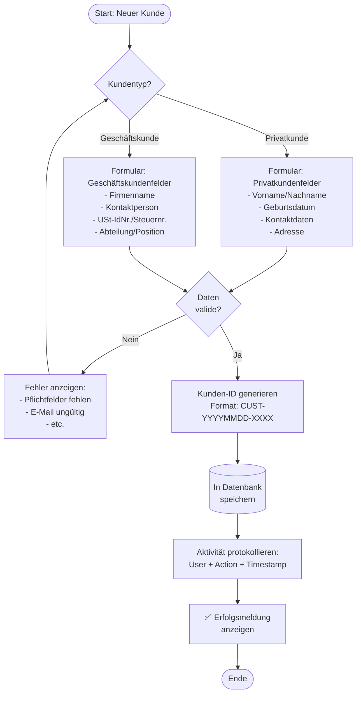
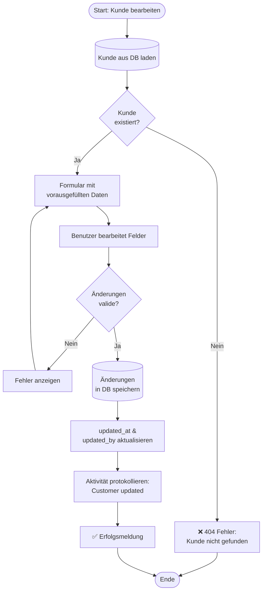
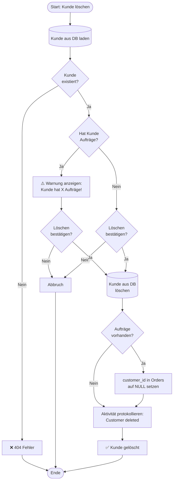
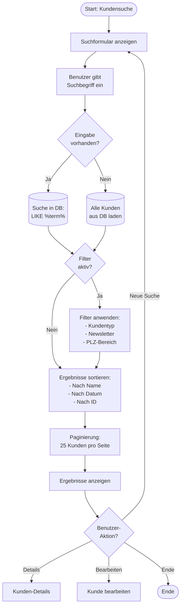
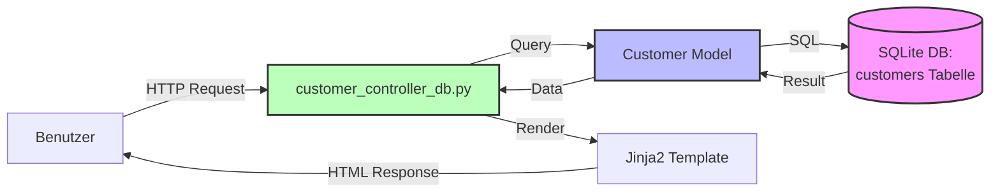

# Workflow: Kundenverwaltung

**Erstellt von Hans Hahn - Alle Rechte vorbehalten**

---

## Prozess: Neuen Kunden anlegen



---

## Prozess: Kunde bearbeiten



---

## Prozess: Kunde löschen



---

## Prozess: Kunde suchen



---

## Datenfluss: Customer-Model



---

## Klassen & Methoden

### Customer Model (`src/models/models.py`)

**Hauptattribute:**
- `id`: Eindeutige Kunden-ID (CUST-YYYYMMDD-XXXX)
- `customer_type`: 'private' oder 'business'
- `first_name`, `last_name`: Name (Privatkunde)
- `company_name`: Firmenname (Geschäftskunde)
- `email`, `phone`, `mobile`: Kontaktdaten
- `street`, `house_number`, `postal_code`, `city`, `country`: Adresse
- `tax_id`, `vat_id`: Steuernummern (Geschäftskunde)
- `newsletter`: Boolean - Newsletter-Anmeldung
- `notes`: Freitext-Notizen

**Properties:**
- `display_name`: Gibt formattierten Namen zurück
  - Privatkunde: "Vorname Nachname"
  - Geschäftskunde: "Firmenname"

**Methods:**
- `get(key, default=None)`: Dictionary-kompatibel

**Relationships:**
- `orders`: 1:n zu Order

---

### Controller: `customer_controller_db.py`

**Blueprint:** `customer_bp`  
**URL-Prefix:** `/customers`

**Routen:**

| Route | Methode | Funktion | Beschreibung |
|-------|---------|----------|--------------|
| `/` | GET | `index()` | Kundenliste mit Suche/Filter |
| `/new` | GET | `new()` | Formular für neuen Kunden |
| `/create` | POST | `create()` | Kunden in DB anlegen |
| `/<id>` | GET | `show(id)` | Kunden-Details anzeigen |
| `/<id>/edit` | GET | `edit(id)` | Bearbeitungs-Formular |
| `/<id>/update` | POST | `update(id)` | Änderungen speichern |
| `/<id>/delete` | POST | `delete(id)` | Kunden löschen |

**Wichtige Funktionen:**

```python
def create():
    # 1. Formulardaten validieren
    # 2. Kunden-ID generieren
    # 3. Customer-Objekt erstellen
    # 4. In DB speichern (db.session.add + commit)
    # 5. Aktivität protokollieren
    # 6. Erfolgsmeldung & Redirect
    pass

def update(id):
    # 1. Customer aus DB laden
    # 2. Formulardaten validieren
    # 3. Attribute aktualisieren
    # 4. updated_at, updated_by setzen
    # 5. Änderungen speichern (db.session.commit)
    # 6. Aktivität protokollieren
    # 7. Erfolgsmeldung & Redirect
    pass

def delete(id):
    # 1. Customer aus DB laden
    # 2. Prüfen ob Aufträge vorhanden
    # 3. Warnung anzeigen wenn Aufträge
    # 4. Nach Bestätigung: db.session.delete
    # 5. Commit
    # 6. Aktivität protokollieren
    # 7. Erfolgsmeldung & Redirect
    pass
```

---

## Templates

**Verzeichnis:** `src/templates/customers/`

### `index.html` - Kundenliste
- Suchformular (Name, E-Mail, ID)
- Filter (Kundentyp, Newsletter, PLZ-Bereich)
- Ergebnis-Tabelle mit Sortierung
- Paginierung (25 pro Seite)
- Aktionen: Details, Bearbeiten, Löschen

### `new.html` - Neuer Kunde
- Kundentyp-Auswahl (Radio: Privat/Geschäft)
- Dynamisches Formular (JS: Felder ein-/ausblenden)
- Validierung (HTML5 + JavaScript)
- Speichern → POST /customers/create

### `show.html` - Kunden-Details
- Alle Kundendaten anzeigen
- Verknüpfte Aufträge (Tabelle)
- Aktivitäts-Historie
- Aktionen: Bearbeiten, Löschen, Neuer Auftrag

### `edit.html` - Kunde bearbeiten
- Vorausgefülltes Formular
- Gleiche Validierung wie new.html
- Speichern → POST /customers/<id>/update

---

## Validierungsregeln

### Pflichtfelder (Privatkunde)
- ✅ Vorname
- ✅ Nachname
- ✅ E-Mail ODER Telefon

### Pflichtfelder (Geschäftskunde)
- ✅ Firmenname
- ✅ Kontaktperson
- ✅ E-Mail ODER Telefon

### Optionale Felder
- Geburtsdatum (Privatkunde)
- Adresse (Straße, PLZ, Ort)
- USt-IdNr., Steuernr. (Geschäftskunde)
- Abteilung, Position (Geschäftskunde)
- Notizen
- Newsletter-Anmeldung

### Format-Validierung
- **E-Mail:** Regex-Validierung
- **Telefon/Mobil:** Nur Zahlen, Leerzeichen, +, -, ()
- **PLZ:** 5 Ziffern (Deutschland)
- **USt-IdNr.:** DE + 9 Ziffern

---

## Sicherheit & Berechtigungen

### Zugriffskontrolle
- Alle Routen: `@login_required`
- Nur eingeloggte Benutzer dürfen Kunden verwalten

### Aktivitäts-Protokollierung
Alle Aktionen werden in `activity_logs` protokolliert:
- `customer_created` - Kunde angelegt
- `customer_updated` - Kunde bearbeitet
- `customer_deleted` - Kunde gelöscht

Format:
```python
ActivityLog(
    username=current_user.username,
    action='customer_created',
    details=f'Customer {customer.id} - {customer.display_name}',
    timestamp=datetime.utcnow()
)
```

---

## Fehlerbehandlung

### Häufige Fehler

**404 - Kunde nicht gefunden:**
```python
customer = Customer.query.get(id)
if not customer:
    flash('Kunde nicht gefunden!', 'danger')
    return redirect(url_for('customer.index'))
```

**Duplikate E-Mail:**
```python
existing = Customer.query.filter_by(email=email).first()
if existing:
    flash('E-Mail bereits vergeben!', 'warning')
    return redirect(url_for('customer.new'))
```

**Datenbankfehler:**
```python
try:
    db.session.commit()
except Exception as e:
    db.session.rollback()
    flash(f'Fehler beim Speichern: {str(e)}', 'danger')
    return redirect(url_for('customer.new'))
```

---

**Erstellt von Hans Hahn - Alle Rechte vorbehalten**  
**Stand:** 10. November 2025
