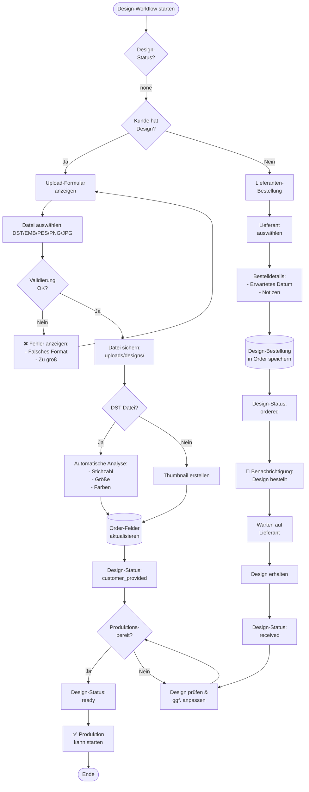
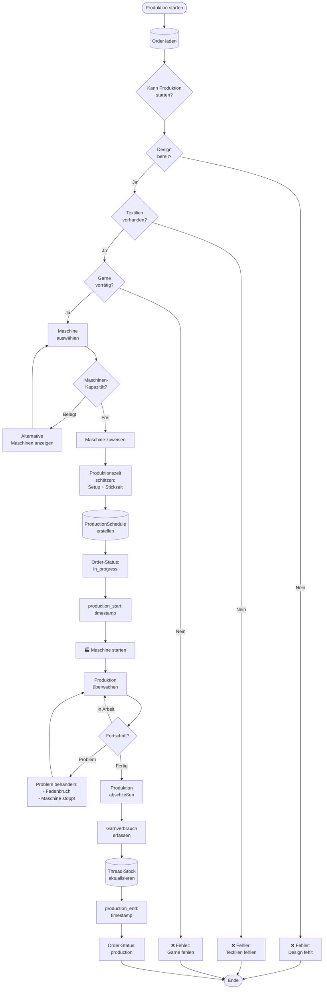
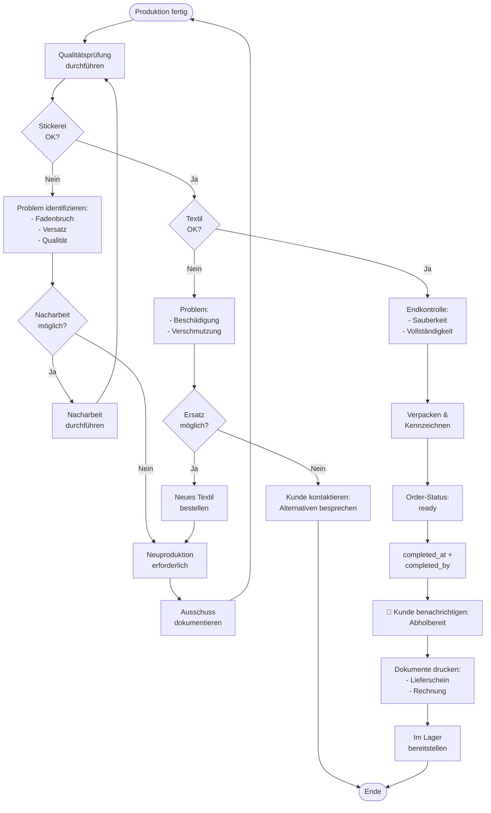
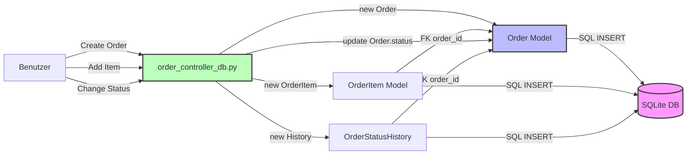

# Workflow: Auftragsverwaltung

**Erstellt von Hans Hahn - Alle Rechte vorbehalten**

---

## Gesamtprozess: Von der Anfrage bis zur Auslieferung

```mermaid
flowchart TD
    Start([Kundenanfrage]) --> CreateOrder[Auftrag anlegen]
    CreateOrder --> SelectType{Auftragstyp?}
    
    SelectType -->|Stickerei| EmbroideryFlow[Stickerei-Details<br/>erfassen]
    SelectType -->|Druck| PrintFlow[Druck-Details<br/>erfassen]
    SelectType -->|Kombiniert| CombinedFlow[Stickerei + Druck<br/>Details erfassen]
    
    EmbroideryFlow --> AddTextiles[Textilien hinzufügen]
    PrintFlow --> AddTextiles
    CombinedFlow --> AddTextiles
    
    AddTextiles --> CheckDesign{Design<br/>vorhanden?}
    
    CheckDesign -->|Kunde liefert| UploadDesign[Design hochladen<br/>& analysieren]
    CheckDesign -->|Muss bestellt werden| OrderDesign[Design beim<br/>Lieferanten bestellen]
    
    UploadDesign --> DesignReady{Design<br/>OK?}
    OrderDesign --> WaitDesign[Warten auf<br/>Lieferant]
    WaitDesign --> DesignReady
    
    DesignReady -->|Nein| FixDesign[Design korrigieren]
    FixDesign --> DesignReady
    
    DesignReady -->|Ja| CheckTextiles{Textilien<br/>vorrätig?}
    
    CheckTextiles -->|Nein| OrderTextiles[Textilien bei<br/>Lieferant bestellen]
    OrderTextiles --> WaitTextiles[Warten auf<br/>Lieferung]
    WaitTextiles --> TextilesReady
    
    CheckTextiles -->|Ja| TextilesReady[Alle Materialien<br/>verfügbar]
    
    TextilesReady --> UpdateStatus1[Status: accepted]
    UpdateStatus1 --> ScheduleProduction[Produktion planen]
    ScheduleProduction --> UpdateStatus2[Status: in_progress]
    UpdateStatus2 --> StartProduction[Produktion starten]
    StartProduction --> UpdateStatus3[Status: production]
    UpdateStatus3 --> Production[Produktion durchführen]
    Production --> QualityCheck{Qualitätsprüfung<br/>OK?}
    
    QualityCheck -->|Nein| Rework[Nacharbeit/<br/>Neuproduktion]
    Rework --> Production
    
    QualityCheck -->|Ja| UpdateStatus4[Status: ready]
    UpdateStatus4 --> NotifyCustomer[Kunde benachrichtigen:<br/>Abholbereit]
    NotifyCustomer --> WaitPickup[Warten auf<br/>Abholung/Versand]
    WaitPickup --> CheckDelivery{Abholung oder<br/>Versand?}
    
    CheckDelivery -->|Abholung| Pickup[Kunde holt ab]
    CheckDelivery -->|Versand| Ship[Versand erstellen]
    
    Pickup --> UpdateStatus5[Status: completed]
    Ship --> UpdateStatus5
    UpdateStatus5 --> CreateInvoice[Rechnung erstellen]
    CreateInvoice --> End([Auftrag abgeschlossen])
```



---

## Detailprozess: Stickerei-Auftrag erstellen

```mermaid
flowchart TD
    Start([Start: Neuer<br/>Stickerei-Auftrag]) --> SelectCustomer[Kunde auswählen]
    SelectCustomer --> EnterBasics[Grunddaten:<br/>- Auftragsnummer<br/>- Liefertermin<br/>- Eilauftrag?]
    
    EnterBasics --> UploadDesign{Design-Datei<br/>hochladen?}
    
    UploadDesign -->|Ja| ValidateFile{Dateiformat<br/>OK?}
    ValidateFile -->|Nein| ShowError[❌ Fehler:<br/>Nur DST/EMB/PES/etc.]
    ShowError --> UploadDesign
    
    ValidateFile -->|Ja| AnalyzeDST[DST-Datei analysieren:<br/>- Stichzahl<br/>- Größe<br/>- Farbwechsel]
    
    AnalyzeDST --> ExtractColors[Farbliste extrahieren]
    ExtractColors --> MatchThreads[Garne zuordnen:<br/>- Madeira-Farben<br/>- Bestand prüfen]
    
    UploadDesign -->|Nein| SetDesignStatus[Design-Status:<br/>needs_order]
    SetDesignStatus --> MatchThreads
    
    MatchThreads --> EnterEmbroideryDetails[Stickerei-Details:<br/>- Position (Brust/Rücken/etc.)<br/>- Größe<br/>- Anzahl Positionen]
    
    EnterEmbroideryDetails --> CalculateStitchPrice[Preis berechnen:<br/>Grundpreis +<br/>Stichzahl × Preis/1000]
    
    CalculateStitchPrice --> AddTextileItems[Textilien hinzufügen]
    AddTextileItems --> SelectArticle[Artikel auswählen]
    SelectArticle --> SelectVariant[Variante wählen:<br/>- Größe<br/>- Farbe]
    SelectVariant --> EnterQuantity[Menge eingeben]
    EnterQuantity --> CalculateItemPrice[Position-Preis:<br/>Menge × VK-Preis]
    
    CalculateItemPrice --> CheckStock{Artikel<br/>vorrätig?}
    
    CheckStock -->|Nein| SetOrderStatus[Textile Status:<br/>to_order]
    CheckStock -->|Ja| SetOrderStatus2[Textile Status:<br/>none]
    
    SetOrderStatus --> AddMore{Weitere<br/>Positionen?}
    SetOrderStatus2 --> AddMore
    
    AddMore -->|Ja| AddTextileItems
    AddMore -->|Nein| CalculateTotal[Gesamtpreis:<br/>Stickerei + Textilien]
    
    CalculateTotal --> EnterDiscount[Rabatt eingeben?<br/>Optional]
    EnterDiscount --> EnterDeposit[Anzahlung?<br/>Optional]
    
    EnterDeposit --> AddNotes[Notizen hinzufügen:<br/>- Intern<br/>- Kunde]
    
    AddNotes --> SaveOrder[(Auftrag in DB<br/>speichern)]
    SaveOrder --> SetInitialStatus[Status: new]
    SetInitialStatus --> LogActivity[Aktivität<br/>protokollieren]
    LogActivity --> ShowSuccess[✅ Auftrag erstellt]
    ShowSuccess --> End([Ende])
```

---

## Prozess: Design-Workflow



---

## Prozess: Textilien bestellen

```mermaid
flowchart TD
    Start([Textilien für<br/>Auftrag bestellen]) --> CheckItems[(OrderItems<br/>mit Status to_order)]
    
    CheckItems --> HasItems{Items<br/>vorhanden?}
    HasItems -->|Nein| NoItems[ℹ️ Keine Bestellung<br/>erforderlich]
    NoItems --> End([Ende])
    
    HasItems -->|Ja| GroupBySupplier[Items nach<br/>Lieferant gruppieren]
    GroupBySupplier --> ForEachSupplier{Für jeden<br/>Lieferant}
    
    ForEachSupplier --> CreateSupplierOrder[SupplierOrder<br/>erstellen]
    CreateSupplierOrder --> AddItemsToOrder[Items zur<br/>Bestellung hinzufügen]
    AddItemsToOrder --> CalculateSubtotal[Zwischensumme<br/>berechnen]
    CalculateSubtotal --> AddShipping[Versandkosten<br/>hinzufügen]
    AddShipping --> CalculateTotal[Gesamtbetrag<br/>berechnen]
    
    CalculateTotal --> SaveSupplierOrder[(SupplierOrder<br/>in DB speichern)]
    SaveSupplierOrder --> LinkOrderItems[OrderItems mit<br/>SupplierOrder verknüpfen]
    LinkOrderItems --> UpdateItemStatus[Item-Status:<br/>ordered]
    
    UpdateItemStatus --> CheckWebshop{Webshop-<br/>Integration?}
    
    CheckWebshop -->|Ja| AutoOrder[Automatische<br/>Bestellung]
    CheckWebshop -->|Nein| ManualOrder[Manuelle<br/>Bestellung]
    
    AutoOrder --> GenerateOrderURL[Webshop-URL<br/>generieren]
    GenerateOrderURL --> SubmitOrder[API-Call:<br/>Bestellung absenden]
    SubmitOrder --> CheckResponse{Erfolgreich?}
    
    CheckResponse -->|Nein| LogError[Fehler protokollieren]
    LogError --> ManualOrder
    
    CheckResponse -->|Ja| SaveTrackingInfo[Tracking-Info<br/>speichern]
    SaveTrackingInfo --> NotifySuccess[✅ Bestellung<br/>erfolgreich]
    
    ManualOrder --> OpenWebshopURL[Webshop-Link<br/>öffnen]
    OpenWebshopURL --> ManualEntry[👤 Benutzer bestellt<br/>manuell]
    ManualEntry --> EnterTrackingManual[Tracking-Info<br/>manuell eingeben]
    EnterTrackingManual --> NotifySuccess
    
    NotifySuccess --> MoreSuppliers{Weitere<br/>Lieferanten?}
    MoreSuppliers -->|Ja| ForEachSupplier
    MoreSuppliers -->|Nein| AllOrdered[Alle Textilien<br/>bestellt]
    AllOrdered --> End
```



---

## Prozess: Produktionsstart



---

## Prozess: Qualitätsprüfung & Fertigstellung



---

## Datenfluss: Order-Model



---

## Klassen & Methoden

### Order Model (`src/models/models.py`)

**Hauptattribute:**
- `id`: Order-ID (ORD-YYYYMMDD-XXXX)
- `customer_id`: FK → Customer
- `order_number`: Eindeutige Auftragsnummer
- `order_type`: 'embroidery'/'printing'/'dtf'/'combined'
- `status`: Auftragsstatus (siehe Status-Übersicht)
- `stitch_count`: Stichzahl (Stickerei)
- `design_file_path`: Pfad zur Design-Datei
- `total_price`: Gesamtpreis
- `due_date`: Liefertermin
- `assigned_machine_id`: FK → Machine

**Design-Workflow-Felder:**
- `design_status`: 'none'/'customer_provided'/'needs_order'/'ordered'/'received'/'ready'
- `design_supplier_id`: FK → Supplier
- `design_order_date`, `design_expected_date`, `design_received_date`

**Methods:**
- `can_start_production()` → (bool, reason)
- `get_design_status_display()` → String
- `has_design_file()` → bool
- `needs_design_order()` → bool
- `is_design_ready()` → bool

**Relationships:**
- `customer`: n:1 → Customer
- `items`: 1:n → OrderItem
- `status_history`: 1:n → OrderStatusHistory
- `shipments`: 1:n → Shipment
- `production_schedules`: 1:n → ProductionSchedule
- `assigned_machine`: n:1 → Machine
- `design_supplier`: n:1 → Supplier

---

### OrderItem Model

**Attribute:**
- `id`: Item-ID (auto-increment)
- `order_id`: FK → Order
- `article_id`: FK → Article
- `quantity`: Menge
- `unit_price`: Stückpreis
- `textile_size`, `textile_color`: Variante
- **Lieferanten-Bestellung:**
  - `supplier_order_status`: 'none'/'to_order'/'ordered'/'delivered'
  - `supplier_order_id`: FK → SupplierOrder
  - `supplier_order_date`, `supplier_expected_date`, `supplier_delivered_date`

---

### Controller: `order_controller_db.py`

**Blueprint:** `order_bp`  
**URL-Prefix:** `/orders`

**Hauptrouten:**

| Route | Methode | Funktion | Beschreibung |
|-------|---------|----------|--------------|
| `/` | GET | `index()` | Auftragsliste |
| `/new` | GET | `new()` | Neuer Auftrag |
| `/create` | POST | `create()` | Auftrag anlegen |
| `/<id>` | GET | `show(id)` | Auftrags-Details |
| `/<id>/edit` | GET | `edit(id)` | Bearbeiten |
| `/<id>/update` | POST | `update(id)` | Speichern |
| `/<id>/status` | POST | `update_status(id)` | Status ändern |
| `/<id>/items/add` | POST | `add_item(id)` | Position hinzufügen |
| `/<id>/design` | GET | `design_workflow(id)` | Design-Workflow |

---

## Status-Übersicht

### Auftragsstatus

1. **new** - Neu erfasst
   - Auftrag angelegt
   - Noch nicht bestätigt

2. **accepted** - Angenommen
   - Auftrag bestätigt
   - Design & Materialien geprüft
   - Produktionsplanung möglich

3. **in_progress** - In Bearbeitung
   - Materialien beschafft
   - Produktion geplant
   - Wartet auf freie Maschine

4. **production** - In Produktion
   - Aktiv an Maschine
   - Wird produziert

5. **ready** - Fertig
   - Produktion abgeschlossen
   - Qualitätsprüfung bestanden
   - Abholbereit

6. **completed** - Abgeschlossen
   - Übergeben/Versendet
   - Rechnung erstellt
   - Bezahlt

7. **cancelled** - Storniert
   - Auftrag abgebrochen

### Design-Status

1. **none** - Kein Design
2. **customer_provided** - Kunde hat geliefert
3. **needs_order** - Muss bestellt werden
4. **ordered** - Bei Lieferant bestellt
5. **received** - Vom Lieferanten erhalten
6. **ready** - Produktionsbereit

### Textile-Status (OrderItem)

1. **none** - Keine Bestellung nötig
2. **to_order** - Muss bestellt werden
3. **ordered** - Bestellt
4. **delivered** - Geliefert

---

## Templates

**Verzeichnis:** `src/templates/orders/`

- `index.html` - Auftragsliste mit Filtern
- `new.html` - Neuer Auftrag (Formular)
- `show.html` - Auftrags-Details
- `edit.html` - Auftrag bearbeiten
- `design_workflow.html` - Design-Verwaltung
- `items_manage.html` - Positionen verwalten

---

**Erstellt von Hans Hahn - Alle Rechte vorbehalten**  
**Stand:** 10. November 2025
