# Workflow: Design-Workflow & DST-Analyse

**Erstellt von Hans Hahn - Alle Rechte vorbehalten**

---

## Gesamtprozess: Design-Workflow

```mermaid
flowchart TD
    Start([Auftrag erstellt]) --> CheckDesign{Design-<br/>Quelle?}
    
    CheckDesign -->|Kunde liefert| CustomerPath[Kunde liefert Design]
    CheckDesign -->|Bestellen| SupplierPath[Bei Lieferant bestellen]
    CheckDesign -->|Eigenes Design| InternalPath[Intern erstellen]
    
    CustomerPath --> UploadInterface[Upload-Interface]
    UploadInterface --> SelectFiles[Dateien auswählen:<br/>DST/EMB/PES<br/>PNG/JPG/PDF]
    
    SelectFiles --> ValidateFiles{Dateien<br/>valide?}
    ValidateFiles -->|Nein| ShowErrors[❌ Fehler:<br/>- Format ungültig<br/>- Zu groß<br/>- Korrupt]
    ShowErrors --> SelectFiles
    
    ValidateFiles -->|Ja| SaveFiles[Dateien sichern:<br/>instance/uploads/designs/]
    
    SaveFiles --> CheckFiletype{Datei-<br/>typ?}
    
    CheckFiletype -->|DST/EMB/PES| AnalyzeEmbroidery[Stickdatei analysieren]
    CheckFiletype -->|PNG/JPG| AnalyzeImage[Bilddatei analysieren]
    CheckFiletype -->|PDF| AnalyzePDF[PDF analysieren]
    
    AnalyzeEmbroidery --> ExtractStitchData[DST-Daten extrahieren:<br/>- Stichzahl<br/>- Größe<br/>- Farbwechsel<br/>- Farbliste]
    
    ExtractStitchData --> MatchThreadColors[Garnfarben zuordnen]
    MatchThreadColors --> CheckThreadStock{Garne<br/>vorrätig?}
    
    CheckThreadStock -->|Nein| CreateThreadOrder[Garnbestellung<br/>vormerken]
    CheckThreadStock -->|Ja| ThreadsOK[Garne OK]
    CreateThreadOrder --> ThreadsOK
    
    ThreadsOK --> GenerateThumbnail[Thumbnail erstellen]
    
    AnalyzeImage --> CheckImageQuality{Bildqualität<br/>OK?}
    CheckImageQuality -->|Nein| WarnQuality[⚠️ Warnung:<br/>Auflösung zu niedrig]
    CheckImageQuality -->|Ja| GenerateThumbnail
    WarnQuality --> GenerateThumbnail
    
    AnalyzePDF --> ExtractPDFImages[Bilder aus PDF<br/>extrahieren]
    ExtractPDFImages --> GenerateThumbnail
    
    GenerateThumbnail --> UpdateOrderData[(Order-Felder<br/>aktualisieren:<br/>- design_file_path<br/>- design_thumbnail_path<br/>- stitch_count<br/>- design_width_mm<br/>- design_height_mm)]
    
    UpdateOrderData --> SetStatusProvided[design_status:<br/>customer_provided]
    SetStatusProvided --> ProductionReady[✅ Produktionsbereit]
    
    SupplierPath --> SelectSupplier[Lieferant wählen]
    SelectSupplier --> EnterDesignDetails[Design-Details:<br/>- Beschreibung<br/>- Erwartetes Datum<br/>- Preis]
    
    EnterDesignDetails --> CreateDesignOrder[(Design-Bestellung<br/>in Order speichern:<br/>- design_supplier_id<br/>- design_order_date<br/>- design_expected_date)]
    
    CreateDesignOrder --> SetStatusOrdered[design_status:<br/>ordered]
    SetStatusOrdered --> NotifyStaff[📧 Mitarbeiter<br/>benachrichtigen]
    NotifyStaff --> WaitForDelivery[⏳ Warten auf<br/>Lieferung]
    
    WaitForDelivery --> ReceiveDesign[Design erhalten]
    ReceiveDesign --> SetStatusReceived[design_status:<br/>received]
    SetStatusReceived --> UploadReceived[Empfangenes Design<br/>hochladen]
    UploadReceived --> AnalyzeEmbroidery
    
    InternalPath --> InternalDesignTool[Interne Design-<br/>Software]
    InternalDesignTool --> CreateDesignFile[Design-Datei<br/>erstellen]
    CreateDesignFile --> SaveFiles
    
    ProductionReady --> CanStartProduction{Kann Produktion<br/>starten?}
    CanStartProduction -->|Nein| WaitMaterials[⏳ Warte auf<br/>Materialien]
    CanStartProduction -->|Ja| End([Bereit für<br/>Produktion])
    WaitMaterials --> End
```



---

## Detailprozess: DST-Datei-Analyse

```mermaid
flowchart TD
    Start([DST-Datei<br/>hochgeladen]) --> OpenFile[Datei öffnen:<br/>pyembroidery.read]
    
    OpenFile --> CheckValid{Datei<br/>lesbar?}
    CheckValid -->|Nein| Error[❌ Fehler:<br/>Datei korrupt]
    Error --> End([Ende])
    
    CheckValid -->|Ja| ReadStitches[Stiche einlesen:<br/>pattern.stitches]
    
    ReadStitches --> CountStitches[Stichzahl zählen:<br/>Total Stitches]
    CountStitches --> CalculateBounds[Boundingbox berechnen:<br/>min/max X/Y]
    
    CalculateBounds --> ConvertToMM[Umrechnung in mm:<br/>X/Y × 0.1]
    ConvertToMM --> CalculateSize[Größe berechnen:<br/>width_mm = max_x - min_x<br/>height_mm = max_y - min_y]
    
    CalculateSize --> ExtractColors[Farbwechsel<br/>identifizieren:<br/>COLOR_CHANGE commands]
    
    ExtractColors --> CountColorChanges[Farbwechsel<br/>zählen]
    CountColorChanges --> ExtractColorList[Farbliste<br/>erstellen]
    
    ExtractColorList --> MapToThreads[Farben zu Garnen<br/>zuordnen:<br/>RGB → Thread-DB]
    
    MapToThreads --> EstimateTime[Produktionszeit<br/>schätzen:<br/>time = (stitches / speed)<br/>+ setup + color_changes]
    
    EstimateTime --> CreateResult[Analyse-Ergebnis<br/>erstellen:<br/>JSON-Objekt]
    
    CreateResult --> ReturnResult[Ergebnis zurückgeben]
    
    ReturnResult --> UpdateOrder[(Order-Felder<br/>aktualisieren:<br/>- stitch_count<br/>- design_width_mm<br/>- design_height_mm<br/>- thread_colors)]
    
    UpdateOrder --> GenerateThumbnail[Thumbnail<br/>generieren:<br/>PNG-Vorschau]
    
    GenerateThumbnail --> SaveThumbnail[Thumbnail speichern:<br/>thumbnails/design_id.png]
    
    SaveThumbnail --> End
```

---

## DST-Analyse: Code-Beispiel

```python
# src/utils/dst_analyzer.py

import pyembroidery

def analyze_dst_file(filepath):
    """
    Analysiert eine DST-Stickdatei und extrahiert alle relevanten Daten
    
    Args:
        filepath (str): Pfad zur DST-Datei
        
    Returns:
        dict: Analyse-Ergebnis mit allen Daten
    """
    try:
        # Datei mit pyembroidery einlesen
        pattern = pyembroidery.read(filepath)
        
        # Stichzahl ermitteln
        stitch_count = len([s for s in pattern.stitches if s[2] == pyembroidery.STITCH])
        
        # Boundingbox berechnen (in 0.1mm-Einheiten)
        bounds = pattern.bounds()
        min_x, min_y, max_x, max_y = bounds
        
        # Umrechnung in mm
        width_mm = (max_x - min_x) * 0.1
        height_mm = (max_y - min_y) * 0.1
        
        # Farbwechsel zählen
        color_changes = len([s for s in pattern.stitches if s[2] == pyembroidery.COLOR_CHANGE])
        
        # Farbliste extrahieren
        colors = []
        thread_list = pattern.threadlist
        
        for idx, thread in enumerate(thread_list):
            color_rgb = thread.color
            color_hex = thread.hex if hasattr(thread, 'hex') else rgb_to_hex(color_rgb)
            
            colors.append({
                'index': idx,
                'rgb': color_rgb,
                'hex': color_hex,
                'name': thread.description if hasattr(thread, 'description') else f'Color {idx+1}'
            })
        
        # Produktionszeit schätzen (bei 1000 Stiche/Min)
        machine_speed = 1000  # Stiche pro Minute
        setup_time = 15  # Minuten
        color_change_time = 3  # Minuten pro Farbwechsel
        
        stitch_time = stitch_count / machine_speed
        total_time = setup_time + stitch_time + (color_changes * color_change_time)
        
        # Ergebnis zusammenstellen
        result = {
            'success': True,
            'stitch_count': stitch_count,
            'width_mm': round(width_mm, 2),
            'height_mm': round(height_mm, 2),
            'color_changes': color_changes,
            'colors': colors,
            'estimated_time_minutes': round(total_time, 1),
            'machine_speed': machine_speed
        }
        
        return result
        
    except Exception as e:
        return {
            'success': False,
            'error': str(e)
        }

def rgb_to_hex(rgb):
    """Konvertiert RGB-Tupel zu Hex-String"""
    if isinstance(rgb, int):
        # Integer-RGB zu Hex
        return f'#{rgb:06X}'
    elif isinstance(rgb, tuple):
        # Tupel-RGB zu Hex
        return '#%02X%02X%02X' % rgb
    return '#000000'
```

---

## Prozess: Garn-Zuordnung

```mermaid
flowchart TD
    Start([Farbliste aus DST]) --> ForEachColor{Für jede<br/>Farbe}
    
    ForEachColor --> GetRGB[RGB-Wert<br/>extrahieren]
    GetRGB --> SearchDB[(Thread-Datenbank<br/>durchsuchen)]
    
    SearchDB --> CalculateDelta[Farbabstand<br/>berechnen:<br/>ΔE = sqrt((R1-R2)² +<br/>(G1-G2)² + (B1-B2)²)]
    
    CalculateDelta --> FindClosest[Nächste Farbe<br/>finden:<br/>min(ΔE)]
    
    FindClosest --> CheckTolerance{ΔE < 30?}
    
    CheckTolerance -->|Ja| GoodMatch[✅ Gute Übereinstimmung]
    CheckTolerance -->|Nein| PoorMatch[⚠️ Schlechte Übereinstimmung]
    
    GoodMatch --> CheckStock{Garn<br/>vorrätig?}
    PoorMatch --> SuggestAlternatives[Alternative Garne<br/>vorschlagen]
    SuggestAlternatives --> CheckStock
    
    CheckStock -->|Ja| AddToList[Zur Garn-Liste<br/>hinzufügen]
    CheckStock -->|Nein| MarkReorder[Nachbestellung<br/>vormerken]
    MarkReorder --> AddToList
    
    AddToList --> MoreColors{Weitere<br/>Farben?}
    MoreColors -->|Ja| ForEachColor
    MoreColors -->|Nein| SaveSelection[(Garn-Auswahl<br/>in Order speichern:<br/>selected_threads JSON)]
    
    SaveSelection --> UpdateOrder[Order aktualisieren]
    UpdateOrder --> End([Ende])
```

---

## Prozess: Thumbnail-Generierung

```mermaid
flowchart TD
    Start([Design-Datei<br/>vorhanden]) --> CheckFileType{Datei-<br/>typ?}
    
    CheckFileType -->|DST/EMB/PES| ConvertToImage[Stickdatei zu PNG<br/>konvertieren:<br/>pyembroidery.write_png]
    CheckFileType -->|PNG/JPG| LoadImage[Bild laden:<br/>PIL.Image.open]
    CheckFileType -->|PDF| ExtractFirstPage[Erste Seite<br/>aus PDF extrahieren]
    
    ConvertToImage --> ResizeImage[Größe anpassen:<br/>max 200x200px<br/>Aspect Ratio erhalten]
    LoadImage --> ResizeImage
    ExtractFirstPage --> ResizeImage
    
    ResizeImage --> OptimizeQuality[Qualität optimieren:<br/>- Kompression<br/>- Schärfe<br/>- Kontrast]
    
    OptimizeQuality --> GenerateFilename[Dateinamen erstellen:<br/>design_{order_id}_thumb.png]
    
    GenerateFilename --> SaveThumbnail[Thumbnail speichern:<br/>static/thumbnails/]
    
    SaveThumbnail --> UpdateOrderPath[(Order.design_thumbnail_path<br/>aktualisieren)]
    
    UpdateOrderPath --> End([Ende])
```

---

## Upload-Sicherheit

```mermaid
flowchart TD
    Start([Datei-Upload]) --> ValidateExtension{Datei-<br/>Extension?}
    
    ValidateExtension -->|Nicht erlaubt| Reject1[❌ Ablehnen:<br/>Nur DST/EMB/PES/PNG/JPG/PDF]
    Reject1 --> End([Ende])
    
    ValidateExtension -->|Erlaubt| CheckMimeType{MIME-Type<br/>prüfen}
    
    CheckMimeType -->|Falsch| Reject2[❌ Ablehnen:<br/>Extension ≠ MIME-Type]
    Reject2 --> End
    
    CheckMimeType -->|OK| CheckFileSize{Dateigröße<br/>< 16MB?}
    
    CheckFileSize -->|Nein| Reject3[❌ Ablehnen:<br/>Datei zu groß]
    Reject3 --> End
    
    CheckFileSize -->|Ja| SanitizeFilename[Dateinamen<br/>bereinigen:<br/>- Sonderzeichen entfernen<br/>- Leerzeichen → _<br/>- Umlaute → ae/oe/ue]
    
    SanitizeFilename --> GenerateUniqueFilename[Eindeutigen Namen<br/>generieren:<br/>timestamp_originalname]
    
    GenerateUniqueFilename --> CheckDuplicate{Datei<br/>existiert?}
    
    CheckDuplicate -->|Ja| AddSuffix[Suffix hinzufügen:<br/>_1, _2, ...]
    CheckDuplicate -->|Nein| SaveFile[Datei speichern:<br/>instance/uploads/designs/]
    AddSuffix --> SaveFile
    
    SaveFile --> SetPermissions[Berechtigungen<br/>setzen:<br/>644 (rw-r--r--)]
    
    SetPermissions --> ScanVirus{Virus-<br/>Scan?}
    ScanVirus -->|Optional| VirusScan[Virus-Scan<br/>durchführen]
    ScanVirus -->|Übersprungen| Success
    VirusScan --> VirusFound{Virus<br/>gefunden?}
    
    VirusFound -->|Ja| DeleteFile[Datei löschen]
    DeleteFile --> Reject4[❌ Ablehnen:<br/>Virus gefunden]
    Reject4 --> End
    
    VirusFound -->|Nein| Success[✅ Upload<br/>erfolgreich]
    Success --> ReturnPath[Dateipfad<br/>zurückgeben]
    ReturnPath --> End
```

---

## Klassen & Methoden

### Design-Upload Utility (`src/utils/design_upload.py`)

```python
import os
from werkzeug.utils import secure_filename
from PIL import Image

ALLOWED_EXTENSIONS = {
    'dst', 'emb', 'pes', 'jef', 'exp', 'vp3',  # Stickdateien
    'png', 'jpg', 'jpeg', 'gif', 'svg',        # Bilder
    'pdf'                                       # PDF
}

def allowed_file(filename):
    """Prüft ob Datei-Extension erlaubt ist"""
    return '.' in filename and \
           filename.rsplit('.', 1)[1].lower() in ALLOWED_EXTENSIONS

def save_upload(file, upload_folder, order_id):
    """
    Speichert hochgeladene Datei sicher
    
    Args:
        file: Werkzeug FileStorage Objekt
        upload_folder: Zielordner
        order_id: Order-ID für eindeutigen Namen
        
    Returns:
        str: Relativer Pfad zur gespeicherten Datei
    """
    if file and allowed_file(file.filename):
        # Dateinamen bereinigen
        filename = secure_filename(file.filename)
        
        # Eindeutigen Namen generieren
        timestamp = datetime.now().strftime('%Y%m%d_%H%M%S')
        unique_filename = f"{order_id}_{timestamp}_{filename}"
        
        # Vollständigen Pfad erstellen
        filepath = os.path.join(upload_folder, unique_filename)
        
        # Datei speichern
        file.save(filepath)
        
        return unique_filename
    
    return None

def generate_thumbnail(filepath, thumbnail_folder, max_size=(200, 200)):
    """
    Generiert Thumbnail für Design-Datei
    
    Args:
        filepath: Pfad zur Originaldatei
        thumbnail_folder: Zielordner für Thumbnail
        max_size: Maximale Größe (width, height)
        
    Returns:
        str: Pfad zum Thumbnail
    """
    try:
        # Datei-Extension prüfen
        ext = filepath.rsplit('.', 1)[1].lower()
        
        if ext in ['dst', 'emb', 'pes']:
            # Stickdatei → PNG konvertieren
            import pyembroidery
            pattern = pyembroidery.read(filepath)
            
            # Temporäre PNG erstellen
            temp_png = filepath + '.png'
            pyembroidery.write_png(pattern, temp_png)
            
            # PNG als Image laden
            img = Image.open(temp_png)
            os.remove(temp_png)  # Temp-Datei löschen
            
        elif ext in ['png', 'jpg', 'jpeg', 'gif']:
            # Bild direkt laden
            img = Image.open(filepath)
            
        elif ext == 'pdf':
            # PDF → Bild (erste Seite)
            from pdf2image import convert_from_path
            images = convert_from_path(filepath, first_page=1, last_page=1)
            img = images[0] if images else None
        
        if img:
            # Thumbnail erstellen
            img.thumbnail(max_size, Image.Resampling.LANCZOS)
            
            # Thumbnail-Dateinamen erstellen
            basename = os.path.basename(filepath)
            thumb_name = f"thumb_{basename}.png"
            thumb_path = os.path.join(thumbnail_folder, thumb_name)
            
            # Thumbnail speichern
            img.save(thumb_path, 'PNG', optimize=True)
            
            return thumb_name
    
    except Exception as e:
        print(f"Fehler bei Thumbnail-Generierung: {e}")
    
    return None
```

---

### DST-Analyzer Utility (`src/utils/dst_analyzer.py`)

**Hauptfunktionen:**

```python
def analyze_dst_file(filepath):
    """Analysiert DST-Datei (siehe Code-Beispiel oben)"""
    pass

def estimate_production_time(stitch_count, color_changes, machine_speed=1000):
    """
    Schätzt Produktionszeit
    
    Args:
        stitch_count: Anzahl Stiche
        color_changes: Anzahl Farbwechsel
        machine_speed: Stiche/Minute (default 1000)
        
    Returns:
        float: Geschätzte Zeit in Minuten
    """
    setup_time = 15  # Rüstzeit
    color_change_time = 3  # Zeit pro Farbwechsel
    
    stitch_time = stitch_count / machine_speed
    total = setup_time + stitch_time + (color_changes * color_change_time)
    
    return round(total, 1)

def match_thread_color(rgb, thread_database):
    """
    Findet passende Garnfarbe in Datenbank
    
    Args:
        rgb: RGB-Tupel (r, g, b)
        thread_database: Liste von Thread-Objekten
        
    Returns:
        Thread: Nächste passende Garnfarbe
    """
    min_distance = float('inf')
    best_match = None
    
    for thread in thread_database:
        # Farbabstand berechnen (einfache Euklidische Distanz)
        distance = sqrt(
            (rgb[0] - thread.rgb_r)**2 +
            (rgb[1] - thread.rgb_g)**2 +
            (rgb[2] - thread.rgb_b)**2
        )
        
        if distance < min_distance:
            min_distance = distance
            best_match = thread
    
    return best_match, min_distance
```

---

## Controller: Design-Workflow

### `design_workflow_controller.py`

**Blueprint:** `design_workflow_bp`  
**URL-Prefix:** `/design-workflow`

**Routen:**

| Route | Methode | Funktion | Beschreibung |
|-------|---------|----------|--------------|
| `/` | GET | `index()` | Design-Übersicht |
| `/<order_id>` | GET | `show(order_id)` | Design für Auftrag |
| `/<order_id>/upload` | POST | `upload(order_id)` | Design hochladen |
| `/<order_id>/analyze` | POST | `analyze(order_id)` | DST analysieren |
| `/<order_id>/order` | POST | `order_design(order_id)` | Design bestellen |
| `/<order_id>/status` | POST | `update_status(order_id)` | Status ändern |
| `/<order_id>/thumbnail` | GET | `thumbnail(order_id)` | Thumbnail anzeigen |

---

## Templates

**Verzeichnis:** `src/templates/design_workflow/`

- `index.html` - Übersicht aller Designs
- `show.html` - Design-Details für Auftrag
- `upload_form.html` - Upload-Formular
- `analyze_result.html` - Analyse-Ergebnis
- `order_form.html` - Design-Bestellung

---

## Fehlerbehandlung

### Häufige Fehler

**Ungültiges Dateiformat:**
```python
if not allowed_file(file.filename):
    flash('Ungültiges Dateiformat! Nur DST/EMB/PES/PNG/JPG/PDF erlaubt.', 'danger')
    return redirect(url_for('design_workflow.show', order_id=order_id))
```

**Datei zu groß:**
```python
if file.content_length > app.config['MAX_CONTENT_LENGTH']:
    flash('Datei zu groß! Maximale Größe: 16MB', 'danger')
    return redirect(url_for('design_workflow.show', order_id=order_id))
```

**DST-Analyse fehlgeschlagen:**
```python
result = analyze_dst_file(filepath)
if not result['success']:
    flash(f'DST-Analyse fehlgeschlagen: {result["error"]}', 'danger')
    return redirect(url_for('design_workflow.show', order_id=order_id))
```

---

**Erstellt von Hans Hahn - Alle Rechte vorbehalten**  
**Stand:** 10. November 2025
