# Workflow: Produktionsplanung & Maschinenmanagement

**Erstellt von Hans Hahn - Alle Rechte vorbehalten**  
**Basiert auf:** IST-SOLL-Analyse  
**Priorität:** 🔴 HOCH (Phase 2, Woche 3)

---

## 🎯 Ziel dieses Workflows

**IST-Zustand:** 50% implementiert - Basis-Modelle vorhanden, aber keine vollständige UI  
**SOLL-Zustand:** 100% - Vollständige Produktionsplanung mit Kalender, Kapazitätsplanung und Garnverbrauch-Tracking

---

## Gesamtprozess: Produktionsplanung


---

## Detailprozess: Kapazitätsplanung (Automatisch)

```mermaid
flowchart TD
    Start([Auto-Planung<br/>starten]) --> GetAvailableMachines[(Verfügbare Maschinen<br/>laden)]
    
    GetAvailableMachines --> ForEachMachine{Für jede<br/>Maschine}
    
    ForEachMachine --> CheckMachineType{Maschinen-Typ<br/>passend?}
    CheckMachineType -->|Nein| NextMachine[Nächste Maschine]
    NextMachine --> ForEachMachine
    
    CheckMachineType -->|Ja| CheckMaintenace{Wartung<br/>fällig?}
    CheckMaintenace -->|Ja| NextMachine
    
    CheckMaintenace -->|Nein| GetSchedule[(Aktueller<br/>Zeitplan laden)]
    GetSchedule --> FindFreeSlots[Freie Zeitslots<br/>finden]
    
    FindFreeSlots --> CalculateScore[Score berechnen:<br/>- Verfügbarkeit<br/>- Rüstzeit<br/>- Fähigkeiten<br/>- Priorität]
    
    CalculateScore --> AddToList[Zu Kandidaten-<br/>Liste hinzufügen]
    AddToList --> MoreMachines{Weitere<br/>Maschinen?}
    
    MoreMachines -->|Ja| ForEachMachine
    MoreMachines -->|Nein| SortByScore[Nach Score<br/>sortieren:<br/>Beste zuerst]
    
    SortByScore --> HasCandidates{Kandidaten<br/>gefunden?}
    
    HasCandidates -->|Nein| ErrorNoCapacity[❌ Keine Kapazität<br/>verfügbar]
    ErrorNoCapacity --> SuggestOvertime[💡 Vorschlag:<br/>Überstunden oder<br/>Eilauftrag verschieben]
    SuggestOvertime --> End([Ende])
    
    HasCandidates -->|Ja| ReturnBest[Beste Option<br/>zurückgeben]
    ReturnBest --> ShowSuggestion[🎯 Empfehlung anzeigen:<br/>Maschine + Zeitslot<br/>+ Geschätzte Zeit]
    
    ShowSuggestion --> UserDecision{Benutzer<br/>akzeptiert?}
    UserDecision -->|Nein| ShowAll[Alle Kandidaten<br/>anzeigen]
    ShowAll --> ManualSelect[👤 Manuell<br/>auswählen]
    ManualSelect --> Confirm
    
    UserDecision -->|Ja| Confirm[Bestätigen]
    Confirm --> CreateSchedule[(Schedule erstellen)]
    CreateSchedule --> End
```



---

## Prozess: Garnverbrauch-Tracking

```mermaid
flowchart TD
    Start([Produktion<br/>gestartet]) --> LoadOrder[(Order-Daten<br/>laden)]
    
    LoadOrder --> GetThreads[Ausgewählte Garne<br/>aus Order holen:<br/>selected_threads JSON]
    
    GetThreads --> ForEachThread{Für jedes<br/>Garn}
    
    ForEachThread --> GetThreadData[(Thread-Details<br/>aus DB laden)]
    GetThreadData --> CalculateUsage[Verbrauch schätzen:<br/>Stiche pro Farbe ×<br/>Meter pro 1000 Stiche]
    
    CalculateUsage --> CheckStock{Lagerbestand<br/>ausreichend?}
    
    CheckStock -->|Nein| WarnStock[⚠️ Warnung:<br/>Garn wird knapp]
    WarnStock --> SuggestOrder[💡 Vorschlag:<br/>Nachbestellen]
    SuggestOrder --> RecordUsage
    
    CheckStock -->|Ja| RecordUsage[(ThreadUsage<br/>erstellen)]
    
    RecordUsage --> SetUsageData[Daten setzen:<br/>- thread_id<br/>- order_id<br/>- quantity_used<br/>- usage_type<br/>- machine_id]
    
    SetUsageData --> SaveUsage[(In DB<br/>speichern)]
    SaveUsage --> UpdateStock[ThreadStock<br/>aktualisieren:<br/>quantity -= used]
    
    UpdateStock --> LogActivity[Aktivität<br/>protokollieren]
    LogActivity --> MoreThreads{Weitere<br/>Garne?}
    
    MoreThreads -->|Ja| ForEachThread
    MoreThreads -->|Nein| CalculateTotal[Gesamt-Verbrauch<br/>berechnen]
    
    CalculateTotal --> UpdateOrder[Order.production_end<br/>setzen]
    UpdateOrder --> GenerateReport[📊 Verbrauchs-<br/>Bericht erstellen]
    
    GenerateReport --> End([Ende])
```



---

## UI-Komponente: Produktionskalender

### Kalender-Ansichten

1. **Tagesansicht** - Detailliert pro Stunde
2. **Wochenansicht** - Übersicht 5-7 Tage
3. **Monatsansicht** - Gesamtüberblick

### Features

```mermaid
graph LR
    Calendar[Produktionskalender] --> DragDrop[Drag & Drop<br/>Aufträge verschieben]
    Calendar --> ColorCode[Farbcodierung:<br/>- Eilauftrag rot<br/>- Normal grün<br/>- Wartung orange]
    Calendar --> Filter[Filter:<br/>- Maschine<br/>- Status<br/>- Priorität]
    Calendar --> Export[Export:<br/>- PDF<br/>- Excel<br/>- iCal]
```



---

## Klassen & Methoden

### ProductionSchedule Model

```python
class ProductionSchedule(db.Model):
    """Produktionsplanung"""
    __tablename__ = 'production_schedules'
    
    id = db.Column(db.Integer, primary_key=True)
    machine_id = db.Column(db.String(50), db.ForeignKey('machines.id'), nullable=False)
    order_id = db.Column(db.String(50), db.ForeignKey('orders.id'))
    
    # Zeitplanung
    scheduled_start = db.Column(db.DateTime, nullable=False)
    scheduled_end = db.Column(db.DateTime, nullable=False)
    actual_start = db.Column(db.DateTime)
    actual_end = db.Column(db.DateTime)
    
    # Details
    status = db.Column(db.String(50), default='scheduled')  # scheduled, in_progress, completed, cancelled
    priority = db.Column(db.Integer, default=5)  # 1-10, 1 = höchste
    operator_id = db.Column(db.String(50), db.ForeignKey('users.id'))  # NEU: Bediener
    notes = db.Column(db.Text)
    
    # Geschätzte Zeiten
    estimated_duration_minutes = db.Column(db.Integer)
    actual_duration_minutes = db.Column(db.Integer)
    
    # Metadaten
    created_at = db.Column(db.DateTime, default=datetime.utcnow)
    created_by = db.Column(db.String(80))
    updated_at = db.Column(db.DateTime, onupdate=datetime.utcnow)
    updated_by = db.Column(db.String(80))
    
    # Relationships
    machine = db.relationship('Machine', backref='production_schedules')
    order = db.relationship('Order', backref='production_schedules')
    operator = db.relationship('User', backref='assigned_schedules', foreign_keys=[operator_id])
```

### ThreadUsage Model (NEU - zu implementieren)

```python
class ThreadUsage(db.Model):
    """Garnverbrauch pro Auftrag"""
    __tablename__ = 'thread_usage'
    
    id = db.Column(db.Integer, primary_key=True)
    thread_id = db.Column(db.String(50), db.ForeignKey('threads.id'), nullable=False)
    order_id = db.Column(db.String(50), db.ForeignKey('orders.id'))
    machine_id = db.Column(db.String(50), db.ForeignKey('machines.id'))
    
    # Verbrauch
    quantity_used = db.Column(db.Float, default=0)  # in Meter oder Konen
    usage_type = db.Column(db.String(50))  # production, test, waste
    unit = db.Column(db.String(20), default='meter')  # meter, cone, gram
    
    # Details
    stitch_count = db.Column(db.Integer)  # Stichzahl für diese Farbe
    color_index = db.Column(db.Integer)  # Farbindex im Design
    
    # Metadaten
    used_at = db.Column(db.DateTime, default=datetime.utcnow)
    recorded_by = db.Column(db.String(80))
    notes = db.Column(db.Text)
    
    # Relationships
    thread = db.relationship('Thread', backref='usage_history')
    order = db.relationship('Order', backref='thread_usage')
    machine = db.relationship('Machine', backref='thread_usage')
```

---

## Controller: ProductionController

### Neue Routen (zu implementieren)

```python
@production_bp.route('/calendar')
@login_required
def calendar():
    """Produktionskalender (Hauptansicht)"""
    view = request.args.get('view', 'week')  # day, week, month
    machine_filter = request.args.get('machine')
    
    # Lade Schedules
    query = ProductionSchedule.query
    if machine_filter:
        query = query.filter_by(machine_id=machine_filter)
    
    schedules = query.filter(
        ProductionSchedule.scheduled_start >= datetime.now() - timedelta(days=7)
    ).order_by(ProductionSchedule.scheduled_start).all()
    
    # Maschinen für Filter
    machines = Machine.query.filter_by(active=True).all()
    
    return render_template('production/calendar.html',
                         schedules=schedules,
                         machines=machines,
                         view=view)

@production_bp.route('/schedule/create', methods=['POST'])
@login_required
def create_schedule():
    """Neuen Schedule erstellen"""
    order_id = request.form.get('order_id')
    machine_id = request.form.get('machine_id')
    scheduled_start = request.form.get('scheduled_start')
    priority = int(request.form.get('priority', 5))
    
    # Order laden
    order = Order.query.get_or_404(order_id)
    machine = Machine.query.get_or_404(machine_id)
    
    # Produktionszeit berechnen
    duration = calculate_production_time(order, machine)
    
    # Schedule erstellen
    schedule = ProductionSchedule(
        machine_id=machine_id,
        order_id=order_id,
        scheduled_start=datetime.fromisoformat(scheduled_start),
        scheduled_end=datetime.fromisoformat(scheduled_start) + timedelta(minutes=duration),
        estimated_duration_minutes=duration,
        priority=priority,
        status='scheduled',
        created_by=current_user.username
    )
    
    db.session.add(schedule)
    
    # Order-Status aktualisieren
    order.status = 'in_progress'
    order.assigned_machine_id = machine_id
    
    db.session.commit()
    
    flash('Produktion eingeplant!', 'success')
    return redirect(url_for('production.calendar'))

@production_bp.route('/schedule/<int:schedule_id>/start', methods=['POST'])
@login_required
def start_production(schedule_id):
    """Produktion starten"""
    schedule = ProductionSchedule.query.get_or_404(schedule_id)
    
    # Prüfungen
    order = schedule.order
    if not order.can_start_production()[0]:
        flash('Produktion kann nicht gestartet werden: ' + order.can_start_production()[1], 'danger')
        return redirect(url_for('production.calendar'))
    
    # Start setzen
    schedule.actual_start = datetime.utcnow()
    schedule.status = 'in_progress'
    
    order.status = 'production'
    order.production_start = datetime.utcnow()
    
    db.session.commit()
    
    # Log
    log_activity('production_started', f'Produktion gestartet: {order.order_number}')
    
    flash('Produktion gestartet!', 'success')
    return redirect(url_for('production.show_schedule', schedule_id=schedule_id))

@production_bp.route('/schedule/<int:schedule_id>/complete', methods=['POST'])
@login_required
def complete_production(schedule_id):
    """Produktion abschließen mit Garnverbrauch"""
    schedule = ProductionSchedule.query.get_or_404(schedule_id)
    order = schedule.order
    
    # Garnverbrauch erfassen
    thread_usage_data = request.form.get('thread_usage')  # JSON
    if thread_usage_data:
        thread_usage = json.loads(thread_usage_data)
        
        for usage in thread_usage:
            # ThreadUsage erstellen
            tu = ThreadUsage(
                thread_id=usage['thread_id'],
                order_id=order.id,
                machine_id=schedule.machine_id,
                quantity_used=float(usage['quantity_used']),
                usage_type='production',
                stitch_count=usage.get('stitch_count'),
                recorded_by=current_user.username
            )
            db.session.add(tu)
            
            # Lagerbestand aktualisieren
            thread = Thread.query.get(usage['thread_id'])
            if thread and thread.stock:
                thread.stock.quantity -= float(usage['quantity_used'])
    
    # Schedule abschließen
    schedule.actual_end = datetime.utcnow()
    schedule.status = 'completed'
    schedule.actual_duration_minutes = int(
        (schedule.actual_end - schedule.actual_start).total_seconds() / 60
    )
    
    # Order aktualisieren
    order.production_end = datetime.utcnow()
    order.production_minutes = schedule.actual_duration_minutes
    order.status = 'ready'  # Bereit zur Abholung
    
    db.session.commit()
    
    # Log
    log_activity('production_completed', 
                f'Produktion abgeschlossen: {order.order_number} in {schedule.actual_duration_minutes} Minuten')
    
    flash('Produktion abgeschlossen!', 'success')
    return redirect(url_for('production.calendar'))
```

---

## Templates

### `production/calendar.html`

```html


Produktionskalender


<div class="container-fluid">
    <div class="row">
        <div class="col-12">
            <h1>Produktionskalender</h1>
            
            <!-- Ansicht-Wechsler -->
            <div class="btn-group mb-3">
                <a href="{{ url_for('production.calendar', view='day') }}" 
                   class="btn btn-sm {{ 'btn-primary' if view == 'day' else 'btn-outline-primary' }}">
                    Tag
                </a>
                <a href="{{ url_for('production.calendar', view='week') }}" 
                   class="btn btn-sm {{ 'btn-primary' if view == 'week' else 'btn-outline-primary' }}">
                    Woche
                </a>
                <a href="{{ url_for('production.calendar', view='month') }}" 
                   class="btn btn-sm {{ 'btn-primary' if view == 'month' else 'btn-outline-primary' }}">
                    Monat
                </a>
            </div>
            
            <!-- Maschinen-Filter -->
            <select id="machine-filter" class="form-select mb-3" style="width: 300px;">
                <option value="">Alle Maschinen</option>
                
                <option value="{{ machine.id }}">{{ machine.name }}</option>
                
            </select>
            
            <!-- Kalender -->
            <div id="production-calendar" class="calendar-container">
                <!-- Hier kommt der Kalender (FullCalendar.js oder eigene Implementierung) -->
            </div>
        </div>
    </div>
</div>

<script>
// Kalender-Logik
// TODO: FullCalendar.js integrieren oder eigene Implementierung
</script>

```

---

## Implementierungs-Checkliste

### Phase 1: Models (Tag 1)
- [ ] `ThreadUsage` Model erstellen
- [ ] `ProductionSchedule` erweitern (operator_id, estimated_duration)
- [ ] Migration erstellen und ausführen
- [ ] Model-Tests schreiben

### Phase 2: Backend-Logik (Tag 2)
- [ ] `calculate_production_time()` Funktion
- [ ] `calculate_capacity_score()` Algorithmus
- [ ] `find_best_machine()` KI-Logik
- [ ] `record_thread_usage()` Funktion

### Phase 3: Controller (Tag 3)
- [ ] `/calendar` Route
- [ ] `/schedule/create` Route
- [ ] `/schedule/<id>/start` Route
- [ ] `/schedule/<id>/complete` Route
- [ ] `/capacity/suggest` API-Endpoint

### Phase 4: UI (Tag 4-5)
- [ ] `calendar.html` Template
- [ ] JavaScript für Drag & Drop
- [ ] Farbcodierung
- [ ] Filter-Funktionen
- [ ] Responsive Design

### Phase 5: Testing (Tag 5)
- [ ] Controller-Tests
- [ ] Integration-Tests
- [ ] UI-Tests (Selenium)
- [ ] Performance-Tests

---

**Erstellt von Hans Hahn - Alle Rechte vorbehalten**  
**Stand:** 10. November 2025
